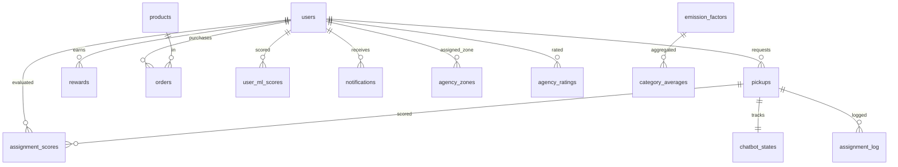

# Database Schema — Notun Alo

> **Document:** `docs/07-database.md`  
> **Version:** 1.0  
> **Last Updated:** May 2026  
> **Engine:** MySQL / MariaDB 10.4+  
> **Collation:** `utf8mb4_general_ci`

---

## Table of Contents

1. [Entity Relationship Diagram](#1-entity-relationship-diagram)
2. [Core Tables](#2-core-tables)
3. [AI/ML Tables](#3-aiml-tables)
4. [Chatbot Tables](#4-chatbot-tables)
5. [Views](#5-views)
6. [Relationships & Constraints](#6-relationships--constraints)
7. [Indexes](#7-indexes)
8. [Query Patterns](#8-query-patterns)
9. [Seed Data](#9-seed-data)

---

## 1. Entity Relationship Diagram



---

## 2. Core Tables

### 2.1 `users` — User Accounts

Core user table storing all account types (user, agency, admin, super_admin).

```sql
CREATE TABLE `users` (
    `id`            INT(11)       NOT NULL AUTO_INCREMENT,
    `name`          VARCHAR(100)  NOT NULL,
    `email`         VARCHAR(150)  NOT NULL,
    `password`      VARCHAR(255)  NOT NULL,
    `address`       TEXT          DEFAULT NULL,
    `phone`         VARCHAR(20)   DEFAULT NULL,
    `picture_url`   VARCHAR(500)  DEFAULT NULL,
    `role`          ENUM('admin','user','agency','super_admin') NOT NULL DEFAULT 'user',
    `is_available`  TINYINT(1)    NOT NULL DEFAULT 1,
    `lat`           DECIMAL(10,8) DEFAULT NULL,
    `lng`           DECIMAL(11,8) DEFAULT NULL,
    `max_capacity`  INT(11)       NOT NULL DEFAULT 10,
    `specialty`     VARCHAR(100)  DEFAULT NULL,
    `zone_id`       INT(11)       DEFAULT NULL,
    `created_at`    TIMESTAMP     NOT NULL DEFAULT CURRENT_TIMESTAMP,
    PRIMARY KEY (`id`),
    UNIQUE KEY `email` (`email`)
) ENGINE=InnoDB DEFAULT CHARSET=utf8mb4 COLLATE=utf8mb4_general_ci;
```

**Columns:**

| Column | Type | Description |
|---|---|---|
| `id` | INT PK AUTO_INCREMENT | Unique user ID |
| `name` | VARCHAR(100) | Full name (supports Unicode for Bengali names) |
| `email` | VARCHAR(150) UNIQUE | Login credential, used for password reset |
| `password` | VARCHAR(255) | bcrypt hash (`PASSWORD_BCRYPT`) |
| `address` | TEXT | Free-text address, used for city extraction for percentile ranking |
| `phone` | VARCHAR(20) | Optional phone number |
| `picture_url` | VARCHAR(500) | Profile picture URL or upload path |
| `role` | ENUM | User type: `admin`, `user`, `agency`, `super_admin` |
| `is_available` | TINYINT(1) | Agency availability flag (1=accepting pickups) |
| `lat` | DECIMAL(10,8) | Agency latitude (WGS-84) for distance scoring |
| `lng` | DECIMAL(11,8) | Agency longitude (WGS-84) |
| `max_capacity` | INT | Max simultaneous pickups for agency |
| `specialty` | VARCHAR(100) | Comma-separated categories (e.g., "Plastic,Metal") |
| `zone_id` | INT | Geographic zone for k-means clustering |
| `created_at` | TIMESTAMP | Account creation timestamp |

### 2.2 `rewards` — Points Tracking

Tracks user reward points balance and lifetime earnings.

```sql
CREATE TABLE `rewards` (
    `id`              INT(11)   NOT NULL AUTO_INCREMENT,
    `user_id`         INT(11)   NOT NULL,
    `total_points`    INT(11)   NOT NULL DEFAULT 0,
    `lifetime_points` INT(11)   NOT NULL DEFAULT 0,
    `last_updated`    TIMESTAMP NOT NULL DEFAULT CURRENT_TIMESTAMP ON UPDATE CURRENT_TIMESTAMP,
    PRIMARY KEY (`id`),
    UNIQUE KEY `user_id` (`user_id`),
    CONSTRAINT `rewards_ibfk_1` FOREIGN KEY (`user_id`) REFERENCES `users` (`id`) ON DELETE CASCADE
) ENGINE=InnoDB DEFAULT CHARSET=utf8mb4 COLLATE=utf8mb4_general_ci;
```

**Points per kg by category (defined in `config.php`):**
| Category | Points/kg |
|---|---|
| Paper | 5 |
| Plastic | 8 |
| Metal | 12 |

**Key queries:**
- Points balance: `SELECT total_points FROM rewards WHERE user_id = ?`
- Leaderboard (top N): `SELECT u.name, r.lifetime_points FROM users u JOIN rewards r ON u.id = r.user_id ORDER BY r.lifetime_points DESC LIMIT 10`

### 2.3 `pickups` — Waste Collection Requests

The core operational table — every pickup request creates a row.

```sql
CREATE TABLE `pickups` (
    `id`               INT(11)       NOT NULL AUTO_INCREMENT,
    `user_id`          INT(11)       NOT NULL,
    `agency_id`        INT(11)       DEFAULT NULL,
    `category`         VARCHAR(50)   NOT NULL,
    `subcategory`      VARCHAR(100)  DEFAULT NULL,
    `estimated_weight` DECIMAL(10,2) NOT NULL COMMENT 'Weight in KG',
    `actual_weight`    DECIMAL(10,2) DEFAULT NULL,
    `status`           ENUM('pending','assigned','collected','completed','cancelled') NOT NULL DEFAULT 'pending',
    `schedule_date`    DATE          NOT NULL,
    `collection_date`  DATE          DEFAULT NULL,
    `created_at`       TIMESTAMP     NOT NULL DEFAULT CURRENT_TIMESTAMP,
    `updated_at`       TIMESTAMP     NULL DEFAULT NULL ON UPDATE CURRENT_TIMESTAMP,
    `task_type`        VARCHAR(20)   DEFAULT NULL,
    PRIMARY KEY (`id`),
    KEY `user_id` (`user_id`),
    KEY `agency_id` (`agency_id`),
    CONSTRAINT `pickups_ibfk_1` FOREIGN KEY (`user_id`) REFERENCES `users` (`id`) ON DELETE CASCADE,
    CONSTRAINT `pickups_ibfk_2` FOREIGN KEY (`agency_id`) REFERENCES `users` (`id`) ON DELETE SET NULL
) ENGINE=InnoDB DEFAULT CHARSET=utf8mb4 COLLATE=utf8mb4_general_ci;
```

**Status lifecycle:**
```
pending → assigned → collected → completed
    ↓          ↓
 cancelled  cancelled
```

| Status | Meaning |
|---|---|
| `pending` | User submitted, awaiting agency assignment |
| `assigned` | Agency has been assigned |
| `collected` | Agency has physically collected the waste |
| `completed` | Waste processed, points awarded |
| `cancelled` | User or admin cancelled the request |

**Key query patterns:**
- User's recent pickups: `SELECT * FROM pickups WHERE user_id = ? ORDER BY schedule_date DESC LIMIT 5`
- Pending unassigned: `SELECT * FROM pickups WHERE status = 'pending' AND agency_id IS NULL AND schedule_date >= CURDATE()`
- Agency workload: `SELECT * FROM pickups WHERE agency_id = ? AND status IN ('assigned', 'collected')`
- Monthly stats: `SELECT MONTH(created_at) as m, YEAR(created_at) as y, category, SUM(estimated_weight) as kg FROM pickups WHERE user_id = ? AND status = 'completed' AND created_at >= DATE_SUB(NOW(), INTERVAL 12 MONTH) GROUP BY y, m, category`

### 2.4 `products` — Upcycle Shop Items

Products available for purchase with points and/or cash.

```sql
CREATE TABLE `products` (
    `id`           INT(11)       NOT NULL AUTO_INCREMENT,
    `name`         VARCHAR(200)  NOT NULL,
    `description`  TEXT          DEFAULT NULL,
    `category`     VARCHAR(100)  DEFAULT NULL,
    `price_points` INT(11)       NOT NULL DEFAULT 0,
    `price_cash`   DECIMAL(10,2) NOT NULL DEFAULT 0.00,
    `image_url`    VARCHAR(500)  DEFAULT NULL,
    `stock`        INT(11)       NOT NULL DEFAULT 0,
    `created_at`   TIMESTAMP     NOT NULL DEFAULT CURRENT_TIMESTAMP,
    PRIMARY KEY (`id`)
) ENGINE=InnoDB DEFAULT CHARSET=utf8mb4 COLLATE=utf8mb4_general_ci;
```

**Seed products (auto-inserted if table empty):**

| Product | Points | Cash (BDT) | Category | Stock |
|---|---|---|---|---|
| Recycled Notebook | 150 | 120 | Stationery | 22 |
| Upcycled Tote Bag | 200 | 180 | Accessories | 15 |
| Metal Pen Set | 120 | 95 | Stationery | 40 |
| Eco Planter Pot | 180 | 150 | Home | 20 |
| Recycled Coaster Set | 100 | 80 | Home | 49 |

### 2.5 `orders` — Product Purchases

Records user purchases from the upcycle shop.

```sql
CREATE TABLE `orders` (
    `id`           INT(11)                                   NOT NULL AUTO_INCREMENT,
    `user_id`      INT(11)                                   NOT NULL,
    `agency_id`    INT(11)                                   DEFAULT NULL,
    `product_id`   INT(11)                                   NOT NULL,
    `quantity`     INT(11)                                   NOT NULL DEFAULT 1,
    `total_points` INT(11)                                   DEFAULT NULL,
    `payment_type` ENUM('points','cash')                     NOT NULL,
    `status`       ENUM('pending','confirmed','assigned','delivered','cancelled') NOT NULL DEFAULT 'pending',
    `created_at`   TIMESTAMP                                 NOT NULL DEFAULT CURRENT_TIMESTAMP,
    PRIMARY KEY (`id`),
    KEY `user_id` (`user_id`),
    KEY `product_id` (`product_id`),
    KEY `agency_id` (`agency_id`),
    CONSTRAINT `orders_ibfk_1` FOREIGN KEY (`user_id`)    REFERENCES `users`   (`id`) ON DELETE CASCADE,
    CONSTRAINT `orders_ibfk_2` FOREIGN KEY (`product_id`) REFERENCES `products` (`id`) ON DELETE CASCADE,
    CONSTRAINT `fk_orders_agency` FOREIGN KEY (`agency_id`) REFERENCES `users` (`id`) ON DELETE SET NULL
) ENGINE=InnoDB DEFAULT CHARSET=utf8mb4 COLLATE=utf8mb4_general_ci;
```

### 2.6 `emission_factors` — Environmental Impact Factors

Scientific emission factors for calculating environmental impact of recycling.

```sql
CREATE TABLE `emission_factors` (
    `id`                  INT(11)       NOT NULL AUTO_INCREMENT,
    `category`            VARCHAR(50)   NOT NULL,
    `subcategory`         VARCHAR(100)  NOT NULL,
    `co2_sa_adjusted`     DECIMAL(6,4)  NOT NULL,
    `water_liters_per_kg` DECIMAL(8,2)  NOT NULL,
    `energy_kwh_per_kg`   DECIMAL(6,4)  NOT NULL,
    `co2_equivalent_label` VARCHAR(200) DEFAULT NULL,
    `is_ewaste`           TINYINT(1)    DEFAULT 0,
    PRIMARY KEY (`id`),
    KEY `idx_category` (`category`),
    KEY `idx_subcategory` (`subcategory`)
) ENGINE=InnoDB DEFAULT CHARSET=utf8mb4 COLLATE=utf8mb4_general_ci;
```

**Emission factors (excerpt):**

| Category | Subcategory | CO₂ (kg/kg) | Water (L/kg) | Energy (kWh/kg) |
|---|---|---|---|---|
| Paper | Mixed paper | 2.68 | 26.40 | 17.00 |
| Paper | Office paper (HGP) | 3.41 | 33.20 | 21.00 |
| Plastic | PET (#1 bottles) | 1.90 | 8.10 | 84.00 |
| Plastic | HDPE (#2 bottles) | 1.55 | 6.40 | 78.00 |
| Metal | Aluminium cans | 7.74 | 14.30 | 42.00 |
| Metal | Steel / Iron | 1.51 | 5.20 | 8.50 |
| E-waste | Mobile phones | 37.40 | 910.00 | 99.9999 |
| E-waste | Mixed WEEE | 2.72 | 180.00 | 38.00 |
| Glass | Mixed glass | 0.26 | 2.10 | 2.80 |
| Organic | Food waste (compost) | 0.49 | 0.00 | 0.50 |
| Textile | Mixed clothing | 3.40 | 35.00 | 28.00 |
| Wood | Dimensional lumber | 0.46 | 1.80 | 4.50 |

---

## 3. AI/ML Tables

### 3.1 `user_ml_scores` — Churn Predictions

ML model output for user churn risk assessment.

```sql
CREATE TABLE `user_ml_scores` (
    `user_id`     INT(11)                  NOT NULL,
    `churn_score` DECIMAL(6,5)             NOT NULL,
    `risk_label`  ENUM('low','medium','high') NOT NULL,
    `updated_at`  TIMESTAMP                NOT NULL DEFAULT CURRENT_TIMESTAMP ON UPDATE CURRENT_TIMESTAMP,
    PRIMARY KEY (`user_id`),
    CONSTRAINT `fk_user_ml_scores_user` FOREIGN KEY (`user_id`) REFERENCES `users` (`id`) ON DELETE CASCADE
) ENGINE=InnoDB DEFAULT CHARSET=utf8mb4 COLLATE=utf8mb4_general_ci;
```

**Risk thresholds:**
- `low`: churn_score < 0.4
- `medium`: 0.4 ≤ churn_score < 0.7
- `high`: churn_score ≥ 0.7

### 3.2 `assignment_scores` — Scoring Audit Trail

Records every agency assignment decision with full scoring breakdown.

```sql
CREATE TABLE `assignment_scores` (
    `id`                       INT(11)       NOT NULL AUTO_INCREMENT,
    `pickup_id`                INT(11)       NOT NULL,
    `agency_id`                INT(11)       NOT NULL,
    `score_total`              DECIMAL(6,4)  NOT NULL DEFAULT 0.0000,
    `score_load`               DECIMAL(6,4)  NOT NULL DEFAULT 0.0000,
    `score_completion`         DECIMAL(6,4)  NOT NULL DEFAULT 0.0000,
    `score_distance`           DECIMAL(6,4)  NOT NULL DEFAULT 0.0000,
    `score_rating`             DECIMAL(6,4)  NOT NULL DEFAULT 0.0000,
    `score_specialty`          DECIMAL(6,4)  NOT NULL DEFAULT 0.0000,
    `predicted_completion_hrs` DECIMAL(5,2)  DEFAULT NULL,
    `model_version`            VARCHAR(20)   NOT NULL DEFAULT 'weighted_v1',
    `scored_at`                TIMESTAMP     NOT NULL DEFAULT CURRENT_TIMESTAMP,
    PRIMARY KEY (`id`),
    KEY `idx_as_pickup` (`pickup_id`),
    KEY `idx_as_agency` (`agency_id`),
    KEY `idx_as_scored` (`scored_at`),
    CONSTRAINT `fk_as_pickup` FOREIGN KEY (`pickup_id`) REFERENCES `pickups` (`id`) ON DELETE CASCADE,
    CONSTRAINT `fk_as_agency` FOREIGN KEY (`agency_id`) REFERENCES `users` (`id`) ON DELETE CASCADE
) ENGINE=InnoDB DEFAULT CHARSET=utf8mb4 COLLATE=utf8mb4_general_ci;
```

**Scoring dimensions:**
| Score | Weight | Description |
|---|---|---|
| `score_load` | Varies | Current load ratio (active/capacity) — lower is better |
| `score_completion` | Varies | Historical completion rate — higher is better |
| `score_distance` | Varies | Geographic distance to pickup location — lower is better |
| `score_rating` | Varies | Average user rating — higher is better |
| `score_specialty` | Varies | Category match with agency specialty |

### 3.3 `agency_zones` — Geographic Zone Mapping

K-means clustering output assigning agencies to zones.

```sql
CREATE TABLE `agency_zones` (
    `agency_id`  INT(11)     NOT NULL,
    `zone_id`    INT(11)     NOT NULL,
    `zone_label` VARCHAR(20) NOT NULL DEFAULT 'unknown',
    PRIMARY KEY (`agency_id`),
    CONSTRAINT `fk_az_agency` FOREIGN KEY (`agency_id`) REFERENCES `users` (`id`) ON DELETE CASCADE
) ENGINE=InnoDB DEFAULT CHARSET=utf8mb4 COLLATE=utf8mb4_general_ci;
```

### 3.4 `model_versions` — ML Model Registry

Tracks every trained ML model version.

```sql
CREATE TABLE `model_versions` (
    `id`          INT(11)      NOT NULL AUTO_INCREMENT,
    `version_tag` VARCHAR(20)  NOT NULL,
    `model_type`  VARCHAR(20)  NOT NULL COMMENT 'RF or GB',
    `trained_on`  INT(11)      NOT NULL DEFAULT 0 COMMENT 'Number of training rows',
    `test_mae`    DECIMAL(5,2) DEFAULT NULL,
    `trained_at`  TIMESTAMP    NOT NULL DEFAULT CURRENT_TIMESTAMP,
    `is_active`   TINYINT(1)   NOT NULL DEFAULT 1,
    PRIMARY KEY (`id`),
    KEY `idx_mv_active` (`is_active`)
) ENGINE=InnoDB DEFAULT CHARSET=utf8mb4 COLLATE=utf8mb4_general_ci;
```

### 3.5 `assignment_log` — Assignment Transaction Log

Immutable audit log of every pickup assignment.

```sql
CREATE TABLE `assignment_log` (
    `id`            INT(11)      NOT NULL AUTO_INCREMENT,
    `pickup_id`     INT(11)      NOT NULL,
    `agency_id`     INT(11)      NOT NULL,
    `method`        VARCHAR(20)  NOT NULL DEFAULT 'ai' COMMENT 'ai | fallback_sql',
    `score_total`   DECIMAL(6,4) DEFAULT NULL,
    `model_version` VARCHAR(20)  DEFAULT NULL,
    `assigned_at`   TIMESTAMP    NOT NULL DEFAULT CURRENT_TIMESTAMP,
    PRIMARY KEY (`id`),
    KEY `idx_al_pickup` (`pickup_id`),
    KEY `idx_al_agency` (`agency_id`)
) ENGINE=InnoDB DEFAULT CHARSET=utf8mb4 COLLATE=utf8mb4_general_ci;
```

### 3.6 `agency_ratings` — User Ratings

One rating per completed pickup (1-5 stars).

```sql
CREATE TABLE `agency_ratings` (
    `id`         INT(11)    NOT NULL AUTO_INCREMENT,
    `pickup_id`  INT(11)    NOT NULL,
    `agency_id`  INT(11)    NOT NULL,
    `user_id`    INT(11)    NOT NULL,
    `rating`     TINYINT    NOT NULL CHECK (`rating` BETWEEN 1 AND 5),
    `created_at` TIMESTAMP  NOT NULL DEFAULT CURRENT_TIMESTAMP,
    PRIMARY KEY (`id`),
    UNIQUE KEY `uq_pickup_rating` (`pickup_id`),
    KEY `idx_ar_agency` (`agency_id`),
    KEY `idx_ar_user` (`user_id`),
    CONSTRAINT `fk_ar_pickup` FOREIGN KEY (`pickup_id`) REFERENCES `pickups` (`id`) ON DELETE CASCADE,
    CONSTRAINT `fk_ar_agency` FOREIGN KEY (`agency_id`) REFERENCES `users` (`id`) ON DELETE CASCADE,
    CONSTRAINT `fk_ar_user`   FOREIGN KEY (`user_id`)   REFERENCES `users` (`id`) ON DELETE CASCADE
) ENGINE=InnoDB DEFAULT CHARSET=utf8mb4 COLLATE=utf8mb4_general_ci;
```

### 3.7 `notifications` — In-App Notifications

```sql
CREATE TABLE `notifications` (
    `id`         INT(11)      NOT NULL AUTO_INCREMENT,
    `user_id`    INT(11)      NOT NULL,
    `title`      VARCHAR(200) NOT NULL,
    `message`    TEXT         NOT NULL,
    `is_read`    TINYINT(1)   NOT NULL DEFAULT 0,
    `created_at` TIMESTAMP    NOT NULL DEFAULT CURRENT_TIMESTAMP,
    PRIMARY KEY (`id`),
    KEY `idx_notif_user` (`user_id`),
    KEY `idx_notif_read` (`is_read`),
    CONSTRAINT `fk_notif_user` FOREIGN KEY (`user_id`) REFERENCES `users` (`id`) ON DELETE CASCADE
) ENGINE=InnoDB DEFAULT CHARSET=utf8mb4 COLLATE=utf8mb4_general_ci;
```

---

## 4. Chatbot Tables

### 4.1 `chatbot_cache` — AI Response Cache

```sql
CREATE TABLE `chatbot_cache` (
    `id`             INT AUTO_INCREMENT PRIMARY KEY,
    `cache_key`      VARCHAR(64) NOT NULL UNIQUE,
    `response_text`  TEXT NOT NULL,
    `suggestions`    JSON DEFAULT NULL,
    `lang`           VARCHAR(5) NOT NULL DEFAULT 'en',
    `created_at`     TIMESTAMP DEFAULT CURRENT_TIMESTAMP,
    INDEX `idx_cache_key` (`cache_key`),
    INDEX `idx_created` (`created_at`)
) ENGINE=InnoDB DEFAULT CHARSET=utf8mb4 COLLATE=utf8mb4_unicode_ci;
```

- Cache key: `md5(strtolower(message) + '|' + lang)`
- TTL: 5 minutes (checked via `WHERE created_at > DATE_SUB(NOW(), INTERVAL 5 MINUTE)`)
- Skipped for user-specific queries (points, my data)

### 4.2 `chat_messages` — Conversation History

```sql
CREATE TABLE `chat_messages` (
    `id`         INT AUTO_INCREMENT PRIMARY KEY,
    `user_id`    INT NOT NULL,
    `session_id` VARCHAR(64) NOT NULL DEFAULT 'main',
    `role`       ENUM('user','assistant','system') NOT NULL,
    `content`    TEXT NOT NULL,
    `created_at` TIMESTAMP DEFAULT CURRENT_TIMESTAMP,
    INDEX `idx_session` (`user_id`, `session_id`, `created_at`)
) ENGINE=InnoDB DEFAULT CHARSET=utf8mb4 COLLATE=utf8mb4_unicode_ci;
```

### 4.3 `chatbot_circuit` — Circuit Breaker State

Single-row table tracking consecutive failures of the Pollinations API.

```sql
CREATE TABLE `chatbot_circuit` (
    `id`                  INT PRIMARY KEY DEFAULT 1,
    `consecutive_failures` INT NOT NULL DEFAULT 0,
    `last_failure_at`     TIMESTAMP NULL,
    `opened_at`           TIMESTAMP NULL
) ENGINE=InnoDB DEFAULT CHARSET=utf8mb4;
```

- After 3 consecutive failures, circuit opens for 300 seconds (5 minutes)
- Single row with `id=1` maintained by `INSERT IGNORE`

### 4.4 `chatbot_states` — Multi-Turn State Machine

```sql
CREATE TABLE `chatbot_states` (
    `id`         INT AUTO_INCREMENT PRIMARY KEY,
    `user_id`    INT NOT NULL,
    `session_id` VARCHAR(64) NOT NULL DEFAULT 'main',
    `step`       VARCHAR(32) NOT NULL DEFAULT 'idle',
    `data`       JSON DEFAULT NULL,
    `created_at` TIMESTAMP DEFAULT CURRENT_TIMESTAMP,
    `updated_at` TIMESTAMP DEFAULT CURRENT_TIMESTAMP ON UPDATE CURRENT_TIMESTAMP,
    UNIQUE KEY `uk_user_session` (`user_id`, `session_id`)
) ENGINE=InnoDB DEFAULT CHARSET=utf8mb4;
```

**Step values:**
| Step | Description |
|---|---|
| `idle` | No active flow |
| `awaiting_category` | Waiting for user to pick Paper/Plastic/Metal |
| `awaiting_weight` | Waiting for weight input |
| `awaiting_date` | Waiting for date input |
| `confirming` | Waiting for user confirmation |

### 4.5 `user_rank_cache` — Percentile Rank Cache

```sql
CREATE TABLE `user_rank_cache` (
    `user_id`       INT PRIMARY KEY,
    `percentile`    INT NOT NULL DEFAULT 0,
    `city`          VARCHAR(100) NOT NULL DEFAULT '',
    `total_in_city` INT NOT NULL DEFAULT 0,
    `metric`        VARCHAR(50) NOT NULL DEFAULT 'co2_prevented',
    `calculated_at` TIMESTAMP NOT NULL DEFAULT CURRENT_TIMESTAMP,
    INDEX `idx_calculated` (`calculated_at`)
) ENGINE=InnoDB DEFAULT CHARSET=utf8mb4 COLLATE=utf8mb4_unicode_ci;
```

- TTL: 15 minutes
- Caches user percentile rank within their city

---

## 5. Views

### 5.1 `agency_stats` — Aggregated Agency Metrics

```sql
CREATE VIEW `agency_stats` AS
SELECT
    u.id                                                    AS agency_id,
    u.name                                                  AS agency_name,
    u.lat,
    u.lng,
    u.is_available,
    u.max_capacity,
    u.specialty,
    COUNT(CASE WHEN p.status IN ('assigned', 'in_progress') THEN 1 END) AS active_pickups,
    ROUND(COUNT(CASE WHEN p.status IN ('assigned', 'in_progress') THEN 1 END) / GREATEST(u.max_capacity, 1), 4) AS load_ratio,
    ROUND(COALESCE(COUNT(CASE WHEN p.status = 'completed' THEN 1 END) / NULLIF(COUNT(p.id), 0), 1.0), 4) AS completion_rate,
    ROUND(COALESCE(AVG(ar.rating), 4.0), 2)                AS avg_rating,
    COUNT(CASE WHEN p.status = 'completed' THEN 1 END)     AS total_completed,
    ROUND(AVG(CASE WHEN p.status = 'completed' THEN TIMESTAMPDIFF(HOUR, p.created_at, p.updated_at) END), 2) AS avg_completion_hrs
FROM `users` u
LEFT JOIN `pickups`        p  ON p.agency_id = u.id
LEFT JOIN `agency_ratings` ar ON ar.agency_id = u.id
WHERE u.role = 'agency'
GROUP BY u.id, u.name, u.lat, u.lng, u.is_available, u.max_capacity, u.specialty;
```

### 5.2 `category_averages` — Aggregated Emission Factors

```sql
CREATE VIEW `category_averages` AS
SELECT
    `category`,
    ROUND(AVG(`co2_sa_adjusted`), 4)     AS `avg_co2`,
    ROUND(AVG(`water_liters_per_kg`), 2) AS `avg_water_liters_per_kg`,
    ROUND(AVG(`energy_kwh_per_kg`), 4)   AS `avg_energy_kwh_per_kg`
FROM `emission_factors`
GROUP BY `category`;
```

Used as fallback when a pickup has no subcategory match in `emission_factors`:
```sql
COALESCE(SUM(p.estimated_weight * COALESCE(ef.co2_sa_adjusted, ca.avg_co2, 1.2)), 0) AS co2_saved_kg
```

---

## 6. Relationships & Constraints

| Foreign Key | From | To | On Delete |
|---|---|---|---|
| `rewards_ibfk_1` | `rewards.user_id` | `users.id` | CASCADE |
| `pickups_ibfk_1` | `pickups.user_id` | `users.id` | CASCADE |
| `pickups_ibfk_2` | `pickups.agency_id` | `users.id` | SET NULL |
| `orders_ibfk_1` | `orders.user_id` | `users.id` | CASCADE |
| `orders_ibfk_2` | `orders.product_id` | `products.id` | CASCADE |
| `fk_orders_agency` | `orders.agency_id` | `users.id` | SET NULL |
| `fk_user_ml_scores_user` | `user_ml_scores.user_id` | `users.id` | CASCADE |
| `fk_as_pickup` | `assignment_scores.pickup_id` | `pickups.id` | CASCADE |
| `fk_as_agency` | `assignment_scores.agency_id` | `users.id` | CASCADE |
| `fk_ar_pickup` | `agency_ratings.pickup_id` | `pickups.id` | CASCADE |
| `fk_ar_agency` | `agency_ratings.agency_id` | `users.id` | CASCADE |
| `fk_ar_user` | `agency_ratings.user_id` | `users.id` | CASCADE |
| `fk_az_agency` | `agency_zones.agency_id` | `users.id` | CASCADE |
| `fk_notif_user` | `notifications.user_id` | `users.id` | CASCADE |

---

## 7. Indexes

| Table | Index | Columns | Type |
|---|---|---|---|
| `users` | PRIMARY | `id` | Unique |
| `users` | `email` | `email` | Unique |
| `rewards` | PRIMARY | `id` | Unique |
| `rewards` | `user_id` | `user_id` | Unique |
| `pickups` | PRIMARY | `id` | Unique |
| `pickups` | `user_id` | `user_id` | Non-unique |
| `pickups` | `agency_id` | `agency_id` | Non-unique |
| `products` | PRIMARY | `id` | Unique |
| `orders` | PRIMARY | `id` | Unique |
| `orders` | `user_id` | `user_id` | Non-unique |
| `orders` | `product_id` | `product_id` | Non-unique |
| `orders` | `agency_id` | `agency_id` | Non-unique |
| `user_ml_scores` | PRIMARY | `user_id` | Unique |
| `emission_factors` | PRIMARY | `id` | Unique |
| `emission_factors` | `idx_category` | `category` | Non-unique |
| `emission_factors` | `idx_subcategory` | `subcategory` | Non-unique |
| `assignment_scores` | `idx_as_pickup` | `pickup_id` | Non-unique |
| `assignment_scores` | `idx_as_agency` | `agency_id` | Non-unique |
| `assignment_scores` | `idx_as_scored` | `scored_at` | Non-unique |
| `assignment_log` | `idx_al_pickup` | `pickup_id` | Non-unique |
| `assignment_log` | `idx_al_agency` | `agency_id` | Non-unique |
| `agency_ratings` | `uq_pickup_rating` | `pickup_id` | Unique |
| `agency_ratings` | `idx_ar_agency` | `agency_id` | Non-unique |
| `agency_ratings` | `idx_ar_user` | `user_id` | Non-unique |
| `notifications` | `idx_notif_user` | `user_id` | Non-unique |
| `notifications` | `idx_notif_read` | `is_read` | Non-unique |
| `chatbot_cache` | `idx_cache_key` | `cache_key` | Non-unique |
| `chatbot_cache` | `idx_created` | `created_at` | Non-unique |
| `chat_messages` | `idx_session` | `user_id, session_id, created_at` | Non-unique |
| `chatbot_states` | `uk_user_session` | `user_id, session_id` | Unique |
| `user_rank_cache` | `idx_calculated` | `calculated_at` | Non-unique |
| `model_versions` | `idx_mv_active` | `is_active` | Non-unique |

---

## 8. Query Patterns

### User Dashboard
```sql
-- Points and tier
SELECT total_points, lifetime_points FROM rewards WHERE user_id = ?;

-- Pickup stats
SELECT
    COUNT(CASE WHEN status = 'completed' THEN 1 END) as completed,
    COUNT(CASE WHEN status = 'pending' THEN 1 END) as pending,
    COUNT(CASE WHEN status = 'scheduled' THEN 1 END) as scheduled
FROM pickups WHERE user_id = ?;

-- Total impact
SELECT COALESCE(SUM(estimated_weight), 0) as total_kg
FROM pickups WHERE user_id = ? AND status = 'completed';

-- Leaderboard
SELECT u.name, r.lifetime_points
FROM users u JOIN rewards r ON u.id = r.user_id
ORDER BY r.lifetime_points DESC LIMIT 10;

-- Recent activity
SELECT category, status, created_at
FROM pickups WHERE user_id = ? ORDER BY created_at DESC LIMIT 5;
```

### Admin Panel
```sql
-- Platform totals
SELECT COALESCE(SUM(estimated_weight), 0) as tw FROM pickups WHERE status = 'completed';
SELECT COUNT(*) as cnt FROM pickups;
SELECT COUNT(*) as cnt FROM users WHERE role = 'user';
SELECT COUNT(*) as cnt FROM products;

-- Email search
SELECT u.name, u.email, u.picture_url, r.lifetime_points
FROM users u JOIN rewards r ON u.id = r.user_id
WHERE u.role = 'user' AND u.email LIKE ?
ORDER BY r.lifetime_points DESC;
```

### Environmental Impact
```sql
-- Full impact calculation
SELECT
    u.id AS user_id, u.name AS user_name,
    COUNT(p.id) AS total_pickups,
    SUM(CASE WHEN p.status = 'completed' THEN 1 ELSE 0 END) AS completed_pickups,
    COALESCE(SUM(p.estimated_weight), 0) AS total_kg_recycled,
    COALESCE(SUM(p.estimated_weight * COALESCE(ef.co2_sa_adjusted, ca.avg_co2, 1.2)), 0) AS co2_saved_kg,
    COALESCE(SUM(p.estimated_weight * COALESCE(ef.water_liters_per_kg, ca.avg_water_liters_per_kg, 20)), 0) AS water_saved_liters,
    COALESCE(SUM(p.estimated_weight * COALESCE(ef.energy_kwh_per_kg, ca.avg_energy_kwh_per_kg, 5)), 0) AS energy_saved_kwh
FROM users u
LEFT JOIN pickups p ON p.user_id = u.id AND p.status IN ('completed', 'scheduled')
LEFT JOIN emission_factors ef ON ef.category = p.category
    AND p.subcategory IS NOT NULL AND p.subcategory <> ''
    AND ef.subcategory = p.subcategory
LEFT JOIN category_averages ca ON ca.category = p.category
WHERE u.id = ?
GROUP BY u.id, u.name;

-- Monthly breakdown
SELECT
    MONTH(created_at) AS m, YEAR(created_at) AS y,
    category, SUM(estimated_weight) AS kg
FROM pickups
WHERE user_id = ? AND status = 'completed'
  AND created_at >= DATE_SUB(NOW(), INTERVAL 12 MONTH)
GROUP BY y, m, category
ORDER BY y, m, category;
```

### Percentile Ranking
```sql
-- User's total CO2
SELECT COALESCE(SUM(estimated_weight), 0) * 1.2 AS co2_kg
FROM pickups WHERE user_id = ? AND status = 'completed';

-- All users in city
SELECT u.id, COALESCE(SUM(p.estimated_weight), 0) * 1.2 AS co2_kg
FROM users u
LEFT JOIN pickups p ON p.user_id = u.id AND p.status = 'completed'
WHERE u.address LIKE ? AND u.role = 'user'
GROUP BY u.id HAVING co2_kg > 0;
```

---

## 9. Seed Data

The initial database (`notun_alo.sql`) includes:

**Users:**
| ID | Name | Email | Role |
|---|---|---|---|
| 1 | Admin User | admin1@gmail.com | admin |
| 2 | Green Agency | agency@notunalo.com | agency |
| 3 | Agent One | agent1@gmail.com | agency |
| 4 | Agent Two | agent2@gmail.com | agency |
| 5 | Test User | user@notunalo.com | user |
| 6 | Ayush Hassan | ahr_007@gmail.com | user |

**Rewards:**
| ID | User | Points |
|---|---|---|
| 1 | Test User (ID=3) | 250 |
| 2 | Ayush Hassan (ID=6) | 0 |

**Products:** 6 upcycle shop items (see table in section 2.4).
**Orders:** 2 sample orders.
**Pickups:** 6 sample pickup requests with varying statuses.

The merged schema (`clean_merged_notun_alo.sql`) additionally includes 38 users with churn demo data, emission factors for 28 material subcategories, and extended pickup history for impact demo users.
