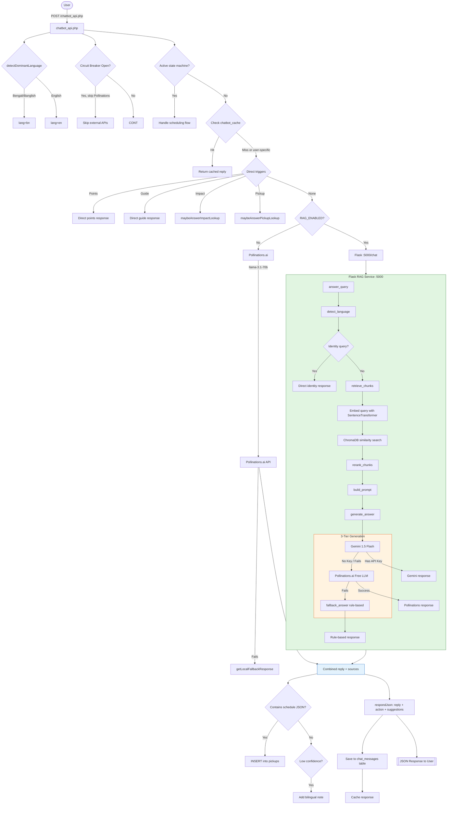
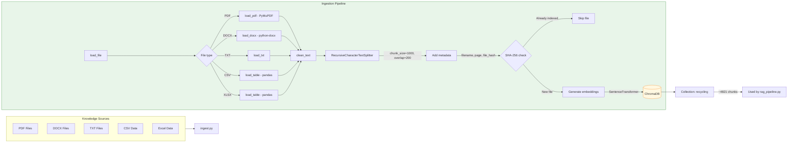
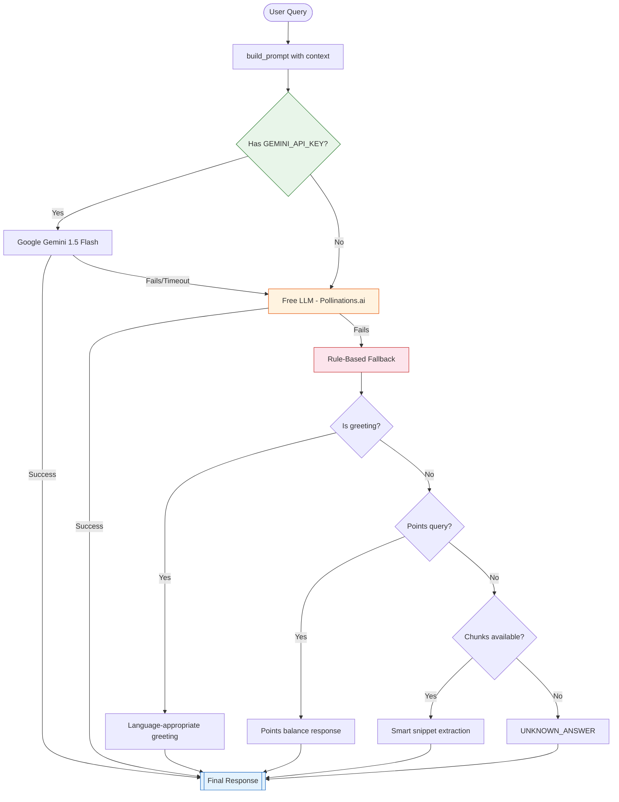

# AI / RAG System — Notun Alo

> **Document:** `docs/08-ai-rag-system.md`  
> **Version:** 1.0  
> **Last Updated:** May 2026

---

## Table of Contents

1. [System Overview](#1-system-overview)
2. [Architecture Diagram](#2-architecture-diagram)
3. [Flask RAG Service](#3-flask-rag-service)
4. [Embedding Generation](#4-embedding-generation)
5. [Chunking Strategy](#5-chunking-strategy)
6. [Knowledge Base](#6-knowledge-base)
7. [Retrieval Logic](#7-retrieval-logic)
8. [Prompt Engineering](#8-prompt-engineering)
9. [Answer Generation](#9-answer-generation)
10. [Fallback Chain](#10-fallback-chain)
11. [Memory & History](#11-memory--history)
12. [File Ingestion Pipeline](#12-file-ingestion-pipeline)
13. [Configuration](#13-configuration)
14. [Verifier Module](#14-verifier-module)
15. [Impact & Churn AI Services](#15-impact--churn-ai-services)
16. [Chatbot API Integration](#16-chatbot-api-integration)

---

## 1. System Overview

The Notun Alo AI/RAG (Retrieval-Augmented Generation) system provides intelligent, context-aware responses to user queries about recycling, waste management, and platform features. It combines:

- **Retrieval:** Semantic search over a curated knowledge base of 27+ documents about Bangladesh waste management, recycling guides, environmental laws, and scientific data
- **Augmentation:** Retrieved content is injected into a structured prompt with user context and conversation history
- **Generation:** Three-tier response generation (Gemini AI → Free LLM → Rule-based fallback)

**Key design goals:**
- Support Bengali, Banglish (transliterated Bengali in Latin script), and English
- Offline-capable embedding model (no internet dependency after initial download)
- Graceful degradation: if any layer fails, the next layer handles the request
- Circuit breaker pattern to prevent cascading API failures
- 5-minute response cache for non-personalized queries

---

## 2. Architecture Diagram

### End-to-End RAG Flow



### Document Ingestion Pipeline



### 3-Tier Fallback Chain



---

## 3. Flask RAG Service

**File:** `app.py` (112 lines)

A Flask web server acting as the RAG inference microservice on port 5000.

### Endpoints

| Endpoint | Method | Description |
|---|---|---|
| `/health` | GET | Health check — returns service status, collection name, unknown answer template |
| `/chat` | POST | Main chat endpoint — accepts query, language, user context; returns answer + sources |
| `/ingest` | POST | Triggers document re-ingestion (optional `rebuild: true` to delete and recreate collection) |
| `/upload` | POST | Accepts file upload, saves to `uploads/`, indexes immediately |
| `/sources` | GET | Returns the last retrieved chunks with metadata and distance scores (for debugging) |

### Request/Response for `/chat`

**Request:**
```json
{
    "query": "What is the environmental impact of recycling plastic in Bangladesh?",
    "language": "auto",
    "user_name": "Robi",
    "user_points": 250
}
```

**Response (success):**
```json
{
    "answer": "প্লাস্টিক রিসাইক্লিংয়ের পরিবেশগত প্রভাব উল্লেখযোগ্য। বাংলাদেশে প্রতিদিন প্রচুর প্লাস্টিক বর্জ্য উৎপন্ন হয়... ♻️",
    "sources": [
        {
            "filename": "plastic-recycling-guide.pdf",
            "page_number": 12,
            "source_doc": "Phase 1 (RAG)/Plastic recycling guides/plastic-recycling-guide.pdf",
            "folder_category": "Plastic recycling guides",
            "file_type": "pdf"
        }
    ],
    "verification": {"score": 0.95}
}
```

**Response (no relevant data):**
```json
{
    "answer": "I couldn't find specific details on that in my current records, but I can help with recycling info, points, or pickups! 🌿",
    "sources": [],
    "verification": {"score": 0.0}
}
```

### Server Configuration
```python
# Default settings
app.run(host="127.0.0.1", port=5000, debug=True)

# Environment variables
os.environ["HF_HUB_OFFLINE"] = "1"      # No internet for HF downloads
os.environ["TRANSFORMERS_OFFLINE"] = "1" # Transformers offline mode
os.environ["NO_PROXY"] = "*"             # Bypass proxy for local requests
```

---

## 4. Embedding Generation

### Model

`sentence-transformers/paraphrase-multilingual-MiniLM-L12-v2`

| Property | Value |
|---|---|
| **Architecture** | MiniLM (12-layer transformer) |
| **Vector Dimension** | 384 |
| **Languages** | 50+ including Bengali, Hindi, Arabic |
| **Model Size** | ~470 MB |
| **Download** | One-time via HuggingFace Hub |
| **Mode** | Offline (`local_files_only=True`) after first download |
| **Usage** | Both document embedding (ingestion) and query embedding (retrieval) |

**Initialization:**
```python
def get_embedding_model():
    global _embedding_model
    if _embedding_model is None:
        _embedding_model = SentenceTransformer(
            EMBEDDING_MODEL_NAME,
            local_files_only=True  # Offline mode
        )
    return _embedding_model
```

**Environment variables for offline mode:**
```bash
export HF_HUB_OFFLINE=1
export TRANSFORMERS_OFFLINE=1
```

### How Embedding Works

1. **Document Ingestion:** Each text chunk is passed through the model → produces a 384-dimensional float vector → stored in ChromaDB with the chunk text and metadata
2. **Query Time:** User's question is embedded with the same model → produces a 384-dimensional query vector → ChromaDB finds the closest chunks via cosine similarity

---

## 5. Chunking Strategy

### Text Splitter

**Preferred:** `langchain_text_splitters.RecursiveCharacterTextSplitter`
- `chunk_size = 1000` characters
- `chunk_overlap = 200` characters

**Fallback** (if langchain not installed): `SimpleSplitter`
- Splits every 800 characters
- Each chunk up to 1000 characters
- No overlap

### Per-File-Type Extraction

| File Type | Extractor | Notes |
|---|---|---|
| **PDF** | PyMuPDF (`fitz`) | Page-by-page text extraction via `page.get_text("text")`. Empty pages skipped |
| **DOCX** | `python-docx` | Extracts paragraph text and table cells (joined with `|`) |
| **TXT** | Direct UTF-8 read | Errors ignored via `errors="ignore"` |
| **CSV** | `pandas.read_csv` | Handles encoding errors, variable separators, bad lines |
| **XLSX** | `pandas.read_excel` | Converts to CSV format text for embedding |

### Chunk Metadata

Every chunk stored in ChromaDB includes:

| Field | Description | Example |
|---|---|---|
| `chunk_id` | Unique ID: `{file_hash[:16]}-{page}-{counter}` | `a1b2c3d4e5f6a7b8-3-12` |
| `filename` | Original file name | `plastic-recycling-guide.pdf` |
| `page_number` | Source page (1 for non-PDF) | `12` |
| `source_doc` | Full file path | `Phase 1 (RAG)/Plastic recycling guides/...` |
| `folder_category` | Subfolder name | `Plastic recycling guides` |
| `file_type` | File extension | `pdf` |
| `file_hash` | SHA-256 hex digest | `a1b2c3d4...` |

### Deduplication

- SHA-256 hash of each file computed on ingestion
- `is_indexed()` checks if any chunk with same `file_hash` exists in ChromaDB
- Prevents re-indexing during incremental runs
- `--rebuild` flag deletes entire collection and re-ingests everything

---

## 6. Knowledge Base

### Location
`Phase 1 (RAG)/` — 27 files across 5 categories

### Document Inventory

| Category | Files | Description |
|---|---|---|
| **Bangladesh waste context** | 6 | Waste generation in Bangladesh, management papers, ASEF background, academic research |
| **Environmental laws & NGOs** | 2 | Bangladesh environmental regulations, waste management policies |
| **Paper recycling** | 4 | Paper recycling processes, recovered office paper, recycled fiber facts |
| **Plastic recycling guides** | 5 | UNDP plastic pollution report, APR sorting BMPs, project docs, recycling guides |
| **Waste reports** | 6 | Waste concern database, DCCCA reports, Chittagong case studies, Wikipedia on recycling |
| **Root datasets** | 4 | FAQ TXT, Chatbot Q&A PDFs, E-waste CSV, Material Consumption XLSX/CSV |

### Total Indexed
- **~4,821 chunks** in the ChromaDB `recycling` collection
- File types: PDF (16), TXT (5), CSV (3), XLSX (1), DOCX (0 — available for future)
- File size range: 2 KB (FAQ TXT) to 15 MB (UNDP report PDF)

### Example Documents
| File | Type | Pages | Content |
|---|---|---|---|
| `Waste_generation_and_management_in_Bangladesh.pdf` | PDF | 42 | Academic overview of Bangladesh waste |
| `plastic-recycling-guide.pdf` | PDF | 28 | Practical plastic recycling processes |
| `Bangladesh.txt` | TXT | — | Country-specific recycling context |
| `E_waste_Statistics_by_Country_2015_2024.csv` | CSV | — | Global e-waste stats by country |
| `Domestic_Material_Consumption.xlsx` | XLSX | — | Material consumption data |
| `Chatbot QNA.pdf` | PDF | 10 | Predefined Q&A pairs for the chatbot |

---

## 7. Retrieval Logic

### `rag_pipeline.py:retrieve_chunks()`

```
Input:  query (string), top_k (int, default 8)
Output: List of chunk dicts with text, metadata, distance
Steps:
  1. Get embedding model (singleton)
  2. Embed query → 384-dim vector
  3. ChromaDB query: {
        query_embeddings=[vector],
        n_results=top_k,
        include=["documents", "metadatas", "distances"]
     }
  4. Assemble chunk list with text + metadata + distance
  5. Pass through reranker (currently pass-through)
  6. Log: query, retrieval time (ms), chunk count
  7. Return chunks
```

### Reranker

**File:** `reranker.py`

Currently a **pass-through** — returns chunks unchanged. Designed as a placeholder for future cross-encoder re-ranking (e.g., `cross-encoder/ms-marco-MiniLM-L-6-v2`).

```python
def rerank_chunks(chunks: List[Dict]) -> List[Dict]:
    # TODO: implement cross-encoder re-ranking
    return chunks  # Pass-through for now
```

### Similarity Search Configuration

- **Distance metric:** Cosine similarity (ChromaDB default)
- **Top-K:** 8 chunks retrieved per query
- **Collection:** `recycling` (PersistentClient, persisted to `chroma_db/`)

---

## 8. Prompt Engineering

### `rag_pipeline.py:build_prompt()`

Assembles a structured prompt for the LLM:

```
You are Notun Alo (নতুন আলো), a highly intelligent and natural conversational AI.
Your goal is to be a smooth, human-like, and emotionally adaptive guide.

[IDENTITY]
User: {user_name} ({user_points} pts)

[KNOWLEDGE SOURCE]
[Source 1: filename.pdf]
{chunk text ...}

---

[Source 2: filename.txt]
{chunk text ...}
...

[CONVERSATIONAL RULES (STRICT)]
1. Natural Multilingualism:
   - If User speaks Bangla → Reply fully in natural Bangla.
   - If User speaks English → Reply fully in clean English.
   - NEVER mix languages unnaturally in one sentence.
   - Understand Banglish perfectly and reply in natural Bangla.

2. Anti-Robotic:
   - NEVER say "I am an AI assistant" or "I am still learning".
   - If you don't know something, use natural unknown responses.
   - Avoid formal/textbook language. Use modern, conversational tones.

3. Conciseness:
   - Keep casual greetings short.
   - Don't overexplain simple questions.

4. Emotional Flow:
   - Be empathetic if the user is frustrated.
   - Use exactly one relevant emoji (♻️, 🌿, 😊).

5. RAG Integration:
   - Summarize knowledge base info conversationally.
   - Stay factually accurate based on the context provided.

USER: {query}

[NOTUN ALO]:
```

### Language Detection at Prompt Level

```python
def detect_language(text: str, requested: str | None = None) -> str:
    # Bengali Unicode range check (U+0980-U+09FF)
    if any("\u0980" <= char <= "\u09ff" for char in text):
        return "bn"
    # Explicit request override
    if requested in {"bn", "en"}:
        return requested
    # Banglish keyword matching
    banglish_keywords = {"ki", "obostha", "kemon", "acho", ...}
    if any(word in banglish_keywords for word in text.lower().split()):
        return "bn"
    return "en"
```

**Unknown answer strings:**
- English: `"I couldn't find specific details on that in my current records, but I can help with recycling info, points, or pickups! 🌿"`
- Bengali: `"এই বিষয়ে আমার কাছে এখন পর্যাপ্ত তথ্য নেই, তবে আমি আপনাকে রিসাইক্লিং, পয়েন্ট বা পিকআপ নিয়ে সাহায্য করতে পারি। 🌿"`

---

## 9. Answer Generation

### `rag_pipeline.py:generate_answer()`

Three-tier generation strategy:

### Tier 1: Google Gemini AI

```python
genai.configure(api_key=GEMINI_API_KEY)
model = genai.GenerativeModel("gemini-1.5-flash")
response = model.generate_content(
    prompt,
    generation_config={
        "temperature": 0.2,
        "max_output_tokens": 900
    }
)
```

| Parameter | Value |
|---|---|
| **Model** | `gemini-1.5-flash` (configurable via `GEMINI_MODEL` env) |
| **Temperature** | 0.2 (low — factual, deterministic) |
| **Max Tokens** | 900 |
| **API Key** | `GEMINI_API_KEY` in `.env` |

**Fallback condition:** If no API key set, or if response is empty after generation, falls to Tier 2.

### Tier 2: Free LLM (Pollinations.ai)

```python
def call_free_llm(query, chunks, language):
    prompt = build_prompt(query, chunks, language)
    payload = {
        "messages": [
            {"role": "system", "content": "You are Notun Alo's helpful recycling assistant."},
            {"role": "user", "content": prompt}
        ],
        "model": "openai",
        "private": True
    }
    resp = requests.post("https://text.pollinations.ai/openai", json=payload, timeout=10)
    # Extract response from choices[0].message.content
```

| Parameter | Value |
|---|---|
| **URL** | `https://text.pollinations.ai/openai` |
| **Model** | `openai` (maps to Llama 3.1 70B) |
| **Timeout** | 10 seconds |
| **Privacy** | `private: true` |

### Tier 3: Rule-Based Fallback

**`rag_pipeline.py:fallback_answer()`**

| Condition | Response |
|---|---|
| Greeting (English) | `"Hello {name}! 😊 I'm your Notun Alo assistant..."` |
| Greeting (Bengali) | `"হ্যালো {name}! 😊 আমি Notun Alo সহকারী..."` |
| Points query (EN) | `"🏆 Your current balance is **{points} points**..."` |
| Points query (BN) | `"🏆 আপনার বর্তমান ব্যালেন্স: **{points} পয়েন্ট**..."` |
| Chunks available | Smart snippet extraction: find chunk with most keyword matches, return first 500 chars |
| No chunks, no match | UNKNOWN_ANSWER (based on language) |

**Smart snippet extraction algorithm:**
```python
query_words = [w for w in query.split() if len(w) > 2]
best_chunk = chunks[0]
max_matches = 0
for chunk in chunks:
    text = chunk.get("text", "").lower()
    matches = sum(1 for word in query_words if word in text)
    if matches > max_matches:
        max_matches = matches
        best_chunk = chunk
snippet = best_chunk.get("text", "").strip()[:500]
```

### Source Formatting

```python
def format_sources(chunks):
    seen = set()
    sources = []
    for chunk in chunks:
        key = (meta.get("source_doc"), meta.get("page_number"))
        if key in seen: continue  # Deduplicate by document+page
        seen.add(key)
        sources.append({
            "filename": meta.get("filename", "unknown"),
            "page_number": meta.get("page_number", 1),
            "source_doc": meta.get("source_doc", ""),
            "folder_category": meta.get("folder_category", ""),
            "file_type": meta.get("file_type", ""),
        })
    return sources
```

---

## 10. Fallback Chain

The complete fallback chain across both the PHP and Python layers:

```
chatbot_api.php (PHP)
  ├── State machine flow (direct DB interaction)
  ├── Cache hit (chatbot_cache, 5-min TTL)
  ├── Direct triggers (points, guide, impact, pickup)
  ├── RAG service (if RAG_ENABLED=true)
  │     └── Flask :5000/chat
  │           ├── Gemini 1.5 Flash
  │           ├── Pollinations.ai free LLM
  │           └── Rule-based fallback (rag_pipeline.py)
  ├── Pollinations.ai direct (llama-3.1-70b)
  │     └── Circuit breaker (3 failures = 5-min cooldown)
  └── Rule-based fallback (getLocalFallbackResponse in PHP)
        └── 15-intent scoring engine
```

**Circuit breaker pattern** (in `chatbot_state.php`):
- Tracks consecutive failures in `chatbot_circuit` table
- After 3 failures, circuit opens for 300 seconds
- During open circuit, Pollinations.ai is skipped entirely
- Each success resets the counter

---

## 11. Memory & History

### Server-Side Memory (chat_messages table)

- Every `user` and `assistant` message is saved to the `chat_messages` table
- Loaded on each request: last 6-8 messages (configurable)
- Used as conversation context for Pollinations.ai requests
- Session-scoped by `(user_id, session_id)`

### Client-Side Memory (localStorage)

- Chatbot.php stores conversation in `localStorage` keyed by user
- Can optionally send full history array to `chatbot_api.php`
- Survives page refreshes without server round-trips

### RAG Caching (chatbot_cache table)

- Cache key: `md5(strtolower(message) + '|' + lang)`
- TTL: 5 minutes
- Only caches non-personalized responses (not points, not "my" queries)
- On cache hit: saves messages to history but returns cached response immediately
- Avoids redundant LLM calls for common queries

---

## 12. File Ingestion Pipeline

### `ingest.py` — CLI Document Indexer

**Usage:**
```bash
# Full rebuild (deletes and recreates collection)
python ingest.py --rebuild

# Incremental (skips already-indexed files by hash)
python ingest.py

# Index a single uploaded file
python ingest.py --file uploads/test.pdf
```

### Pipeline Steps

```
1. argparse parsing (--rebuild, --file)
2. Get or create ChromaDB collection (delete if --rebuild)
3. Get SentenceTransformer model
4. Iterate over all supported files in:
   - Phase 1 (RAG)/ (knowledge base)
   - uploads/ (user uploads)
   - Extra files from --file parameter
5. For each file:
   a. Compute SHA-256 hash
   b. If not --rebuild and hash already indexed → skip
   c. Load file content based on extension
   d. Clean text (remove null bytes, normalize whitespace)
   e. Split into chunks (RecursiveCharacterTextSplitter)
   f. Generate embeddings for all chunks
   g. Add to ChromaDB with metadata
6. Return summary: indexed_files, skipped_files, failed_files, total_chunks
```

### Summary Output

```python
{
    "indexed_files": 5,
    "skipped_files": 22,  # Already indexed
    "failed_files": 0,
    "total_chunks": 4821,
    "collection": "recycling",
    "chroma_path": "chroma_db/"
}
```

---

## 13. Configuration

### Environment Variables

| Variable | Default | Description |
|---|---|---|
| `RAG_ENABLED` | `false` | Enable RAG service calls from PHP (`true`/`false`) |
| `RAG_API_URL` | `http://localhost:5000` | Flask RAG service base URL |
| `GEMINI_API_KEY` | — | Google Gemini API key (Tier 1 generation) |
| `GEMINI_MODEL` | `gemini-1.5-flash` | Gemini model name |

### Offline Mode

```python
# Set automatically at module import
os.environ["HF_HUB_OFFLINE"] = "1"
os.environ["TRANSFORMERS_OFFLINE"] = "1"
os.environ["NO_PROXY"] = "*"
os.environ["no_proxy"] = "*"
```

### Docker Configuration

**`Dockerfile.flask`:** Flask RAG service container
**`Dockerfile.rag`:** RAG pipeline container  
**`start_rag.ps1`:** PowerShell script to start RAG service on Windows

---

## 14. Verifier Module

### `verifier.py`

A placeholder verification module that scores response quality:

```python
class Verifier:
    def verify(self, answer: str, chunks: List[Dict]) -> dict:
        # TODO: implement actual verification logic
        return {"score": 1.0, "verified": True}
```

Currently returns a perfect score for all responses. Designed for future enhancement:
- Factual consistency checking
- Source attribution verification
- Hallucination detection
- Relevance scoring

---

## 15. Impact & Churn AI Services

### Impact Prediction (`ai-service/`)

| File | Description |
|---|---|
| `impact_api.py` | Flask API on port 5003 for environmental impact calculations |
| `cli_impact.py` | CLI tool for forecast generation (called by `api_impact.php`) |
| `environmental_engine.py` | Core impact calculation engine |
| `forecast_engine.py` | 90-day forecast model (Linear Regression) |
| `train_impact_model.py` | Trains impact prediction model |
| `train_forecast_model.py` | Trains forecast model |
| `dashboard_chart.js` | Chart.js stacked bar for monthly CO₂ by category |

### Churn Prediction

| File | Description |
|---|---|
| `train_notun_alo_churn.py` | Trains Random Forest churn classifier |
| `score_users.py` | Scores all users with latest model |
| `notun_alo_churn_model.pkl` | Trained model pickle |

### Assignment AI

| File | Description |
|---|---|
| `assignment_api.py` | Flask API for smart agency assignment |
| `zone_clustering.py` | K-means clustering for agency zones |
| `leaderboard_engine.py` | Leaderboard scoring engine |

---

## 16. Chatbot API Integration

### PHP → RAG Service Communication

**`chatbot_api.php:callRagAssistant()`**

1. **Health check** — `GET /health` on Flask service with 5s timeout
2. **Skip if unhealthy** — Logs warning, returns null (triggers fallback)
3. **Build payload** — JSON with query, language, user_name, user_points
4. **POST /chat** — 60s timeout, 5s connect timeout
5. **Parse response** — Extract `answer` and `sources`
6. **Validate** — Check for empty answer, unknown answer strings, empty sources
7. **Append points** — If user asked about points but RAG didn't include them, appends points line
8. **Return** — `{reply, sources}` or null on failure

```php
function callRagAssistant(string $message, string $lang, array $user): ?array {
    // 1. Health check
    // 2. POST /chat with payload
    // 3. Validate response
    // 4. Return {reply, sources} or null
}
```

### Request Lifecycle Summary

1. User types message in chatbot.php
2. Browser sends POST to `chatbot_api.php` with `{message, session_id, lang, history}`
3. PHP processes through: language detection → circuit breaker → state machine → cache → direct triggers → RAG → Pollinations → fallback
4. Response includes: `{reply, action, source, suggestions, session_id}`
5. Browser renders the reply bubble, updates history in localStorage
6. If action is `pickup_scheduled`, UI shows confirmation with details
