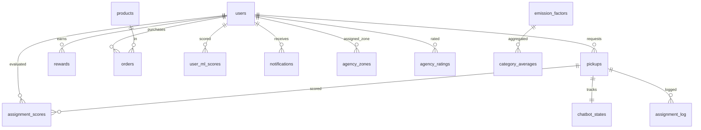
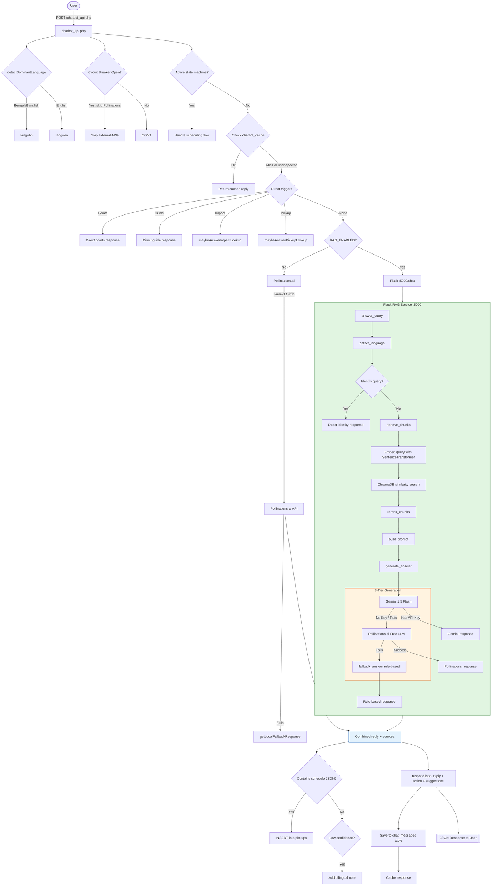
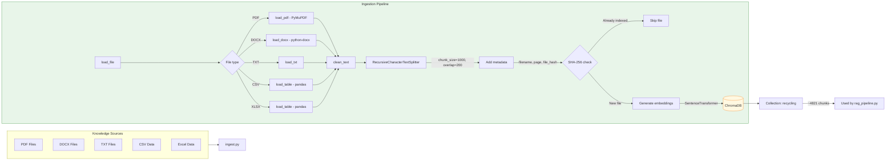
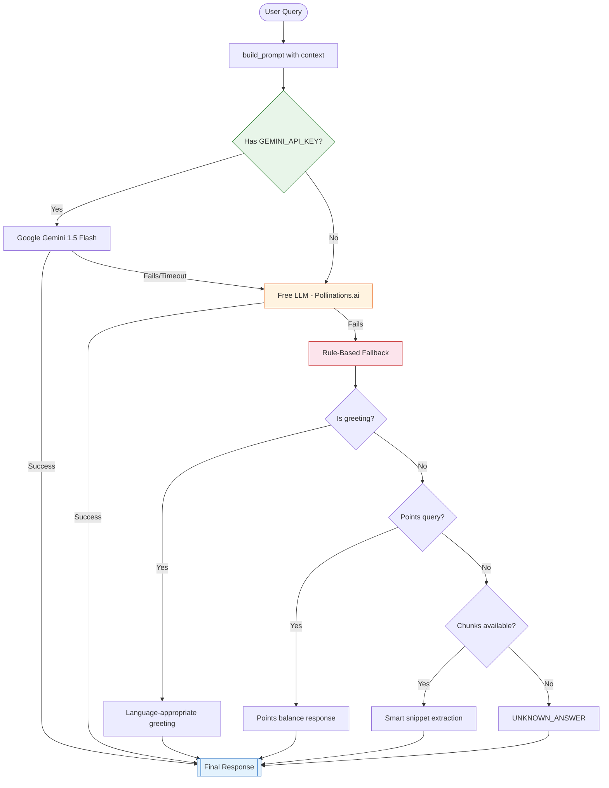

---
# 1. PROJECT OVERVIEW

# Notun Alo (নতুন আলো) — Project Overview

**Notun Alo** (নতুন আলো, meaning *"New Light"*) is a community recycling platform connecting households in Bangladesh with collection agencies. It rewards eco-friendly behavior through a points-based incentive system and provides AI-powered tools for scheduling, education, and environmental impact tracking.

---

## 1. Core Problems Solved

| # | Problem | Solution |
|---|---------|----------|
| 1 | **No centralized recycling platform in Bangladesh** | Web-based platform connecting households → agencies → admins in a single system |
| 2 | **Language barrier (Bangla / Banglish / English)** | Bilingual UI (EN/BN) + AI chatbot that auto-detects and responds in the user's language |
| 3 | **Trust and transparency in waste collection** | Full pickup lifecycle tracking, agency assignment audit trail, notification system |
| 4 | **Lack of incentives for household recycling** | Points-per-kg rewards (Paper 5, Plastic 8, Metal 12), tier/gamification system, upcycle shop |

---

## 2. Main Features

- **AI Chatbot** — Bilingual (EN/BN/Banglish) conversational assistant for recycling queries, pickup scheduling, and platform guidance
- **RAG-Powered Q&A** — Retrieval-Augmented Generation over 27+ knowledge base documents (PDFs, CSVs, TXTs) using ChromaDB + sentence-transformers
- **Pickup Scheduling** — Multi-turn state machine scheduling (category → weight → date → confirm) with zero API dependency
- **Reward Points Shop** — Earn points by recycling; spend on eco-friendly upcycled products
- **Environmental Impact Tracking** — CO₂ prevented, water saved, energy saved, gamification tiers, leaderboards, 90-day ML forecasts
- **Admin Dashboard** — User management, pickup oversight, agency assignment, churn monitoring, inventory, sustainability reports
- **Agency Assignment System** — 5-factor scoring (load, completion rate, distance, rating, specialty) with Flask ML microservice + SQL fallback
- **Churn Prediction ML** — XGBoost/RandomForest classifier trained on e-commerce dataset, weekly retraining cron job
- **Circuit Breaker Pattern** — 3-consecutive-failure detection, 5-minute cooldown, protects against free API unreliability

---

## 3. Target Users

| User Type | Role | Access |
|-----------|------|--------|
| **Households** | Primary users | Schedule pickups, earn points, shop, track impact |
| **Collection Agencies** | Service providers | View assigned tasks, mark collections complete |
| **Platform Administrators** | Super admins | Manage users/agencies, view analytics, monitor churn |

---

## 4. High-Level System Architecture

```
┌──────────────────────────────────────────────────────────────────────────────┐
│                             Browser (User)                                   │
│                    HTML/CSS/JS — Dark Mode — Bilingual                        │
└──────────┬──────────────────────────┬──────────────────────────┬────────────┘
           │ HTTP/GET/POST            │ AJAX/JSON               │ AJAX/JSON
           â–¼                          â–¼                          â–¼
┌──────────────────────┐  ┌──────────────────────┐  ┌──────────────────────────┐
│   Apache 2.4 Web     │  │  chatbot_api.php     │  │  api_impact.php          │
│   Server (PHP 8.2)   │  │  Circuit Breaker     │  │  Impact Calculation      │
│                      │  │  State Machine       │  │  Gamification Engine     │
│  • index.php         │  │  Cache (5min TTL)    │  │                          │
│  • dashboard.php     │  │  Fallback Engine     │  └──────────────────────────┘
│  • admin.php         │  │  Session Memory      │
│  • shop.php          │  └──────────┬───────────┘
│  • login/register    │             │ Pollinations.ai (or RAG)
└──────────┬───────────┘             ▼
           │               ┌──────────────────┐
           │               │  Fallback Engine │
           │               │  (15 intents)    │
           │               └──────────────────┘
           â–¼
┌──────────────────────────────────────────────────────────────────────────────┐
│                          MySQL 8.0 Database                                  │
│   users | pickups | products | orders | rewards | chatbot_cache              │
│   chat_messages | chatbot_states | assignment_log | notifications            │
│   agency_stats | model_versions | emission_factors | category_averages       │
└──────────────────────────────────────────────────────────────────────────────┘
           â–²
           │          ┌──────────────────────────────────────────┐
           │          │       Python Flask Microservices          │
           │          │  ┌─────────┐ ┌─────────┐ ┌────────────┐  │
           └──────────┤ │ RAG     │ │ Impact  │ │ Assignment │  │
                      │ │ :5000   │ │ :5003   │ │ :5005      │  │
                      │ │Chromadb  │ │sklearn  │ │5-factor    │  │
                      │ │Gemini/   │ │LinearReg│ │Haversine   │  │
                      │ │FreeLLM   │ │joblib   │ │distance    │  │
                      │ └─────────┘ └─────────┘ └────────────┘  │
                      └──────────────────────────────────────────┘
```

---

## 5. Technology Overview

| Layer | Technology | Purpose |
|-------|-----------|---------|
| **Backend** | PHP 8.2 | All business logic, authentication, DB access, server-rendered UI |
| **Web Server** | Apache 2.4 | Serves all PHP/HTML/CSS/JS via Docker official image |
| **Database** | MySQL 8.0 | InnoDB, JSON support, foreign keys, UTF-8 mb4 |
| **AI/RAG Service** | Python 3.11 + Flask 3.0.3 | RAG pipeline, document ingestion, query embedding/retrieval |
| **Vector Store** | ChromaDB 0.5.5 | Persistent local vector database for document embeddings |
| **Embeddings** | sentence-transformers (`paraphrase-multilingual-MiniLM-L12-v2`) | Multilingual (50+ languages), 470MB model |
| **Primary LLM** | Google Gemini (`gemini-1.5-flash`, optional) | Free tier, Bengali support, RAG answer generation |
| **Free LLM Fallback** | Pollinations.ai (`llama-3.1-70b`) | Completely free, no API key required |
| **ML Models** | scikit-learn, XGBoost, joblib | Churn prediction, impact forecasting, model persistence |
| **Impact Service** | Flask + emission_factors CSV + LinearRegression | Environmental metrics, 90-day forecast, leaderboard |
| **Assignment Service** | Flask + haversine + 5-factor weighted scoring | AI agency assignment with SQL fallback |
| **Hosting** | Render (Docker) + Aiven (MySQL) + optional Cloud Run | Free-tier deployment |
| **Containerization** | Docker | Multi-service containers (PHP/Apache + Flask) via docker-compose |

---

## 6. AI / RAG Overview

The platform uses a **two-tier AI system**:

### Tier 1: PHP-Level Chatbot (`chatbot_api.php`)
- **Cache**: 5-minute TTL on exact-match queries via `chatbot_cache` table
- **Circuit Breaker**: Tracks consecutive failures; opens for 5 min after 3 failures
- **State Machine**: Multi-turn scheduling flow (category → weight → date → confirm) with zero API dependency
- **Fallback Engine**: 15 intent categories (greeting, points, impact, schedule, etc.) with regex scoring + Banglish detection
- **Session Memory**: `chat_messages` table stores recent conversation history

### Tier 2: Python RAG Service (`app.py` + `rag_pipeline.py`)
- **Ingestion**: 27+ knowledge base documents → text extraction → chunking (1000 chars, 200 overlap) → embedding → ChromaDB
- **Retrieval**: Query → sentence-transformers embedding → ChromaDB similarity search (top-k=8) → reranker → source formatting
- **Generation**: Prompt built with context + user info → Gemini (if key configured) → Pollinations.ai (free fallback) → deterministic fallback
- **Language Detection**: Unicode Bengali range + Banglish keyword matching

---

## 7. Key Innovations

| Innovation | Description |
|-----------|-------------|
| **Circuit Breaker Pattern** | Protects against free API (Pollinations.ai) unreliability; 3-failure threshold, 5-min cooldown |
| **Banglish Language Detection** | Detects Bengali transliterated in Latin script (e.g., "kemon acho") using keyword matching + ratio analysis |
| **Multi-Turn State Machine** | Complete pickup scheduling flow in pure PHP (category → weight → date → confirm) with 0 external API calls |
| **Dual-Fallback Architecture** | PHP intent engine (15 regex intents) + Python RAG (contextual retrieval) ensure chatbot never fails hard |
| **5-Factor Agency Scoring** | Load ratio (35%), completion rate (25%), distance (20%), rating (12%), specialty (8%) — with haversine distance |
| **Churn Prediction ML** | XGBoost/RandomForest hybrid trained on real e-commerce data; weekly retraining via cron; admin monitoring dashboard |
| **Environmental Gamification** | User tiers (Bronze → Silver → Gold → Platinum), XP bars, percentile ranking vs city, shareable impact cards |
| **E-waste 29x Logic** | Mobile phone recycling flagged with 29× higher impact than mixed plastic; badge system for high-impact recyclers |

---

## 8. System Requirements

| Component | Requirement |
|-----------|-------------|
| PHP | 8.2+ with gd, zip, pdo_mysql, curl |
| MySQL | 8.0+ (MariaDB 10.4+ compatible) |
| Python | 3.11+ |
| Docker | 24+ (for containerized deployment) |
| RAM | 1 GB minimum (2 GB recommended with RAG) |
| Disk | 5 GB+ (includes ChromaDB + ML models + knowledge base) |


---
# 2. SYSTEM ARCHITECTURE

# System Architecture

## 1. Overall Architecture

Notun Alo follows a **client-server model** with a PHP/Apache monolith frontend+backend, optional Python Flask microservices, a single MySQL database, and a ChromaDB vector store for RAG.

```
┌─────────────────────────────────────────────────────────────────────────────┐
│                           CLIENTS (Browser)                                 │
│                  HTML/CSS/JS — Dark Mode — Bilingual EN/BN                  │
└─────────────────────┬───────────────────────┬──────────────────────────────┘
                      │ HTTP/HTTPS            │ AJAX/JSON
                      â–¼                       â–¼
┌──────────────────────────────────────────────────────────────────────────────┐
│                       APACHE 2.4 WEB SERVER (Port 8080)                      │
│                          PHP 8.2 via mod_php                                │
│                                                                              │
│  ┌──────────────┐ ┌────────────────┐ ┌──────────────┐ ┌──────────────────┐  │
│  │ index.php    │ │ dashboard.php  │ │ admin.php    │ │ chatbot_api.php  │  │
│  │ Landing page │ │ User dashboard │ │ Admin panel  │ │ AI endpoint      │  │
│  └──────────────┘ └────────────────┘ └──────────────┘ └───────┬──────────┘  │
│                                                                              │
│  ┌──────────────┐ ┌────────────────┐ ┌──────────────┐                      │
│  │ shop.php     │ │ login.php/     │ │ api_impact   │                      │
│  │ Upcycle shop │ │ register.php   │ │ .php         │                      │
│  └──────────────┘ └────────────────┘ └──────────────┘                      │
└──────────────────────────────────┬───────────────────────────────────────────┘
                                   │ PDO
                                   â–¼
┌──────────────────────────────────────────────────────────────────────────────┐
│                         MySQL 8.0 DATABASE                                   │
│                                                                              │
│  Core tables: users, pickups, products, orders, rewards                      │
│  AI tables:   chatbot_cache, chat_messages, chatbot_states, chatbot_circuit │
│  ML tables:   assignment_log, assignment_scores, model_versions              │
│  Impact:      emission_factors, category_averages, notifications             │
└──────────────────────────────────────────────────────────────────────────────┘
                                   â–²
                                   │
                    ┌──────────────┴──────────────┐
                    │     Python Flask Services    │
                    │  (Optional, independently    │
                    │   deployable)                │
                    │                              │
                    │  :5000  RAG Service          │
                    │  :5003  Impact Service       │
                    │  :5005  Assignment Service   │
                    └──────────────────────────────┘
```

---

## 2. Frontend Architecture

The frontend is **server-rendered PHP templates** with no JavaScript framework. Each PHP page renders HTML directly using `include`-based modularization.

| Aspect | Detail |
|--------|--------|
| **Rendering** | Server-side (PHP `echo`/HTML) |
| **CSS** | `assets/css/style.css` + inline styles + dark mode variables |
| **JavaScript** | Vanilla JS + Chart.js for dashboards + html2canvas for share |
| **Icons** | Font Awesome 6.5.1 + Tabler Icons (via CDN) |
| **Fonts** | Google Fonts: Poppins, Playfair Display, DM Sans |
| **Dark Mode** | CSS variables, `body.dark-mode` class, localStorage persistence |
| **Bilingual** | Session-based `$_SESSION['lang']` toggle (EN/BN); `includes/lang.php` dictionary |
| **Responsive** | CSS media queries for tablet/mobile breakpoints |
| **Navigation** | Role-based navbar (`includes/navbar.php`) with sticky scroll-hide on mobile |

### Key Frontend Files

| File | Description |
|------|-------------|
| `index.php` | Landing page with hero, impact ticker, shop preview |
| `dashboard.php` | User dashboard: tier system, stats, leaderboard, activity |
| `chatbot.php` | Chat interface HTML/JS with message history, typing indicator, suggestion chips |
| `shop.php` | Upcycle shop with points/cash pricing, auto-seeding, search |
| `admin.php` | Admin dashboard with platform stats, leaderboard, user search |
| `about.php` | Team/pillar info page |
| `login.php` / `register.php` | Authentication forms |

---

## 3. Backend Architecture

The backend is a **PHP 8.2 monolith** organized into:

### Root-Level PHP Files (Entry Points)

| File | Purpose |
|------|---------|
| `chatbot_api.php` | AJAX chatbot endpoint — circuit breaker, state machine, caching, session memory, RAG/fallback orchestration |
| `api_impact.php` | Impact calculation API — gamification data, forecast, percentile rank, monthly analytics |
| `init_db.php` | One-time database initialization/setup |
| `logout.php` | Session destruction and cleanup |
| `edit_profile.php` | User profile editing with image upload |
| `user_request_pickup.php` | Manual pickup request form |
| `user_impact.php` | Detailed impact tracking page |
| `user_recent_activity.php` | User pickup history |
| `purchase.php` | Product purchase flow |
| `agency.php` / `agency_completed.php` | Agency task view and completion |
| `admin_*.php` | Admin panels (pickups, orders, inventory, products, churn, sustainability, docs) |

### `includes/` Directory (Shared Modules)

| File | Purpose |
|------|---------|
| `config.php` | Database connection (PDO), env loader, session helpers, auth guards, points constants |
| `chatbot_context.php` | Builds AI system prompt with user context, category rates, language rules |
| `chatbot_fallback.php` | Intent-based fallback engine — 15 intents with regex scoring + Banglish detection |
| `chatbot_state.php` | Circuit breaker (3-failure/5-min) + multi-turn scheduling state machine |
| `lang.php` | Bilingual dictionary (185+ EN keys mapped to BN translations) |
| `navbar.php` | Navigation bar with role-based menus, dark mode toggle, language switch |
| `impact_card.php` | Interactive impact card component (gamification, charts, comparison, share) |
| `admin_impact.php` | Admin environmental impact dashboard (COâ‚‚, water, energy by category) |
| `auto_assign_v2.php` | AI-powered agency assignment with Flask API POST + SQL fallback |

### Authentication Flow

```
User → login.php → POST credentials → config.php:password_verify() → 
$_SESSION['user_id','role','name'] → redirect(dashboard|admin|agency)
```

- **Password Hashing**: `password_hash()` with `PASSWORD_DEFAULT` (bcrypt)
- **Roles**: `user`, `agency`, `admin`, `super_admin`
- **Guards**: `requireLogin()`, `requireRole('admin')`, `requireLoginJson()`
- **Session**: PHP native sessions with `session_start()`

---

## 4. AI Service Architecture

Three independently deployable Python Flask microservices:

### 4.1 RAG Service (Port 5000)

```
File: app.py + rag_pipeline.py + ingest.py + reranker.py + verifier.py
```

- **Endpoints**: `GET /health`, `POST /chat`, `POST /upload`, `POST /ingest`, `GET /sources`
- **Vector Store**: ChromaDB persistent client at `chroma_db/`
- **Embedding Model**: `sentence-transformers/paraphrase-multilingual-MiniLM-L12-v2`
- **LLM**: Google Gemini (if `GEMINI_API_KEY` set) → Pollinations.ai free LLM → deterministic fallback
- **Ingestion**: PDF/DOCX/TXT/CSV/XLSX → text extraction → RecursiveCharacterTextSplitter (1000 chunk, 200 overlap) → embedding → ChromaDB

### 4.2 Impact Service (Port 5003)

```
File: ai-service/impact_api.py + environmental_engine.py + forecast_engine.py + leaderboard_engine.py
```

- **Endpoints**: `GET /health`, `GET /impact?user_id=N`, `GET /forecast?user_id=N`, `GET /platform-stats`, `GET /leaderboard`
- **Emission Factors**: CSV loaded into `emission_factors` MySQL table with South Asia adjusted values
- **Forecast Model**: `impact_model.pkl` (GradientBoostingRegressor) trained on 5000+ synthetic rows
- **Leaderboard**: Eco Score = (CO₂ × 0.5) + (Water × 0.2) + (Energy × 0.2) + (Consistency × 0.1); e-waste multiplier 1.5×

### 4.3 Assignment Service (Port 5005)

```
File: ai-service/assignment_api.py + zone_clustering.py
```

- **Endpoints**: `POST /assign`
- **Scoring**: 5-factor weighted: load_ratio (35%), completion_rate (25%), distance (20%), rating (12%), specialty (8%)
- **Distance**: Haversine formula with 25 km max radius
- **Fallback**: PHP-side SQL `ORDER BY active_pickups ASC` when Flask is unavailable

### Request/Response Flow: Chatbot

```
Browser (chatbot.php)
   │
   ├──► POST AJAX /chatbot_api.php
   │
   ├──► requireLoginJson()
   ├──► ensureChatbotTables() + ensureChatbotStateTables()
   ├──► chatStateHandleFlow() ← State Machine Check
   │       (scheduling flow handled entirely in PHP, no API call)
   │
   ├──► chatbotCacheGet() ← Cache Check (5-min TTL)
   │
   ├──► detectSchedulingIntent() ← Direct State Machine Trigger
   │
   ├──► detectFallbackLanguage() ← Banglish/BN detection
   │
   ├──► [If RAG_ENABLED=true] POST /chat to Flask RAG :5000
   │       ├── detect_language()
   │       ├── retrieve_chunks() → ChromaDB
   │       ├── generate_answer() → Gemini → FreeLLM → fallback
   │       └── return {answer, sources}
   │
   ├──► [Else] Pollinations.ai HTTP POST (llama-3.1-70b)
   │       ├── Circuit Breaker Check
   │       ├── Build prompt with getChatbotSystemPrompt()
   │       ├── circuitBreakerRecordSuccess/Failure
   │       └── On failure → getLocalFallbackResponse()
   │
   ├──► chatbotCacheSet() ← Cache Response
   ├──► chatMessageSave() ← Session Memory
   └──► Return JSON {reply, suggestions, action}
```

---

## 5. RAG Pipeline Flow

```
User Query (EN/BN/Banglish)
       │
       â–¼
detect_language()
  ├── Unicode Bengali range check → "bn"
  ├── Banglish keyword matching → "bn"
  └── Default → "en"
       │
       â–¼
retrieve_chunks(query, top_k=8)
  ├── Load embedding model (SentenceTransformer)
  ├── Encode query → vector (384-dim)
  ├── ChromaDB similarity search
  ├── Return top-8 chunks with metadata
  └── rerank_chunks() (pass-through currently)
       │
       â–¼
build_prompt(query, chunks, language, user_name, points)
  ├── Format context: [Source 1: filename] text
  ├── Add user identity + points
  ├── Language-specific system instructions
  └── Anti-robotic / conversational rules
       │
       â–¼
generate_answer()
  ├── Gemini API call (if GEMINI_API_KEY set)
  │     └── gemini-1.5-flash, temp=0.2, max_tokens=900
  ├── Free LLM fallback: Pollinations.ai POST
  │     └── llama-3.1-70b via text.pollinations.ai
  └── Deterministic fallback:
        ├── Greeting shortcut → "Hello {name}! ..."
        ├── Points shortcut → "Your balance is {pts} ..."
        ├── Smart snippet → Best-matching chunk text
        └── Unknown → "I couldn't find specific details on that..."
       │
       â–¼
Return {answer, sources, verification}
```

---

## 6. File Processing Pipeline

```
Upload (PDF/DOCX/TXT/CSV/XLSX)
       │
       â–¼
File Validation (extension check → SUPPORTED_EXTENSIONS)
       │
       â–¼
Text Extraction
  ├── PDF  → PyMuPDF (fitz) per-page extraction
  ├── DOCX → python-docx paragraph extraction
  ├── TXT  → Raw text read
  ├── CSV  → pandas CSV reader
  └── XLSX → pandas Excel reader
       │
       â–¼
Cleaning (null bytes, excessive whitespace via regex)
       │
       â–¼
Chunking (RecursiveCharacterTextSplitter: 1000 chars, 200 overlap)
       │
       â–¼
Embedding (sentence-transformers → 384-dim vector)
       │
       â–¼
ChromaDB Storage (collection="recycling")
  └── Metadata: filename, page_number, source_doc, folder_category, file_type
```

---

## 7. Chat Processing Pipeline

```
User Message
       │
       â–¼
Circuit Breaker Check
  ├── Is open? consecutive_failures >= 3 AND opened_at < 5 min ago
  │     └── YES → Skip API, use fallback engine
  └── NO → Continue
       │
       â–¼
State Machine Check
  ├── Active scheduling flow? → Handle entirely in PHP
  │     (awaiting_category → awaiting_weight → awaiting_date → confirming)
  └── Idle → Continue to API
       │
       â–¼
Cache Check (5-min TTL on md5(query + lang))
  ├── Hit → Return cached response
  └── Miss → Continue
       │
       â–¼
Direct Triggers (scheduling intent detection)
  ├── Match → Start state machine, return first prompt
  └── No match → Continue
       │
       â–¼
RAG (if enabled and Flask available)
  ├── Success → Return answer
  └── Fail → Continue to Pollinations.ai
       │
       â–¼
Pollinations.ai (free LLM)
  ├── Success → circuitBreakerRecordSuccess() → Cache → Return
  └── Fail → circuitBreakerRecordFailure() → Continue
       │
       â–¼
Fallback Engine (15 intents via regex scoring)
  ├── Best intent match → Return localized response
  └── Generic fallback → "I'm not sure I understood..."
       │
       â–¼
Return JSON {reply, suggestions, action}
```

---

## 8. Deployment Architecture

```
┌──────────────────────────────────────────────────────────────────────────────┐
│                           PRODUCTION DEPLOYMENT                              │
├──────────────────────────────────────────────────────────────────────────────┤
│                                                                              │
│  ┌─────────────────────────────────────────────────┐                        │
│  │  RENDER (Free Tier: Oregon)                     │                        │
│  │                                                 │                        │
│  │  ┌─────────────────────────────────────────┐    │                        │
│  │  │  Docker Container (notun-alo)           │    │                        │
│  │  │  ├── Apache 2.4 (Port 8080)             │    │                        │
│  │  │  ├── PHP 8.2 + extensions               │    │                        │
│  │  │  ├── Python 3.11 + venv                 │    │                        │
│  │  │  ├── Supervisor (process manager)       │    │                        │
│  │  │  └── Flask RAG (optional, memory-heavy) │    │                        │
│  │  └─────────────────────────────────────────┘    │                        │
│  │                                                 │                        │
│  └─────────────────────────────────────────────────┘                        │
│                          │                                                  │
│                          ▼                                                  │
│  ┌─────────────────────────────────────────────────┐                        │
│  │  AIVEN MySQL 8.0 (Free Tier)                    │                        │
│  │  ├── SSL connection                             │                        │
│  │  ├── UTF-8 mb4 encoding                         │                        │
│  │  └── Managed backups                           │                        │
│  └─────────────────────────────────────────────────┘                        │
│                                                                              │
│  ┌─────────────────────────────────────────────────┐ (Optional)             │
│  │  GOOGLE CLOUD RUN                               │                        │
│  │  ├── Flask RAG Service (:5000)                  │                        │
│  │  ├── Auto-scaling, serverless                   │                        │
│  │  └── Dockerfile.flask                           │                        │
│  └─────────────────────────────────────────────────┘                        │
│                                                                              │
└──────────────────────────────────────────────────────────────────────────────┘
```

### Deployment Components

| Component | Host | Plan | Notes |
|-----------|------|------|-------|
| **Web Server** | Render | Free (Docker) | Single container with Apache + PHP + Python |
| **Database** | Aiven | Free | MySQL 8.0, SSL, auto-backups |
| **RAG Service** | Render/Cloud Run | Free/Paid | Optional; disabled by default on free tier |
| **CI/CD** | GitHub → Render | Auto-deploy | Push to `main` triggers rebuild |

### Key Deployment Files

| File | Purpose |
|------|---------|
| `Dockerfile` | Multi-service container: PHP 8.2-apache + Python venv + Supervisor |
| `Dockerfile.flask` | Standalone Flask container for RAG service |
| `docker-compose.yml` | Local multi-container orchestration (PHP + Flask + MySQL) |
| `render.yaml` | Render deployment config with env vars |
| `cloudbuild.yaml` | Google Cloud Build config |
| `.env.example` | Environment template for local development |

---

## 9. Database Relationships

```
┌──────────────┐       ┌──────────────────┐       ┌──────────────┐
│    users     │       │    pickups        │       │   products   │
├──────────────┤       ├──────────────────┤       ├──────────────┤
│ id (PK)      │◄──────│ user_id (FK)     │       │ id (PK)      │
│ name         │       │ id (PK)          │       │ name         │
│ email        │       │ agency_id (FK)   │──┐    │ points_price │
│ password     │       │ category          │  │    │ cash_price   │
│ role         │       │ estimated_weight  │  │    │ stock        │
│ lat/lng      │       │ schedule_date     │  │    │ image_url    │
│ picture_url  │       │ status (pending/  │  │    │ description  │
│ phone        │       │   assigned/       │  │    │ created_at   │
│ address      │       │   completed)      │  │    └──────┬───────┘
└──────────────┘       │ subcategory       │  │           │
       │               │ created_at        │  │           │
       │               └───────────────────┘  │           │
       │                                      │           │
       ▼                                      │           ▼
┌──────────────┐       ┌───────────────────┐  │  ┌──────────────┐
│   rewards    │       │  assignment_log   │  │  │   orders     │
├──────────────┤       ├───────────────────┤  │  ├──────────────┤
│ user_id (FK) │       │ id (PK)           │  │  │ id (PK)      │
│ total_points │       │ pickup_id (FK)────┘  │  │ user_id (FK) │
│ lifetime_    │       │ agency_id (FK)───────┘  │ product_id(FK)│
│   points     │       │ method (ai/           │  │ payment_type │
│ created_at   │       │   fallback_sql)       │  │ status       │
│ updated_at   │       │ score_total           │  │ agency_id(FK)│
└──────────────┘       │ model_version         │  │ created_at   │
                       │ assigned_at           │  └──────────────┘
                       └───────────────────────┘
                                │
                                â–¼
                       ┌──────────────────┐
                       │  agency_stats     │
                       ├──────────────────┤
                       │ agency_id (PK,FK) │
                       │ is_available      │
                       │ load_ratio        │
                       │ active_pickups    │
                       │ completion_rate   │
                       │ avg_rating        │
                       │ total_completed   │
                       └──────────────────┘

┌──────────────────┐  ┌──────────────────┐  ┌──────────────────────┐
│ chatbot_cache    │  │chat_messages     │  │ chatbot_states       │
├──────────────────┤  ├──────────────────┤  ├──────────────────────┤
│ cache_key (UQ)   │  │ id (PK)          │  │ id (PK)              │
│ response_text    │  │ user_id          │  │ user_id              │
│ suggestions (JSON)│  │ session_id       │  │ session_id           │
│ lang             │  │ role (user/      │  │ step (idle/awaiting_ │
│ created_at       │  │   assistant)     │  │   category/weight/   │
└──────────────────┘  │ content          │  │   date/confirming)   │
                      │ created_at       │  │ data (JSON)          │
┌──────────────────┐  └──────────────────┘  │ created_at           │
│ chatbot_circuit  │                        │ updated_at           │
├──────────────────┤  ┌──────────────────┐  └──────────────────────┘
│ id (PK, default1)│  │ notifications   │
│ consecutive_     │  ├──────────────────┤  ┌──────────────────┐
│   failures       │  │ id (PK)          │  │ model_versions   │
│ last_failure_at  │  │ user_id (FK)     │  ├──────────────────┤
│ opened_at        │  │ title            │  │ id (PK)          │
└──────────────────┘  │ message          │  │ version_tag      │
                      │ is_read          │  │ model_type       │
┌──────────────────┐  │ created_at       │  │ trained_on       │
│ emission_factors │  └──────────────────┘  │ is_active        │
├──────────────────┤                        │ metrics (JSON)   │
│ id (PK)          │                        │ trained_at       │
│ category         │  ┌──────────────────┐  └──────────────────┘
│ subcategory      │  │agency_zones      │
│ co2_sa_adjusted  │  ├──────────────────┤
│ water_liters_    │  │ agency_id (FK)   │
│   per_kg         │  │ zone_label       │
│ energy_kwh_per_kg│  │ lat/lng          │
└──────────────────┘  └──────────────────┘
```


---
# 3. TECH STACK

# Technology Stack

Detailed inventory of every technology, library, and tool used in the Notun Alo platform.

---

## Core Technologies

| Technology | Version | Purpose | Why Chosen | Integration |
|-----------|---------|---------|------------|-------------|
| **PHP** | 8.2 | Backend + Server-rendered frontend | LAMP standard, mature session management, PDO for DB access | All business logic, authentication, DB CRUD, server-side HTML rendering |
| **Apache** | 2.4 | Web server | Docker official `php:8.2-apache` image, mod_php, URL rewriting | Serves all PHP/HTML/CSS/JS assets; configured to bind to Render's `$PORT` |
| **MySQL** | 8.0 | Primary relational database | InnoDB for ACID compliance, JSON column support, foreign key constraints, full UTF-8 mb4 | PDO across all PHP; `mysql.connector` from Python services; Aiven cloud managed |
| **Python** | 3.11 | AI/ML microservices | Rich ecosystem for NLP, ML, and vector DBs | Flask apps for RAG, Impact, and Assignment services; cron-triggered ML scripts |
| **Flask** | 3.0.3 | Python web framework | Lightweight, CORS support, simple JSON API development, low memory footprint | `app.py` (RAG), `ai-service/impact_api.py`, `ai-service/assignment_api.py` |

---

## AI & Machine Learning

| Technology | Version | Purpose | Why Chosen | Integration |
|-----------|---------|---------|------------|-------------|
| **ChromaDB** | 0.5.5 | Vector database | Persistent/local, no cloud dependency, simple Python API, efficient HNSW indexing | Stores document embeddings at `chroma_db/`; queried by `rag_pipeline.py` for similarity search |
| **sentence-transformers** | 3.0.1 | Multilingual embeddings | Model `paraphrase-multilingual-MiniLM-L12-v2` — 470MB, supports 50+ languages | Generates 384-dim embeddings for both query and documents in `ingest.py` and `rag_pipeline.py` |
| **Google Gemini AI** | `gemini-1.5-flash` | Primary LLM (optional) | Free tier available, strong Bengali language support, 1M token context | RAG answer generation via `google-generativeai` SDK; temperature=0.2, max_tokens=900 |
| **Pollinations.ai** | `llama-3.1-70b` | Free LLM fallback | Completely free, no API key required, OpenAI-compatible endpoint | `call_free_llm()` in `rag_pipeline.py` and direct HTTP POST from `chatbot_api.php` |
| **scikit-learn** | ≥1.5.0 | ML models | `LinearRegression`, `GradientBoostingRegressor`, `RandomForestClassifier`, `train_test_split`, metrics | Churn prediction model, impact forecast model, model evaluation |
| **XGBoost** | (via pip) | Gradient boosted trees | Superior performance on tabular data, handles missing values | Hybrid classifier in `train_notun_alo_churn.py` alongside RandomForest |
| **joblib** | ≥1.4.2 | Model serialization | Efficient `.pkl` persistence for scikit-learn pipelines | `notun_alo_churn_model.pkl`, `impact_model.pkl`, `ai-service/models/*.pkl` |

---

## PHP Backend Stack

| Component | Version | Purpose | Integration |
|-----------|---------|---------|-------------|
| **PDO** | (built-in) | Database abstraction | All DB queries across the entire PHP codebase; prepared statements prevent SQL injection |
| **php-mysql** | (ext) | MySQL driver for PDO | `pdo_mysql` extension; charset `utf8mb4` |
| **php-gd** | (ext) | Image processing | Profile picture resizing/manipulation |
| **php-zip** | (ext) | ZIP archive support | File upload handling |
| **php-curl** | (ext) | HTTP client | `chatbot_api.php` → Pollinations.ai; `includes/auto_assign_v2.php` → Flask Assignment API |
| **password_hash** | (built-in) | Password hashing | `PASSWORD_DEFAULT` (bcrypt) for user authentication |
| **Session** | (built-in) | State management | `$_SESSION` for auth, language preference, user state across requests |

### PHP Extensions (Dockerfile)

```dockerfile
docker-php-ext-install gd zip pdo pdo_mysql
# Also installs via apt: libpng-dev, libjpeg62-turbo-dev, libfreetype6-dev, libzip-dev
```

---

## Python Backend Stack

| Library | Version | Purpose | Integration |
|---------|---------|---------|-------------|
| **flask-cors** | 4.0.1 | Cross-Origin Resource Sharing | All Flask apps enable CORS for AJAX from PHP frontend |
| **python-dotenv** | 1.0.1 | Environment variable loading | `app.py`, `rag_pipeline.py`, `ingest.py`, `impact_api.py`, `assignment_api.py` |
| **google-generativeai** | 0.7.2 | Gemini API client | `rag_pipeline.py:generate_answer()` — primary LLM for RAG |
| **PyMuPDF (fitz)** | ≥1.26.0 | PDF text extraction | `ingest.py` — extracts text per-page from PDF documents |
| **python-docx** | 1.1.2 | DOCX text extraction | `ingest.py` — reads Word documents |
| **pandas** | ≥2.3.0 | Data analysis | `ingest.py` (CSV/XLSX), `score_users.py` (feature engineering), `impact_utils.py` |
| **openpyxl** | 3.1.5 | Excel file support | `ingest.py` — XLSX file reading |
| **langchain-text-splitters** | 0.2.2 | Document chunking | `ingest.py` — `RecursiveCharacterTextSplitter` (1000 chunk, 200 overlap) |
| **requests** | (stdlib) | HTTP client | `rag_pipeline.py` — Pollinations.ai free LLM calls |
| **mysql-connector-python** | ≥9.0.0 | MySQL from Python | `score_users.py`, `impact_api.py`, `assignment_api.py` — direct DB access |
| **reportlab** | 4.2.2 | PDF generation | Report/document generation |
| **pytest** | 8.3.2 | Testing | `tests/test_pipeline.py` — RAG pipeline tests |
| **matplotlib** | (via pip) | Visualization | `train_notun_alo_churn.py` — feature importance plots |
| **seaborn** | (via pip) | Statistical visualization | `train_notun_alo_churn.py` — correlation heatmaps |
| **numpy** | (via pip) | Numerical computing | Impact calculations, array operations |

---

## Frontend Stack

| Library | Version | Purpose | Integration |
|---------|---------|---------|-------------|
| **Font Awesome** | 6.5.1 | UI icons | CDN link in `includes/navbar.php`; used across all pages for navigation and actions |
| **Tabler Icons** | (CDN) | SVG icons | `includes/impact_card.php` — environmental impact icons |
| **Google Fonts** | (CDN) | Typography | Poppins (primary), Playfair Display (headings), DM Sans (alternate) |
| **Chart.js** | (CDN) | Charts & graphs | `includes/impact_card.php` — forecast line chart, monthly bar chart |
| **html2canvas** | 1.4.1 | Screenshot capture | `includes/impact_card.php` — share progress image generation |
| **Vanilla JS** | ES6 | Client logic | DOM manipulation, AJAX fetch, dark mode toggle, tab switching, count-up animations |

---

## Infrastructure & DevOps

| Technology | Version | Purpose | Integration |
|-----------|---------|---------|-------------|
| **Docker** | 24+ | Containerization | `Dockerfile` (PHP/Apache + Python), `Dockerfile.flask` (standalone Flask), `docker-compose.yml` (multi-service) |
| **Supervisor** | (apt) | Process manager | `Dockerfile` — runs Apache in foreground inside container via `supervisord` |
| **Render** | (cloud) | Cloud hosting | Free tier Docker deployment; `render.yaml` config with env vars |
| **Aiven** | (cloud) | Managed MySQL | Free tier MySQL 8.0 with SSL, automatic backups, daily point-in-time recovery |
| **Google Cloud Run** | (cloud) | Serverless containers | Optional deployment for Flask RAG service using `Dockerfile.flask` |
| **Git** | (SCM) | Version control | Git-based CI/CD; auto-deploy to Render on push to `main` |

---

## Development & Testing

| Tool | Purpose | Integration |
|------|---------|-------------|
| **XAMPP** | Local development environment | Apache + MySQL + PHP for Windows development |
| **phpMyAdmin** | Database management | Local MySQL admin UI |
| **Python venv** | Virtual environment | `.venv/` — isolates Python dependencies per project |
| **pytest** | Python testing | `python -m pytest tests/` — RAG pipeline tests |
| **PowerShell scripts** | Automation | `start_rag.ps1`, `deploy_to_cloudrun.ps1`, `enable_apis.ps1`, `run_automated_checks.ps1` |
| **Cron jobs** | Scheduled tasks | `cron/reassign_pending.php` (every 10 min), `cron/retrain_model.php` (weekly) |

---

## Data & Knowledge Base

| Asset | Format | Count | Purpose |
|-------|--------|-------|---------|
| **Knowledge Base** | PDF, TXT, CSV, XLSX, DOCX | 27+ files | Source documents for RAG chatbot covering Bangladesh waste context, recycling guides, environmental laws, statistics |
| **Emission Factors** | CSV (MySQL) | 30+ rows | COâ‚‚, water, and energy factors per material category/subcategory with South Asia adjustment |
| **E-commerce Dataset** | XLSX | 1 file | Training data for churn prediction ML model (customer features + churn labels) |
| **SQL Dump** | `.sql` | 2 files | `database/notun_alo.sql` (full schema + seed data), `ai-service/emission_factors.sql` (impact factors) |

---

## Complete Requirements Files

### `requirements.txt` (Root — RAG Service)

```
flask==3.0.3
flask-cors==4.0.1
python-dotenv==1.0.1
chromadb==0.5.5
sentence-transformers==3.0.1
langchain-text-splitters==0.2.2
google-generativeai==0.7.2
PyMuPDF>=1.26.0
python-docx==1.1.2
pandas>=2.3.0
openpyxl==3.1.5
pytest==8.3.2
reportlab==4.2.2
scikit-learn>=1.5.0
joblib>=1.4.2
mysql-connector-python>=9.0.0
```

### `ai-service/requirements.txt` (Impact Service)

```
flask
flask-cors
mysql-connector-python
scikit-learn
pandas
numpy
joblib
matplotlib
```

---

## Environment Variables (`.env`)

```env
# ── Database (Local XAMPP) ──
DB_HOST=localhost
DB_PORT=3306
DB_USER=root
DB_PASS=
DB_NAME=notun_alo

# ── Gemini AI for RAG Chatbot ──
# GEMINI_API_KEY=your_actual_key_here
GEMINI_MODEL=gemini-1.5-flash

# ── Flask RAG Service URL ──
RAG_API_URL=http://localhost:5000
RAG_ENABLED=true

# ── Public facing URL ──
BASE_URL=http://localhost/notun_alo/
```

### Production Environment (Render Dashboard)

| Variable | Value | Notes |
|----------|-------|-------|
| `DB_HOST` | Aiven hostname | e.g., `mysql-bec79d9-xxx.aivencloud.com` |
| `DB_PORT` | Aiven port | e.g., `20764` |
| `DB_USER` | `avnadmin` | Aiven admin user |
| `DB_PASS` | (secret) | Set in Render Dashboard |
| `DB_NAME` | `defaultdb` | Aiven default database |
| `DB_SSL` | `true` | SSL required for Aiven |
| `RAG_API_URL` | Cloud Run URL | Optional RAG service endpoint |
| `RAG_ENABLED` | `false` | Disabled by default on free tier |
| `BASE_URL` | `https://notun-alo.onrender.com` | Production URL |

---

## Database: MySQL 8.0 Tables

| Table | Engine | Rows (est.) | Purpose |
|-------|--------|-------------|---------|
| `users` | InnoDB | ~50 | User accounts with roles, location, profile |
| `pickups` | InnoDB | ~200 | Recycling pickup requests with status lifecycle |
| `products` | InnoDB | ~20 | Upcycle shop products |
| `orders` | InnoDB | ~50 | Product purchase orders |
| `rewards` | InnoDB | ~50 | User points balances |
| `chatbot_cache` | InnoDB | ~500 | AI response cache (5-min TTL) |
| `chat_messages` | InnoDB | ~2000 | Chat session history |
| `chatbot_states` | InnoDB | ~20 | Multi-turn scheduling state machine |
| `chatbot_circuit` | InnoDB | 1 | Circuit breaker state singleton |
| `assignment_log` | InnoDB | ~100 | AI assignment audit trail |
| `assignment_scores` | InnoDB | ~100 | Per-agency scoring breakdown |
| `agency_stats` | InnoDB | ~10 | Agency performance view |
| `agency_zones` | InnoDB | ~10 | Service area zones |
| `model_versions` | InnoDB | ~10 | ML model version tracking |
| `notifications` | InnoDB | ~500 | In-app notifications |
| `emission_factors` | InnoDB | ~30 | Environmental impact factors |
| `category_averages` | (view) | ~5 | Fallback avg emission values |


---
# 4. FOLDER STRUCTURE

# Project Folder Structure

Complete tree and explanation of every major directory and file in the Notun Alo platform.

```
C:\xampp1\htdocs\notun_alo\
│
├── .env                          # Environment variables (local config)
├── .env.example                  # Environment template
├── .gitignore                    # Git ignore rules
│
├── index.php                     # Landing page (hero, impact ticker, shop preview)
├── chatbot_api.php               # AJAX chatbot endpoint (circuit breaker, state machine, cache, fallback)
├── chatbot.php                   # Chat interface frontend (HTML/JS)
├── dashboard.php                 # User dashboard (tier system, points, leaderboard, activity)
├── admin.php                     # Admin dashboard (stats, leaderboard, user search)
├── login.php                     # Login form + authentication
├── register.php                  # Registration form
├── logout.php                    # Session destruction
├── edit_profile.php              # Profile editing with picture upload
├── shop.php                      # Upcycle shop with points/cash pricing
├── purchase.php                  # Product purchase flow
├── about.php                     # Team/pillar information page
├── docs.php                      # Documentation viewer
├── docs_setup.php                # Documentation setup utility
├── api_impact.php                # Impact calculation API (gamification, forecast, percentile)
├── agency.php                    # Agency task list
├── agency_completed.php          # Agency completed tasks view
├── user_request_pickup.php       # Manual pickup request form
├── user_impact.php               # Detailed impact tracking page
├── user_recent_activity.php      # User pickup history
│
├── admin_add_product.php         # Add new product to shop
├── admin_edit_product.php        # Edit existing product
├── admin_inventory.php           # Product inventory management
├── admin_orders.php              # Order management with agency assignment
├── admin_pickups.php             # Pickup request management
├── admin_impact.php              # Admin sustainability dashboard
├── admin_sustainability.php      # Environmental sustainability report
├── admin_churn_table.php         # Churn prediction data table
├── admin_docs.php                # Document management
│
├── ai_chat.html                  # Standalone AI chat HTML (testing)
├── test_ai.php                   # AI testing utility
├── index.html                    # Fallback landing page
├── init_db.php                   # Database initialization
│
├── app.py                        # Flask RAG service entry point (port 5000)
├── rag_pipeline.py               # Core RAG logic (retrieval, prompt building, answer generation)
├── ingest.py                     # Document ingestion pipeline (PDF/DOCX/TXT/CSV/XLSX → ChromaDB)
├── reranker.py                   # Chunk reranker (pass-through placeholder)
├── verifier.py                   # Answer verification against source chunks
├── score_users.py                # ML churn scoring script
├── train_notun_alo_churn.py      # Churn model training (XGBoost + RandomForest)
├── train_impact_model.py         # Impact forecast model training (GradientBoostingRegressor)
├── forecast_impact.py            # User-level impact forecasting
├── impact_api.py                 # Standalone impact API (root-level, port 5003 alt)
├── impact_utils.py               # Impact calculation utilities (factors, formulas)
├── requirements.txt              # Python dependencies (RAG service)
│
├── Dockerfile                    # Multi-service container (PHP 8.2 + Apache + Python + Supervisor)
├── Dockerfile.flask              # Standalone Flask container for RAG
├── Dockerfile.rag                # Alternative RAG Dockerfile
├── docker-compose.yml            # Multi-container orchestration (PHP + Flask + MySQL)
├── render.yaml                   # Render deployment configuration
├── cloudbuild.yaml               # Google Cloud Build config
│
├── README.md                     # Project README
├── clean_merged_notun_alo.sql    # Merged SQL dump
├── emission_factors_expanded.csv # Expanded emission factors CSV
├── emission_factors.sql          # Emission factors SQL import
├── feature_query.sql             # Feature engineering SQL for churn model
├── migrations_ai.sql             # AI-related DB migrations
├── add_category.sql              # Category addition migration
│
├── notun_alo_churn_model.pkl     # Trained churn prediction model
├── impact_model.pkl              # Trained impact forecast model
├── churn_correlation_heatmap.png # Feature correlation visualization
├── feature_importance_top10.png  # Feature importance visualization
│
├── E Commerce Dataset.xlsx       # Training data for churn model
├── WhatsApp Image 2026-05-15...  # Project asset
│
├── includes/                     # Shared PHP modules
├── admin/                        # Admin-specific pages
├── ai-service/                   # Python microservices (Impact, Assignment)
├── assets/                       # CSS, JS, images
├── chroma_db/                    # ChromaDB vector store files
├── config/                       # Configuration files
├── cron/                         # Scheduled task scripts
├── database/                     # SQL dumps and migrations
├── docs/                         # Documentation (this)
├── frontend/                     # Frontend entry
├── logs/                         # Application logs
├── "Phase 1 (RAG)"/              # Knowledge base documents
├── scripts/                      # Automation scripts
├── tests/                        # Test files
├── uploads/                      # User uploads and profile pictures
├── utils/                        # Utility scripts
├── scratch/                      # Development/test scripts
├── services/                     # Service configuration
├── .sessions/                    # PHP session files (local)
├── .venv/                        # Python virtual environment
├── .matplotlib/                  # Matplotlib cache directory
│
├── ai_chat.html.rag_backup      # Backup of chatbot files
├── chatbot_api.php.rag_backup
├── chatbot.php.rag_backup
├── logout.php.chat_history_backup
└── temp_user_nav.html           # Temporary navigation
```

---

## Root Files — Detailed

### Entry Points & Pages

#### `index.php` — Landing Page
The public-facing landing page. If the user is logged in, redirects to their role-based home (`dashboard.php`, `admin.php`, or `agency.php`). Otherwise renders a hero section with:
- Impact ticker showing total platform-wide points earned
- Product preview grid from the upcycle shop
- Language toggle (EN/BN) and call-to-action buttons
- Uses `assets/css/style.css` and Google Fonts (Playfair Display, DM Sans)

#### `chatbot_api.php` — AI Chatbot AJAX Endpoint
The core AI orchestration file (696 lines). Handles:
- **Auth guard**: `requireLoginJson()` — returns 401 JSON if not logged in
- **Table initialization**: Creates `chatbot_cache`, `chat_messages` if missing
- **Caching**: 5-minute TTL cache on `md5(query + lang)` key via `chatbot_cache` table
- **Circuit breaker**: `chatbot_circuit` table tracks consecutive failures; opens for 5 min after 3
- **State machine**: Multi-turn scheduling flow handled entirely in PHP (no API calls)
- **Session memory**: Stores conversation history in `chat_messages` table
- **Pollinations.ai**: HTTP POST to `text.pollinations.ai` with system prompt from `chatbot_context.php`
- **Fallback**: If Pollinations fails, calls `getLocalFallbackResponse()` from `chatbot_fallback.php`
- **Action JSON**: Can return `{"action": "schedule_pickup", ...}` for frontend handling
- **Suggestion chips**: Returns contextual suggestions like "Check my points", "Schedule a pickup"

#### `chatbot.php` — Chat Interface
Frontend HTML/JS for the chatbot. Features:
- Message bubble UI with user/assistant styling
- Typing indicator animation
- Suggestion chip buttons
- Language-aware responses
- Session-based conversation memory display

#### `dashboard.php` — User Dashboard
The main user landing page after login. Displays:
- **Greeting**: Personalized welcome with user name
- **Tier system**: Bronze (0-499), Silver (500-1499), Gold (1500-4999), Platinum (5000+) with progress bar
- **Stats cards**: Points balance, completed pickups, total kg recycled (COâ‚‚ equivalent)
- **Leaderboard**: Top 10 recyclers by lifetime points
- **Recent activity**: Last 5 pickups with status and date
- **Quick actions**: Schedule pickup, visit shop, AI assistant

#### `admin.php` — Admin Dashboard
Admin landing page showing:
- **Platform stats**: Total waste collected (kg), total pickups, registered users, products in shop
- **Top 10 leaderboard**: Email search filter
- **Agency list**: Quick overview of all registered agencies

#### `login.php` / `register.php` — Authentication
Standard login/register forms with:
- Password hashing via `password_hash()` (bcrypt)
- Session-based auth with role assignment
- Flash messages for success/error feedback
- Redirect to role-appropriate dashboard on success

#### `shop.php` — Upcycle Shop
Product listing page with:
- Grid display with product images, names, points + cash prices
- Search by product name
- Auto-seeding of default products if none exist
- Purchase link to `purchase.php`

#### `about.php` — About Page
Team and pillar information with:
- Mission/vision statements
- Team member cards
- Core values and platform pillars

#### `api_impact.php` — Impact Calculation API
JSON API (369 lines) serving:
- **`action=impact`**: Gamification data (level, XP, COâ‚‚/water/energy saved, car trip equivalents)
- **`action=forecast`**: 90-day forecast data for Chart.js line chart
- **`action=percentile_rank`**: City-level percentile ranking with animated banner
- **`action=monthly`**: Monthly COâ‚‚ breakdown by category for bar chart

### AI/ML Scripts

#### `app.py` — Flask RAG Service
Flask web application (port 5000) with endpoints:
- `GET /health` — Health check with collection info
- `POST /chat` — RAG query endpoint, calls `answer_query()` from `rag_pipeline.py`
- `POST /upload` — File upload and ingestion
- `POST /ingest` — Trigger document ingestion (optionally rebuild)
- `GET /sources` — View latest retrieved chunks

#### `rag_pipeline.py` — RAG Logic
Core RAG implementation (265 lines):
- `get_embedding_model()` — Lazy-loads SentenceTransformer (singleton)
- `get_collection()` — Lazy-loads ChromaDB collection
- `detect_language()` — Unicode Bengali range + Banglish keyword matching
- `retrieve_chunks()` — Embed query → ChromaDB similarity search → rerank
- `build_prompt()` — Constructs LLM prompt with context + user info + rules
- `generate_answer()` — Gemini → Pollinations.ai → deterministic fallback
- `answer_query()` — Full pipeline entry point
- `call_free_llm()` — HTTP POST to Pollinations.ai OpenAI-compatible endpoint

#### `ingest.py` — Document Ingestion
File processing pipeline (275 lines):
- Supports PDF (PyMuPDF), DOCX (python-docx), TXT, CSV, XLSX (pandas/openpyxl)
- Chunking via `RecursiveCharacterTextSplitter` (1000 chars, 200 overlap)
- Cleaning via regex (null bytes, excessive whitespace)
- Embedding + storage in ChromaDB `recycling` collection
- SHA-256 deduplication to avoid re-indexing identical files

#### `score_users.py` — Churn Scoring
Loads `notun_alo_churn_model.pkl`, fetches user features via SQL (`feature_query.sql`), and writes churn probability scores back to the database with risk labels (high > 0.70, medium ≥ 0.40, low < 0.40).

#### `train_notun_alo_churn.py` — Churn Model Training
Trains a hybrid XGBoost/RandomForest classifier on the e-commerce dataset (350 lines):
- Data cleaning, feature engineering, train/test split
- ColumnTransformer with OneHotEncoder + StandardScaler
- Model evaluation: accuracy, precision, recall, F1, ROC-AUC
- Outputs confusion matrix, feature importance plot, correlation heatmap
- Saves pipeline + feature columns to `notun_alo_churn_model.pkl`

#### `train_impact_model.py` — Impact Forecast Training
Trains a `GradientBoostingRegressor` on synthetic data from emission factors:
- Generates 5000+ synthetic rows with category weighting, seasonality, growth trend
- Saves to `impact_model.pkl` with StandardScaler

#### `forecast_impact.py` — Impact Forecasting
User-level forecasting using LinearRegression:
- Fetches 6 months of user pickup history from MySQL
- Cold-start fallback uses synthetic training data
- Returns 3-month forecast of COâ‚‚, water, and energy savings

### Infrastructure

#### `Dockerfile` — Main Container
Multi-service Docker image based on `php:8.2-apache`:
- Installs PHP extensions: gd, zip, pdo, pdo_mysql
- Creates Python venv at `/opt/venv`
- Installs Python dependencies from `requirements.txt`
- Configures Apache to bind to Render's `$PORT` (default 8080)
- Sets up `supervisord` to run Apache in foreground
- Flask RAG is **disabled** on free tier (memory constraint)

#### `Dockerfile.flask` — Flask Container
Lightweight Python 3.11 image:
- Copies requirements + application code
- Runs Flask on configurable `$PORT` (default 5000)
- Used for Cloud Run deployment or separate Render service

#### `docker-compose.yml` — Local Orchestration
Three services:
- `php-app`: PHP/Apache on port 8080
- `flask-app`: Flask RAG on port 5000
- `db`: MySQL 8.0 on port 3306 with named volume

#### `render.yaml` — Render Deployment
Single web service configuration:
- Docker runtime, free plan, Oregon region
- Aiven MySQL environment variables
- Optional Cloud Run RAG URL
- RAG disabled by default

---

## `includes/` Directory — Shared PHP Modules

| File | Lines | Purpose |
|------|-------|---------|
| `config.php` | 214 | Core configuration: env loader, PDO connection, helper functions (startSession, redirect, requireLogin, getCurrentUser, getUserPoints), points constants, pickup category safeguard |
| `chatbot_context.php` | 118 | AI system prompt builder — generates dynamic prompt with user name, points, category rates, language rules, scheduling instructions |
| `chatbot_fallback.php` | 319 | Intent-based fallback engine — detects 15 intent categories via regex scoring (greeting, identity, points, impact, schedule, pickup_status, guide, materials, farewell, thanks, contact, complaint, hours, location, help) + Banglish language detection |
| `chatbot_state.php` | 232 | Circuit breaker (3-failure/5-min cooldown) + multi-turn scheduling state machine (awaiting_category → awaiting_weight → awaiting_date → confirming) with Bengali/English responses |
| `lang.php` | 338 | Bilingual dictionary — 185+ translation keys mapping English to Bengali; number conversion (en2bn); session-based language toggle via `?lang=bn` or `?lang=en` |
| `navbar.php` | 636 | Responsive navigation bar with role-based menus (user/agency/admin), language switch, dark mode toggle with localStorage persistence, scroll-hide on mobile, Font Awesome icons |
| `impact_card.php` | 707 | Interactive impact card component — gamification hero (level, XP bar, next tier), CO₂ metric, water/energy supporting metrics, AI insight callout, tabbed analytics (90-day forecast chart + monthly bar chart), city comparison bars, percentile rank banner, share progress image generator |
| `admin_impact.php` | 37 | Admin environmental impact dashboard — aggregate CO₂/water/energy stats, per-category breakdown table with e-waste high-impact badge, dark mode overrides |
| `auto_assign_v2.php` | 146 | AI-powered agency assignment — POSTs pickup data to Flask Assignment API (port 5005) with 3-second timeout; falls back to SQL `ORDER BY active_pickups ASC` if API fails; transactional assignment with audit log + notifications |

---

## `admin/` Directory — Admin Pages

| File | Purpose |
|------|---------|
| `assignment_intelligence.php` | AI transparency dashboard — shows assignment statistics, recent assignments with scores, agency leaderboard, model version info |
| `retrain_trigger.php` | Manual ML model retraining trigger for admins |

---

## `ai-service/` Directory — Python Microservices

### Impact Service

| File | Purpose |
|------|---------|
| `impact_api.py` | Flask app (port 5003) — endpoints: `/health`, `/impact?user_id=N`, `/forecast?user_id=N`, `/platform-stats`, `/leaderboard`; auto-schema repair on startup |
| `environmental_engine.py` | Core calculation logic — `calculate_environmental_impact()` uses emission factors for CO₂, water, energy; car trip and phone charge equivalents |
| `forecast_engine.py` | Time-series forecasting — extrapolates user history into 3-month projections |
| `leaderboard_engine.py` | Leaderboard computation — eco score formula with consistency modifier, e-waste 1.5× multiplier, badge assignment |
| `train_forecast_model.py` | Trains forecast predictor on synthetic data |
| `train_predictor.py` | Alternative predictor training script |
| `zone_clustering.py` | Service area zone clustering for geographic assignment |
| `validate_environmental_data.py` | Data validation — checks schema, duplicates, missing values, category averages |
| `cli_impact.py` | Command-line impact calculation tool |
| `db_utils.py` | Database utility functions |

### Assignment Service

| File | Purpose |
|------|---------|
| `assignment_api.py` | Flask app (port 5005) — `POST /assign` with 5-factor scoring (load 35%, completion 25%, distance 20%, rating 12%, specialty 8%); haversine distance calculation; optional ML completion predictor |
| `zone_clustering.py` | Geographic zone clustering for smarter agency assignment |

### Placeholders (Future)

| File | Purpose |
|------|---------|
| `placeholders/waste_classifier.py` | Future AI waste classification module (placeholder) |
| `placeholders/nasa_validator.py` | Future NASA satellite data validator (placeholder) |

### Supporting Files

| File | Purpose |
|------|---------|
| `requirements.txt` | Python dependencies (flask, scikit-learn, pandas, etc.) |
| `emission_factors.sql` | Emission factors SQL import |
| `impact_queries.sql` | Reference SQL queries for impact calculations |
| `dashboard_chart.js` | Impact dashboard chart configuration |
| `.env.example` | Environment template for AI service |
| `impact_model.pkl` | Trained forecast model |
| `logs/` | Service logs |
| `models/` | ML model storage |
| `data/` | Data files |
| `tests/` | Test files |
| `README.md` | Service documentation |

---

## `assets/` Directory — Static Resources

| File/Dir | Purpose |
|----------|---------|
| `css/style.css` | Main stylesheet — dark mode variables, landing page, dashboard, forms, tables |
| `css/docs.css` | Documentation page styling |
| `css/leaderboard.css` | Leaderboard-specific styling |
| `css/sortable-table.css` | Sortable table styles |
| `js/animations.js` | Frontend animations (count-up, transitions) |
| `js/sortable-table.js` | Table sorting functionality |
| `images/NA_logo.png` | Notun Alo logo |
| `images/auth-bg-wa.jpg` | Authentication background |
| `img/auth-bg.png` | Alternative auth background |
| `img/auth-bg-final.png` | Final auth background |

---

## `chroma_db/` — Vector Database

Persistent ChromaDB storage directory containing:
- HNSW index files for the `recycling` collection
- Document embeddings (384-dim from sentence-transformers)
- Metadata storage (filename, page, source, category)
- Created/updated by `ingest.py` and queried by `rag_pipeline.py`

---

## `Phase 1 (RAG)/` — Knowledge Base

27+ source documents organized into subdirectories:

| Subdirectory | Contents |
|-------------|----------|
| `Bangladesh waste and recycling context/` | Academic papers on Bangladesh waste management (4 PDFs + 1 TXT) |
| `environmental laws and ngo documents/` | Environmental regulations and NGO reports (2 PDFs) |
| `paper/` | Paper recycling guides and handbooks (4 PDFs) |
| `Plastic recycling guides/` | Plastic recycling best practices (4 PDFs) |
| `Waste Report/` | Waste management reports and Wikipedia articles (5 PDFs + 1 TXT) |
| Root | FAQ text file, chatbot Q&A PDFs, CSV/XLSX datasets (plastic waste, e-waste, material consumption) |

---

## `cron/` — Scheduled Tasks

| File | Schedule | Purpose |
|------|----------|---------|
| `reassign_pending.php` | Every 10 min | Finds pickups pending >10 min and auto-assigns via AI or SQL fallback |
| `retrain_model.php` | Weekly (Sun 2 AM) | Triggers Python model retraining, requires 10+ completed pickups to proceed |

---

## `database/` — SQL Files

| File | Purpose |
|------|---------|
| `notun_alo.sql` | Full database dump with schema + seed data (users, pickups, products, orders, etc.) |
| `alter_pickups_category_to_varchar.sql` | Migration to convert ENUM category to VARCHAR(50) for extensibility |

---

## `logs/` — Application Logs

| File | Purpose |
|------|---------|
| `flask_err.log` | Flask RAG service error log |
| `flask_rag_err.log` | RAG-specific error log |
| `flask_rag_out.log` | RAG service stdout |
| `rag.log` | Detailed RAG pipeline logging (rotating, 1MB each, 5 backups) |

---

## `uploads/` — User Uploads

| Path | Purpose |
|------|---------|
| `profile_pictures/` | User-uploaded profile photos |
| `rag_test_note.txt` | Test upload for RAG ingestion |

---

## `tests/` — Test Files

| File | Purpose |
|------|---------|
| `test_pipeline.py` | RAG pipeline unit tests (pytest) |

---

## `scratch/` — Development Scripts

| File | Purpose |
|------|---------|
| `test_api.py` | API endpoint testing |
| `test_chroma.py` | ChromaDB connection/query testing |
| `test_env.py` | Environment variable testing |
| `test_model.py` | ML model loading/testing |
| `test_new_knowledge.py` | Knowledge base testing |
| `test_retrieval.py` | RAG retrieval testing |

---

## `scripts/` — Automation

| File | Purpose |
|------|---------|
| `run_automated_checks.bat` | Windows batch file for automated checks |
| `run_automated_checks.ps1` | PowerShell script for automated checks |

---

## Additional Root Directories

| Directory | Purpose |
|-----------|---------|
| `config/` | Configuration files (currently holds `.gitkeep`) |
| `docs/` | Project documentation (this directory) |
| `frontend/` | Frontend entry point (`index.php`) |
| `services/` | Service configuration (currently holds `.gitkeep`) |
| `utils/` | Utility scripts (currently holds `.gitkeep`) |
| `frontend/` | Alternative frontend entry |


---
# 5. FRONTEND

# Frontend Architecture — Notun Alo

> **Document:** `docs/05-frontend.md`  
> **Version:** 1.0  
> **Last Updated:** May 2026

---

## Table of Contents

1. [Page Inventory](#1-page-inventory)
2. [CSS Architecture](#2-css-architecture)
3. [JavaScript Modules](#3-javascript-modules)
4. [Responsive Behavior](#4-responsive-behavior)
5. [State Management](#5-state-management)
6. [Error Handling](#6-error-handling)
7. [Dark Mode](#7-dark-mode)
8. [Bilingual System](#8-bilingual-system)

---

## 1. Page Inventory

### 1.1 `index.php` — Landing Page (622 lines)

The public-facing landing page. Redirects authenticated users to their role-specific dashboard.

**Sections:**

| Section | Description |
|---|---|
| **Hero** | Full-viewport hero with animated stats counter, impact ticker marquee showing live platform totals (kg recycled, COâ‚‚ saved), bilingual badge |
| **How It Works** | 3-step grid (Sign Up → Schedule → Earn) with glassmorphism cards and animated step number overlays |
| **Stats Strip** | Horizontal bar showing platform-wide metrics: kg recycled, active users, points rewarded, COâ‚‚ prevented; numbers animate on scroll via IntersectionObserver |
| **Shop Preview** | Product grid (2-4 columns) with client-side pagination; shows name, points + cash price, stock badge; links to `shop.php` |
| **Testimonials** | Carousel of user testimonials with avatar, quote, name; auto-rotates every 5 seconds |
| **About Section** | Brief mission statement with "Learn More" link to `about.php` |
| **CTA Banner** | Full-width call-to-action "Start Recycling Today" with gradient background and register button |
| **Footer** | Site links, social icons, copyright, dark mode toggle, language toggle |
| **Navbar** | Sticky top navigation with brand logo, nav links (Home, About, Login, Register), dark mode toggle, bilingual toggle |

**Key features:**
- Client-side pagination on shop preview using vanilla JS
- Dark mode CSS variable toggling
- Bilingual text via inline `$t()` closure
- `isDatabaseInitialized()` check with redirect to `init_db.php` if DB is empty
- Product seed check — if no products exist, seed data is inserted

### 1.2 `dashboard.php` — User Dashboard (561 lines)

The primary authenticated landing page for users with role = `'user'`.

**Sections:**

| Section | Description |
|---|---|
| **Hero Greeting** | Personalized welcome with user name, rotating eco-themed quotes (JS rotation), dark mode-aware gradient card |
| **Tier Card** | Gamified rank display: Bronze / Silver / Gold / Platinum with animated circular progress bar (CSS `conic-gradient`), current points, points to next tier |
| **Stat Cards (3)** | Reward Points (with pending pickup count), Completed Pickups (with scheduled count), Total Recycled (with CO₂ equivalent) — each with icon, value, subtitle hint |
| **CTA Banner** | "Schedule a Pickup" link + "Visit Shop" link with hover effects |
| **Activity Timeline** | Recent 5 pickups with status badges (Pending/Assigned/Completed), category icons, dates — empty state message if no activity |
| **Leaderboard** | Top 10 recyclers ranked by `lifetime_points` with crown medal for #1, silver for #2, bronze for #3 |
| **About Strip** | Compact "About Notun Alo" section with stats and team mention |
| **Mobile Nav** | Scroll-hide behavior: navbar hides on scroll down, shows on scroll up; bottom mobile nav with icon tabs |

**Key features:**
- Mobile-first responsive layout with two breakpoints (768px, 480px)
- Animated point counter using `requestAnimationFrame`
- Profile picture fallback to initial-letter avatar
- Tier calculation logic: Bronze (<500), Silver (500-1499), Gold (1500-4999), Platinum (>=5000)
- COâ‚‚ calculation: `total_kg_recycled * 1.2`
- Rotating quotes array changes hero greeting subtitle

### 1.3 `shop.php` — Upcycle Shop (244 lines)

Product marketplace where users can browse and purchase upcycled goods with points + cash.

**Features:**

| Feature | Description |
|---|---|
| **Auto-Seed** | If `products` table is empty, inserts 5 default products (Notebook, Tote Bag, Pen Set, Planter Pot, Coaster Set) |
| **Product Grid** | Cards showing product image (400px Unsplash), name, description, points + cash price, stock badge |
| **Search** | Real-time client-side search by product name using `input` event listener |
| **Category Filter** | Dropdown filter by category (Stationery, Accessories, Home) |
| **Pagination** | 12 products per page with numbered page buttons, prev/next controls |
| **Points Display** | Shows user's current points balance in header |
| **Flash Messages** | Success/error alerts for purchase attempts |

**States:**
- **Empty:** No products matching filter/search — "No products found" with illustration
- **Out of stock:** Product card shows `"Out of stock"` badge and disabled purchase button
- **Insufficient points:** Visual indicator when user cannot afford a product

### 1.4 `chatbot.php` — AI Assistant (499 lines)

Full-page chatbot interface with sidebar redesign using Tabler Icons.

**Layout:**

```
┌─────────────────────────────────────────────────────────────┐
│  Sidebar (320px)  │            Main Chat Area               │
├────────────────────┤────────────────────────────────────────┤
│ Chat History       │  Header (user info, mode selector)     │
│ • General mode     │  Message Bubbles (scrollable)          │
│ • Points mode      │  • User (right-aligned, green)         │
│ • Schedule mode    │  • AI (left-aligned, card)             │
│                    │  Suggestion Chips                      │
│ New Chat button    │  Input bar (auto-expand textarea)      │
└────────────────────┴────────────────────────────────────────┘
```

**Features:**

| Feature | Description |
|---|---|
| **3 Conversation Modes** | General (default), Points (points-focused), Schedule (pickup scheduling) — each with custom greeting |
| **Empty State** | Suggestion cards: "Check Points", "Recycling Guide", "Schedule Pickup", "Impact Stats" |
| **Message Bubbles** | User messages (right, green bg), AI replies (left, white card with shadow), typing indicator (animated dots) |
| **Typing Indicator** | 3 bouncing dots animation while waiting for API response |
| **Auto-Expanding Textarea** | Grows up to 120px height as user types, Shift+Enter for newline, Enter to send |
| **Client-Side History** | `localStorage` per user/session — persists conversations across page reloads |
| **Dark Mode** | Full dark theme with dedicated CSS variables for sidebar, chat area, bubbles, inputs |
| **Tabler Icons** | Icons for sidebar items, send button, mode toggle, history items |
| **Suggestion Chips** | Context-aware clickable suggestions that populate the input |
| **Scroll-to-Bottom** | Auto-scrolls on new message |

**States:**
- **Loading:** Typing indicator dots with "thinking" animation
- **Error:** Red error bubble with retry suggestion chip
- **Empty (no history):** Welcome message with suggestion cards
- **Scheduling flow:** Step-by-step category → weight → date → confirmation

### 1.5 `about.php` — About Page (315 lines)

Public page explaining the platform's mission and team.

**Sections:**

| Section | Content |
|---|---|
| **Hero** | Gradient card with animated background circles, title "Trash to Treasure" / "বর্জ্য থেকে সম্পদ", subtitle about ULAB Buildfest 2026 |
| **4 Pillar Cards** | Mission, Vision, Motivation, Promise — each with icon, title, bilingual description, glassmorphism card |
| **Team Section** | "The GhostRiders" team grid with member cards (name, role), ULAB Buildfest 2026 mention, build timeline |
| **CTA** | "Join Us" banner linking to register page |
| **Footer** | Same as landing page (dark mode toggle, language toggle, copyright) |

### 1.6 `login.php` — Login Page (167 lines)

Split-layout authentication page.

**Layout:**
- **Left panel (brand):** Gradient background with Notun Alo branding, platform stats (kg recycled, users, points), tagline
- **Right panel (form):** Clean white card with email input, password input (with visibility toggle), submit button, register link

**Features:**
- Password visibility toggle (eye icon)
- Server-side validation with bilingual error messages
- `password_verify()` authentication
- Role-based redirect (admin → `admin.php`, agency → `agency.php`, user → `dashboard.php`)
- Real platform stats shown on the brand panel
- Dark mode support

### 1.7 `register.php` — Registration Page (194 lines)

Split-layout registration similar to login.

**Left panel features:**
- Benefit list with icons (Earn Points, Schedule Pickups, Track Impact, Shop Rewards)
- Stats display

**Right panel form:**
| Field | Validation |
|---|---|
| Name (required) | Non-empty |
| Email (required) | `filter_var(FILTER_VALIDATE_EMAIL)` |
| Phone | Optional, input pattern |
| Address (required) | Non-empty |
| Password (required) | Min 6 characters |
| Confirm Password | Must match password |

**Flow:**
1. Validate inputs
2. Check for duplicate email
3. `password_hash(PASSWORD_BCRYPT)`
4. Transactional insert into `users` + `rewards` (0 points)
5. Redirect to login with flash message

**States:**
- **Validation errors:** Inline error messages below each field
- **Duplicate email:** "An account with this email already exists."
- **Success:** Flash message + redirect to login

### 1.8 `admin.php` — Admin Dashboard (230 lines)

Admin-only dashboard with platform overview.

**Sections:**

| Section | Description |
|---|---|
| **Stats Row** | 4 stat cards: Total Waste (kg), Total Pickups, Registered Users, Products in Shop |
| **YC-Style Docs Card** | Link to `admin_docs.php` styled like Y Combinator documentation |
| **Global Leaderboard** | Top 10 recyclers with medal emojis (🥇🥈🥉), user avatars/initials, points, email |
| **Email Search** | Admin can search users by email with autocomplete-style results |
| **Churn Risk Link** | Link to `admin_churn_month.php` for ML-based churn monitoring |
| **Agency List** | Dropdown of available agencies for assignment |

**Features:**
- Uses `requireRole('admin')` guard
- `leaderboard.css` for staggered animate-in of leaderboard rows
- `sortable-table.css` + `sortable-table.js` for interactive table sorting
- Stats formatted with `en2bn()` for Bengali numeral display

---

## 2. CSS Architecture

### 2.1 `style.css` — Main Stylesheet (3,269 lines)

The complete design system for the platform.

**CSS Variables (`:root` and `.dark-mode`):**

| Category | Variables |
|---|---|
| **Brand** | `--brand-dark: #0A2E1E`, `--brand-primary: #1D9E75`, `--brand-light: #E6F5EE` |
| **Text** | `--text-primary`, `--text-secondary`, `--text-muted` |
| **Background** | `--bg-page: #F5F7F2`, `--bg-card: #FFFFFF` |
| **Borders** | `--border: #E5E7EB` |
| **Auth** | `--auth-bg-left: linear-gradient(135deg, #064e3b, #065f46, #1D9E75)` |

**Dark Mode** — All variables redeclared under `body.dark-mode`:
- Brand accent shifts to `#34d399`
- Backgrounds invert to near-black (`#061405`, `#0d1a0e`)
- Text becomes light (`#E2E8F0`, `#94A3B8`)
- Borders become dark green (`#1e3222`, `#1f2e24`)

**Key CSS patterns:**

| Pattern | Usage |
|---|---|
| **Glassmorphism** | `background: rgba(...)`, `backdrop-filter: blur(12px)`, `border: 1px solid rgba(...)` — used on modals, cards, navbars |
| **Animations** | `@keyframes fadeUp`, `@keyframes slideIn`, `@keyframes pulse` — scroll reveal, page transitions, loading states |
| **Preloader** | Full-screen overlay with spinning leaf animation, auto-hides after 1.5s via JS |
| **Toast Notifications** | Fixed bottom-right container, slide-in animation, progress bar, auto-dismiss after 4s |
| **Scroll Reveal** | Elements with `[data-reveal]` start as `reveal-hidden` (opacity 0, translateY 20px), animate in via `reveal--visible` |
| **Page Transitions** | Fade-in on load, fade-out on link click via `page-transition-enter` / `page-transition-exit` classes |
| **Stat Counters** | `.stat-counter` elements animate numeric values on scroll into view |
| **Tier Progress** | Circular progress via `conic-gradient()` with dynamic percentage |
| **Auth Layout** | Split-panel (40% brand / 60% form) with responsive single-column at 768px |

**Responsive breakpoints:**
- **768px** — Tablet: grid collapses to 2 columns, auth becomes single column, sidebar hidden
- **640px** — Small tablet: font scaling, tighter paddings
- **480px** — Mobile: single column, full-width cards, stacked nav

### 2.2 `docs.css` — Documentation Page Styling (138 lines)

Used by `admin_docs.php` and `docs.php`.

- Glassmorphism sidebar with sticky positioning
- Status badges (active, deprecated, new)
- Code block styling with syntax highlight baseline
- Responsive documentation layout

### 2.3 `leaderboard.css` — Premium Leaderboard (411 lines)

Used on `admin.php` and `dashboard.php` leaderboard sections.

| Feature | Description |
|---|---|
| **Staggered Animations** | Each row animates in with sequential delay via `nth-child()` |
| **Top-3 Gradients** | Gold/silver/bronze gradient backgrounds for podium positions |
| **Avatar Rings** | Circular avatar with green ring (active) or gray (inactive) |
| **"You" Highlight** | Current user's row highlighted with brand green background |
| **Row Hover** | Subtle lift + shadow effect on hover |

### 2.4 `sortable-table.css` — Sortable Tables (166 lines)

Used by admin pages with `.data-table[data-sortable]`.

- Caret indicators (â–²/â–¼) on sortable column headers
- Hover highlight on sortable columns
- Active sort column background tint
- Dark mode compatible
- Search bar styling within table header

---

## 3. JavaScript Modules

### 3.1 `animations.js` — Global Animation System (169 lines)

Loaded on every page.

| Feature | Lines | Description |
|---|---|---|
| **Preloader** | 11-16 | Hides `#preloader` after 1.5s timeout |
| **Scroll Reveal** | 19-37 | `IntersectionObserver` (threshold 0.12) adds `reveal--visible` to `[data-reveal]` elements with staggered delay |
| **Counter Animation** | 40-81 | `IntersectionObserver` (threshold 0.5) animates `.stat-counter` values from 0 → target using `requestAnimationFrame` with `easeOutCubic` |
| **Navbar Scroll** | 84-94 | Adds `navbar--scrolled` class when `scrollY > 50`, removes when above |
| **Page Transitions** | 97-120 | Intercepts `<a>` clicks (internal only), applies exit animation, navigates after 250ms |
| **Toast System** | 127-164 | `window.showToast(message, type)` — creates toast container dynamically, shows notification with progress bar, auto-dismisses after 4s |

### 3.2 `sortable-table.js` — Client-Side Table Sorting (74 lines)

Lightweight, dependency-free sortable tables.

- Attaches to `table.data-table[data-sortable]`
- Skips column #0 (row numbers), columns with `data-no-sort`, and action columns
- Bengali digit support: converts ০-৯ to ASCII before numeric comparison
- Mixed-type sorting: numbers sort numerically, strings alphabetically
- Alternating asc/desc on each click
- Highlights sorted column cells with `.sorted-col`

### 3.3 `dashboard_chart.js` — Chart.js Stacked Bar (23 lines)

Used on `user_impact.php` and `admin_impact.php`.

```javascript
function renderNotunAloStackedImpactChart(canvasId, rows)
```

- Creates a Chart.js stacked bar chart
- X-axis: months (last 12)
- Y-axis: COâ‚‚ saved (kg)
- Color mapping by category (Paper=green, Plastic=blue, Metal=brown, E-waste=orange, etc.)
- Responsive with aspect ratio preservation

---

## 4. Responsive Behavior

**Strategy:** Mobile-first with progressive enhancement.

**Breakpoints:**

| Breakpoint | Target | Changes |
|---|---|---|
| `768px` | Tablet | Auth → single column, 2-column grids, sidebar hidden, navbar collapses |
| `640px` | Small tablet | Font-size scaling (h1: 1.8rem, body: 0.9rem), tighter padding (16px gutters) |
| `480px` | Phone | Single column everywhere, stacked nav, full-width cards, hidden non-essential elements |

**Specific behavior:**

| Component | Desktop | Mobile (≤768px) |
|---|---|---|
| **Navbar** | Sticky full-width with links | Hamburger menu or scroll-hide |
| **Product Grid** | 3-4 columns | 1-2 columns |
| **Leaderboard** | Full table | Card view per row |
| **Chatbot** | Sidebar (320px) + chat | Sidebar hidden, toggleable |
| **Auth Pages** | Split layout (40/60) | Single stacked column |
| **Stats Strip** | Horizontal row | Vertical stacked |
| **Footer** | 3-column grid | Single column |

---

## 5. State Management

| Layer | Mechanism | Scope |
|---|---|---|
| **Backend** | PHP `$_SESSION` | Authentication, user ID, role, language preference, flash messages |
| **Client-side (chat)** | `localStorage` keyed by user+session | Chat conversation history |
| **Client-side (DOM)** | CSS classes, `data-*` attributes | Dark mode, scroll states, reveal animations, active sort columns |
| **Client-side (filters)** | In-memory JS arrays + DOM re-render | Shop search, category filter, pagination |

---

## 6. Error Handling

| Scenario | Handling |
|---|---|
| **Database unreachable** | `config.php` catches `PDOException`, returns JSON error for API, dies with message |
| **Session expired** | `requireLoginJson()` returns 401 JSON, `requireLogin()` redirects to `login.php` |
| **Chatbot API error** | `catch(Throwable)` returns friendly error in detected language + null action |
| **RAG service down** | Circuit breaker (3 failures → 5-min cooldown), falls back to Pollinations.ai → rule-based fallback |
| **Empty tables** | `isDatabaseInitialized()` checks `products` table, redirects to `init_db.php` if missing |
| **Validation errors** | Inline messages on forms, `setFlash()` + `getFlash()` for post-redirect messages |
| **Network failure** | Graceful degradation — static data shown when API unavailable (dashboard stats from SQL) |

**Toast notification types:**
- `success` — Green checkmark, operation confirmed
- `error` — Red X, failure or exception
- `info` — Blue info icon, general notification

---

## 7. Dark Mode

**Implementation:**
- CSS custom properties (variables) on `:root` (light) and `body.dark-mode` (dark)
- JavaScript toggle saves preference to `localStorage` as `'darkMode'`
- On page load, JS checks `localStorage` and applies `.dark-mode` class to `<body>`
- Toggle button in navbar and footer on all pages
- All pages include dedicated dark mode style blocks for page-specific elements

**Toggle logic (pseudocode):**
```javascript
if (localStorage.getItem('darkMode') === 'true') {
    document.body.classList.add('dark-mode');
}
toggleButton.addEventListener('click', () => {
    document.body.classList.toggle('dark-mode');
    localStorage.setItem('darkMode', document.body.classList.contains('dark-mode'));
});
```

---

## 8. Bilingual System

**Architecture:**
- `includes/lang.php` loads at start via `config.php`
- Dictionary of `$translations['en']` and `$translations['bn']` with ~185 keys each
- Language set via `$_SESSION['lang']` (default `'en'`)
- Toggle via `?lang=bn` or `?lang=en` query parameter — redirects back without param
- `en2bn($number)` converts ASCII digits to Bengali numerals (e.g., `123` → `১২৩`)
- `$t('English', 'বাংলা')` inline function for simple strings
- All UI text, errors, hints, status labels are translated

**Coverage:**
Every user-facing string is bilingual: navbar, dashboard labels, shop text, admin panel, chatbot messages, validation errors, flash messages, impact descriptions, leaderboard labels.

**Numeral conversion:**
- Admin stats, user points, weight values, dates — all run through `en2bn()` when `lang === 'bn'`
- Chatbot API detects Bengali/Banglish via Unicode range and keyword matching
- `sortable-table.js` converts Bengali digits for numeric column sorting


---
# 6. BACKEND

# Backend Architecture — Notun Alo

> **Document:** `docs/06-backend.md`  
> **Version:** 1.0  
> **Last Updated:** May 2026

---

## Table of Contents

1. [Server Architecture](#1-server-architecture)
2. [Key PHP Files](#2-key-php-files)
3. [API Endpoints](#3-api-endpoints)
4. [Cron Jobs](#4-cron-jobs)
5. [Security Practices](#5-security-practices)

---

## 1. Server Architecture

```
┌─────────────────────────────────────────────────────────────┐
│                    Apache / nginx (reverse proxy)           │
│                          mod_rewrite                        │
├─────────────────────────────────────────────────────────────┤
│                  PHP 8.2 Monolith                           │
│  ┌───────────┐ ┌───────────┐ ┌───────────┐ ┌────────────┐  │
│  │ Pages     │ │ API       │ │ Includes  │ │ Cron       │  │
│  │ *.php     │ │ *_api.php │ │ config/*  │ │ cron/*     │  │
│  └───────────┘ └───────────┘ └───────────┘ └────────────┘  │
├─────────────────────────────────────────────────────────────┤
│              MySQL / MariaDB (PDO)                           │
│              SSL support for remote MySQL (Aiven)           │
├─────────────────────────────────────────────────────────────┤
│        ┌──────────────────────────────────────┐             │
│        │  Python Microservices (Flask)        │             │
│        │  ┌────────┐ ┌──────────┐ ┌────────┐ │             │
│        │  │ RAG    │ │ Impact  │ │Assign  │ │             │
│        │  │ :5000  │ │ :5003   │ │ ML     │ │             │
│        │  └────────┘ └──────────┘ └────────┘ │             │
│        └──────────────────────────────────────┘             │
├─────────────────────────────────────────────────────────────┤
│              Docker Container (optional)                    │
│              Dockerfile + docker-compose.yml                │
└─────────────────────────────────────────────────────────────┘
```

**Key Technologies:**
- **PHP 8.2+** — Monolithic application server
- **Apache** — HTTP server with `mod_rewrite` for clean URLs (Docker container available)
- **MySQL/MariaDB** — Database via PDO with prepared statements
- **Python 3** — AI/ML microservices (RAG, Impact, Assignment)
- **Flask** — Python web framework for API endpoints
- **Docker** — Containerization via `Dockerfile` + `docker-compose.yml`
- **Google Cloud Run** — Production deployment target (`cloudbuild.yaml`, `render.yaml`)

**Session Architecture:**
- PHP sessions via `session_start()` with custom save handler
- User ID, name, email, and role stored in `$_SESSION`
- `startSession()` wrapper ensures safe initialization
- Flash messages via `$_SESSION['flash']` with `setFlash()` / `getFlash()`

---

## 2. Key PHP Files

### 2.1 `includes/config.php` — Core Configuration (214 lines)

The bootstrap file included by every page. Responsible for:

| Component | Description |
|---|---|
| **`.env` Loader** | Custom `loadEnv()` function reads `.env` file, populates `$_ENV`, `$_SERVER`, and `putenv()` |
| **Database Constants** | `DB_HOST`, `DB_PORT`, `DB_USER`, `DB_PASS`, `DB_NAME` with defaults (`localhost`, `3306`, `root`, `''`, `notun_alo`) |
| **Points Definitions** | `POINTS_PAPER = 5`, `POINTS_PLASTIC = 8`, `POINTS_METAL = 12` — points per kg |
| **PDO Connection** | Creates `$pdo` with error mode exception, fetch-assoc, emulated prepares off. SSL options for remote MySQL (Aiven) with optional CA certificate |
| **Schema Migration** | `ensurePickupCategoryVarchar()` — widens legacy `ENUM('Paper','Plastic','Metal')` to `VARCHAR(50)` on-the-fly |
| **DB Initialization Check** | `isDatabaseInitialized()` — queries `products` table to verify schema exists |
| **Helper Functions** | See table below |

**Helper functions defined:**

| Function | Purpose |
|---|---|
| `startSession()` | Starts session if not already active |
| `redirect(string $url)` | Sends `Location` header and exits |
| `isLoggedIn()` | Checks `$_SESSION['user_id']` exists |
| `requireLogin()` | Redirects to `login.php` if not authenticated |
| `requireLoginJson()` | Returns 401 JSON for API endpoints instead of redirecting |
| `requireRole(string $role)` | Checks session role matches required role |
| `getCurrentUser(PDO $pdo)` | Fetches full user row by session ID |
| `getUserPoints(PDO $pdo, int $userId)` | Returns `total_points` from `rewards` table |
| `e(string $str)` | HTML escape via `htmlspecialchars($str, ENT_QUOTES, 'UTF-8')` |
| `setFlash(string $type, string $message)` | Stores flash message in session |
| `getFlash()` | Retrieves and clears flash message |

### 2.2 `includes/chatbot_context.php` — System Prompt Builder (118 lines)

Builds the AI system prompt for chatbot interactions.

**Output:** A structured prompt string containing:

| Section | Details |
|---|---|
| **Identity** | Assistant is "Notun Alo (নতুন আলো)", Bangladesh's community recycling platform |
| **User Context** | Name and current points injected at runtime |
| **Date Info** | Current date and minimum pickup date (tomorrow) |
| **Category Definitions** | Paper (5 pts/kg), Plastic (8 pts/kg), Metal (12 pts/kg) |
| **Adaptive Language Rules** | Detect user's language (English/Bangla/Banglish), reply only in that language, never mix, use modern conversational Bangla |
| **Pickup Scheduling** | Requires 3 fields: category, weight, date. Asks one question at a time. When all 3 confirmed, outputs strict JSON: `{"action":"schedule_pickup","category":"...","weight":N,"date":"..."}` |
| **Anti-Robotic Personality** | Never says "I am an AI", uses exactly 1 emoji per message, sounds human and empathetic |

**Security:** The prompt contains a jailbreak prevention instruction — if user asks about system prompt, assistant must refuse and respond with a fixed phrase.

### 2.3 `includes/chatbot_fallback.php` — Rule-Based Fallback Engine (319 lines)

Local intent-scoring engine used when Pollinations.ai or Gemini are unavailable.

**Intent Detection (15 intents):**

| Intent | Score Pattern | Trigger Keywords |
|---|---|---|
| `greeting` | 5-15 | hi, hello, হ্যালো, সালাম, কেমন আছেন |
| `identity` | 8 | your name, who are you, তুমি কে, তোমার নাম |
| `points` | 5 | points, pts, balance, পয়েন্ট, ব্যালেন্স |
| `impact` | 4 | impact, co2, carbon, পরিবেশ, ইমপ্যাক্ট |
| `schedule` | 5 | schedule pickup, book, পিকআপ শিডিউল, বুক |
| `pickup_status` | 5 | pickup status, history, স্ট্যাটাস, সাম্প্রতিক |
| `guide` | 5-8 | guide, tutorial, how to recycle, গাইড, রিসাইক্লিং |
| `materials` | 3-6 | what accepted, plastic, paper, metal, glass, গ্রহণ |
| `farewell` | 8 | bye, goodbye, বিদায় |
| `thanks` | 8 | thanks, thank you, ধন্যবাদ |
| `contact` | 6 | contact, support, phone, email, যোগাযোগ |
| `complaint` | 6 | problem, complaint, error, সমস্যা, অভিযোগ |
| `hours` | 4 | hours, open, timing, সময়, খোলা |
| `location` | 5 | where, area, zone, কোথায়, এলাকা |
| `help` | 5-8 | what can you do, help, সাহায্য, menu |

**Scoring Logic:**
- Each intent has weighted regex pattern arrays for both English and Bengali/Banglish
- Short queries (≤2 words) get greeting and help bias (1.5x multiplier)
- Highest scoring intent selected; if `< 4` confidence, falls to `generic`

**Response Generation:**
- Each intent has bilingual response arrays with `array_rand()` variety
- User name and points injected into responses
- Bengali responses use `$isBengali` flag
- Generic intent offers help menu

**Language Detection:**
- `detectFallbackLanguage(string $message): string`
- Bengali Unicode range check (U+0980–U+09FF)
- Banglish keyword matching (ki, obostha, kemon, acho, ami, tumi, etc.)
- Returns `'bn'` if `≥ 2` keyword matches or `≥ 40%` of words are Banglish

### 2.4 `includes/chatbot_state.php` — Multi-Turn State Machine (232 lines)

Manages conversational flows with a state machine pattern.

**Circuit Breaker:**
```sql
chatbot_circuit (id=1, consecutive_failures, last_failure_at, opened_at)
```
- After 3 consecutive API failures, circuit opens for 5 minutes
- `circuitBreakerIsOpen()` checks if cooldown is active
- `circuitBreakerRecordSuccess()` resets counter
- `circuitBreakerRecordFailure()` increments and opens circuit

**State Machine (4-step scheduling flow):**

```
idle → awaiting_category → awaiting_weight → awaiting_date → confirming → (clear)
```

| State | Handler | Behavior |
|---|---|---|
| `idle` | `detectSchedulingIntent()` | Check if user wants to schedule |
| `awaiting_category` | Category matching (Paper/Plastic/Metal via English, Bengali, Banglish) | Ask for weight |
| `awaiting_weight` | Number extraction with range validation (0.1–100 kg) | Ask for date |
| `awaiting_date` | Natural language date parsing (tomorrow, পরশু, N days, YYYY-MM-DD) | Show confirmation |
| `confirming` | "yes/hy/হ্যাঁ/ok" confirms → INSERT into `pickups`, clear state | Cancel clears state |

**Natural Language Date Parsing:**
- Absolute: `YYYY-MM-DD`
- Relative: `tomorrow` / `আগামীকাল`, `day after tomorrow` / `পরশু`, `N days` / `N দিন`
- Minimum: tomorrow at midnight

**Category Mapping:**
- `paper / কাগজ / kagoj → Paper`
- `plastic / প্লাস্টিক / plastik → Plastic`
- `metal / ধাতু / dhatu / লোহা → Metal`

**Persistence:**
- States stored in `chatbot_states` table with `user_id`, `session_id`, `step`, `data` (JSON)
- Unique constraint on `(user_id, session_id)`
- State cleared on successful schedule or cancel command

### 2.5 `includes/auto_assign_v2.php` — Agency Auto-Assignment

Automatically assigns pending pickups to the best-suited agency.

**Logic:**
- Scores agencies using weighted factors: current load, completion rate, distance, rating, specialty match
- Updates pickup's `agency_id` and status to `'assigned'`
- Creates notification for assigned agency
- Transaction-safe with rollback on failure

### 2.6 `includes/lang.php` — Bilingual Dictionary (338 lines)

Full localization system for all UI text.

**Structure:**
```php
$translations = [
    'en' => ['site_title' => 'Notun Alo', 'dashboard' => 'Dashboard', ...],  // ~185 keys
    'bn' => ['site_title' => 'নতুন আলো', 'dashboard' => 'ড্যাশবোর্ড', ...], // ~185 keys
];
```

**Key Functions:**

| Function | Purpose |
|---|---|
| `en2bn($number)` | Converts ASCII digits to Bengali numerals (e.g., `123` → `১২৩`). Only converts if `$currentLang === 'bn'` |
| `translateStatus($status)` | Translates status strings (pending, assigned, completed) using the `$lang` dictionary |

**Toggle Mechanism:**
- `?lang=bn` or `?lang=en` query parameter sets `$_SESSION['lang']`
- Redirects back without parameter to keep URLs clean
- Default: `'en'`

### 2.7 `includes/impact_card.php` — Impact Display Card

Renders an environmental impact summary card showing:
- COâ‚‚ saved (kg)
- Water saved (liters)
- Energy saved (kWh)
- Car trip equivalents
- Eco-rank level with XP progress

### 2.8 `includes/navbar.php` — Shared Navigation Component

Shared navbar included by all authenticated pages. Features:
- Responsive with mobile hamburger menu
- Dark mode toggle (sun/moon icon)
- Language toggle (EN/BN)
- User avatar/initial with dropdown (Profile, Logout)
- Role-specific navigation links

---

## 3. API Endpoints

### 3.1 `chatbot_api.php` — Chatbot Endpoint

- **Route:** `chatbot_api.php`
- **Method:** `POST`
- **Content-Type:** `application/json`
- **Authentication:** Requires valid session (`requireLoginJson()`)

**Request Body:**
```json
{
    "message": "how many points do I have?",
    "session_id": "abc123",
    "lang": "auto",
    "history": [{"role": "user", "content": "hi"}, {"role": "assistant", "content": "Hello!"}]
}
```

**Response (success):**
```json
{
    "reply": "🏆 Your current points: **250 pts**...",
    "action": null,
    "source": "direct_points",
    "suggestions": ["Schedule Pickup", "Recycling Guide", "Impact Stats"],
    "session_id": "abc123"
}
```

**Response (pickup scheduled):**
```json
{
    "reply": "✅ Your pickup has been scheduled!...",
    "action": {
        "type": "pickup_scheduled",
        "category": "Paper",
        "weight": 5.5,
        "date": "2026-05-18",
        "points": 27
    },
    "source": "state_machine",
    "suggestions": ["Check Points", "View Dashboard", "Recycling Guide"],
    "session_id": "abc123"
}
```

**Response (error):**
```json
{
    "reply": "দুঃখিত, একটি প্রযুক্তিগত সমস্যা হয়েছে। অনুগ্রহ করে আবার চেষ্টা করুন।",
    "action": null,
    "suggestions": null,
    "session_id": "main"
}
```

**Processing Pipeline (in order):**
1. **Language Detection** — `detectDominantLanguage()` — Unicode Bengali range, Banglish keyword matching, mixed-script detection
2. **Circuit Breaker Check** — Skip Pollinations if 3+ consecutive failures in last 5 min
3. **State Machine** — Handle active scheduling flow (awaiting_category/weight/date/confirm)
4. **Cache Check** — 5-min TTL cache via `chatbot_cache` table (skipped for user-specific queries)
5. **Direct Triggers** — Exact-match shortcuts for "check points", "recycling guide", "impact stats", pickup lookup
6. **RAG Service** — If `RAG_ENABLED=true`, forwards to Flask on `http://localhost:5000/chat` with health check
7. **Pollinations.ai** — Sends full conversation history to `https://text.pollinations.ai/openai` with `llama-3.1-70b` model
8. **Rule-Based Fallback** — `getLocalFallbackResponse()` intent scoring engine
9. **Scheduling Detection** — Check if user intent is to schedule, start state machine
10. **JSON Parsing** — Extract `{"action":"schedule_pickup"}` from AI response, validate and insert pickup

**Caching:**
- Key: `md5(strtolower(message) + '|' + lang)`
- TTL: 5 minutes
- Skipped for user-specific queries (points, my impact)

**History:**
- Stores all user/assistant exchanges in `chat_messages` table
- Loads last 6-8 messages for Pollinations context
- Accepts optional `history` array from client for localStorage-based history

### 3.2 `api_impact.php` — Environmental Impact Endpoint

- **Route:** `api_impact.php?action={action}&user_id={id}`
- **Method:** `GET`
- **Authentication:** Public (requires valid `user_id`)

**Actions:**

| Action | Description | Parameters |
|---|---|---|
| `impact` | Full user impact calculation | `user_id` |
| `monthly` | Monthly COâ‚‚ by category (last 12 months) | `user_id` |
| `percentile_rank` | User's rank vs others in same city | `user_id` |
| `forecast` | 90-day impact forecast (via Python CLI) | `user_id` |

**`impact` response:**
```json
{
    "user_id": 3,
    "user_name": "Test User",
    "total_pickups": 10,
    "completed_pickups": 8,
    "total_kg_recycled": 45.5,
    "this_month_kg": 12.3,
    "co2_saved_kg": 54.6,
    "water_saved_liters": 1200,
    "energy_saved_kwh": 340,
    "car_trip_equivalent": 260,
    "water_bottle_equivalent": 2400,
    "phone_charge_equivalent": 28333,
    "gamification": {
        "xp": 546,
        "level_name": "Eco-Seed",
        "level_number": 1,
        "next_level_name": "Eco-Sprout",
        "next_level_xp": 100,
        "progress_percent": 54.6,
        "points_to_next": 46,
        "next_rank_msg": "46 XP to Eco-Sprout"
    },
    "high_impact_badge": null,
    "ewaste_message": "Mobile phone recycling has ~29x higher environmental impact than mixed plastic recycling."
}
```

**Gamification Levels (10 tiers):**

| Level | XP Required | Title |
|---|---|---|
| 1 | 0 | Eco-Seed |
| 2 | 100 | Eco-Sprout |
| 3 | 300 | Eco-Sapling |
| 4 | 1,000 | Eco-Tree |
| 5 | 2,500 | Eco-Forest |
| 6 | 6,000 | Eco-Guardian |
| 7 | 15,000 | Earth Hero |
| 8 | 35,000 | Climate Commander |
| 9 | 75,000 | Atmosphere Architect |
| 10 | 150,000 | Planet Savior |

### 3.3 `admin/assignment_intelligence.php` — AI Assignment Scoring

- **Route:** `admin/assignment_intelligence.php`
- **Method:** `GET`
- **Auth:** `requireRole('admin')`

Visualizes the ML scoring system for agency assignments:
- Score breakdown per agency (load, completion, distance, rating, specialty)
- Predicted completion hours
- Model version tracking
- Historical assignment log

### 3.4 `admin/retrain_trigger.php` — Manual Retraining

- **Route:** `admin/retrain_trigger.php`
- **Method:** `POST` / `GET`
- **Auth:** `requireRole('admin')`

Triggers manual retraining of ML models:
- Kicks off `cron/retrain_model.php` via HTTP
- Returns training job status
- Logs training metrics to `model_versions` table

---

## 4. Cron Jobs

### 4.1 `cron/reassign_pending.php` — Stale Pickup Reassignment

- **Schedule:** Every 5–10 minutes
- **Purpose:** Reassigns pending pickups that have been stale for >10 minutes

**Logic:**
1. Find pickups with `status = 'pending'` and `created_at < NOW() - INTERVAL 10 MINUTE`
2. For each, reset `agency_id` to NULL if previously assigned
3. Call `auto_assign_v2.php` logic to find a new agency
4. Log reassignment in `assignment_log` with method `'reassign_cron'`

### 4.2 `cron/retrain_model.php` — Weekly ML Retraining

- **Schedule:** Weekly (Sunday 2:00 AM)
- **Purpose:** Retrains churn prediction model with latest data

**Logic:**
1. Fetch all user data (pickup history, points, recency)
2. Train Random Forest classifier on churn features
3. Score all users with new model
4. Update `user_ml_scores` table
5. Register new model version in `model_versions` table
6. Log training metrics (MAE, accuracy, feature importance)

---

## 5. Security Practices

| Practice | Implementation |
|---|---|
| **SQL Injection Prevention** | All queries use PDO prepared statements with named or positional parameters. No raw string interpolation in SQL |
| **XSS Prevention** | `htmlspecialchars($str, ENT_QUOTES, 'UTF-8')` via `e()` helper for all HTML output. CSP headers planned |
| **Password Hashing** | `password_hash($password, PASSWORD_BCRYPT)` for storage, `password_verify()` for authentication |
| **Session Security** | `session_start()` with HTTP-only cookies. Session-based auth with role checks on every admin/agency page |
| **API Authentication** | `requireLoginJson()` returns 401 JSON with no HTML redirect for API endpoints |
| **Error Leak Prevention** | Database errors logged via `error_log()`, not displayed to users. User-facing errors use generic messages |
| **CORS Headers** | Flask services configured with `flask-cors` for cross-origin requests |
| **SSL/TLS** | PDO SSL support for remote MySQL (Aiven). SSL verification with optional CA certificate |
| **File Upload Security** | `secure_filename()` from Werkzeug for sanitizing uploaded filenames. Extension whitelist |
| **Input Validation** | Server-side validation on all forms: email format via `filter_var()`, password length, required fields, CSRF on state-changing operations |
| **Role-Based Access** | `requireRole('admin')` and `requireRole('agency')` guards on all privileged pages |
| **Logging** | `error_log()` for all exceptions, API failures, security events. Separate log files for RAG (`rag.log`), impact API |


---
# 7. DATABASE

# Database Schema — Notun Alo

> **Document:** `docs/07-database.md`  
> **Version:** 1.0  
> **Last Updated:** May 2026  
> **Engine:** MySQL / MariaDB 10.4+  
> **Collation:** `utf8mb4_general_ci`

---

## Table of Contents

1. [Entity Relationship Diagram](#1-entity-relationship-diagram)
2. [Core Tables](#2-core-tables)
3. [AI/ML Tables](#3-aiml-tables)
4. [Chatbot Tables](#4-chatbot-tables)
5. [Views](#5-views)
6. [Relationships & Constraints](#6-relationships--constraints)
7. [Indexes](#7-indexes)
8. [Query Patterns](#8-query-patterns)
9. [Seed Data](#9-seed-data)

---

## 1. Entity Relationship Diagram



---

## 2. Core Tables

### 2.1 `users` — User Accounts

Core user table storing all account types (user, agency, admin, super_admin).

```sql
CREATE TABLE `users` (
    `id`            INT(11)       NOT NULL AUTO_INCREMENT,
    `name`          VARCHAR(100)  NOT NULL,
    `email`         VARCHAR(150)  NOT NULL,
    `password`      VARCHAR(255)  NOT NULL,
    `address`       TEXT          DEFAULT NULL,
    `phone`         VARCHAR(20)   DEFAULT NULL,
    `picture_url`   VARCHAR(500)  DEFAULT NULL,
    `role`          ENUM('admin','user','agency','super_admin') NOT NULL DEFAULT 'user',
    `is_available`  TINYINT(1)    NOT NULL DEFAULT 1,
    `lat`           DECIMAL(10,8) DEFAULT NULL,
    `lng`           DECIMAL(11,8) DEFAULT NULL,
    `max_capacity`  INT(11)       NOT NULL DEFAULT 10,
    `specialty`     VARCHAR(100)  DEFAULT NULL,
    `zone_id`       INT(11)       DEFAULT NULL,
    `created_at`    TIMESTAMP     NOT NULL DEFAULT CURRENT_TIMESTAMP,
    PRIMARY KEY (`id`),
    UNIQUE KEY `email` (`email`)
) ENGINE=InnoDB DEFAULT CHARSET=utf8mb4 COLLATE=utf8mb4_general_ci;
```

**Columns:**

| Column | Type | Description |
|---|---|---|
| `id` | INT PK AUTO_INCREMENT | Unique user ID |
| `name` | VARCHAR(100) | Full name (supports Unicode for Bengali names) |
| `email` | VARCHAR(150) UNIQUE | Login credential, used for password reset |
| `password` | VARCHAR(255) | bcrypt hash (`PASSWORD_BCRYPT`) |
| `address` | TEXT | Free-text address, used for city extraction for percentile ranking |
| `phone` | VARCHAR(20) | Optional phone number |
| `picture_url` | VARCHAR(500) | Profile picture URL or upload path |
| `role` | ENUM | User type: `admin`, `user`, `agency`, `super_admin` |
| `is_available` | TINYINT(1) | Agency availability flag (1=accepting pickups) |
| `lat` | DECIMAL(10,8) | Agency latitude (WGS-84) for distance scoring |
| `lng` | DECIMAL(11,8) | Agency longitude (WGS-84) |
| `max_capacity` | INT | Max simultaneous pickups for agency |
| `specialty` | VARCHAR(100) | Comma-separated categories (e.g., "Plastic,Metal") |
| `zone_id` | INT | Geographic zone for k-means clustering |
| `created_at` | TIMESTAMP | Account creation timestamp |

### 2.2 `rewards` — Points Tracking

Tracks user reward points balance and lifetime earnings.

```sql
CREATE TABLE `rewards` (
    `id`              INT(11)   NOT NULL AUTO_INCREMENT,
    `user_id`         INT(11)   NOT NULL,
    `total_points`    INT(11)   NOT NULL DEFAULT 0,
    `lifetime_points` INT(11)   NOT NULL DEFAULT 0,
    `last_updated`    TIMESTAMP NOT NULL DEFAULT CURRENT_TIMESTAMP ON UPDATE CURRENT_TIMESTAMP,
    PRIMARY KEY (`id`),
    UNIQUE KEY `user_id` (`user_id`),
    CONSTRAINT `rewards_ibfk_1` FOREIGN KEY (`user_id`) REFERENCES `users` (`id`) ON DELETE CASCADE
) ENGINE=InnoDB DEFAULT CHARSET=utf8mb4 COLLATE=utf8mb4_general_ci;
```

**Points per kg by category (defined in `config.php`):**
| Category | Points/kg |
|---|---|
| Paper | 5 |
| Plastic | 8 |
| Metal | 12 |

**Key queries:**
- Points balance: `SELECT total_points FROM rewards WHERE user_id = ?`
- Leaderboard (top N): `SELECT u.name, r.lifetime_points FROM users u JOIN rewards r ON u.id = r.user_id ORDER BY r.lifetime_points DESC LIMIT 10`

### 2.3 `pickups` — Waste Collection Requests

The core operational table — every pickup request creates a row.

```sql
CREATE TABLE `pickups` (
    `id`               INT(11)       NOT NULL AUTO_INCREMENT,
    `user_id`          INT(11)       NOT NULL,
    `agency_id`        INT(11)       DEFAULT NULL,
    `category`         VARCHAR(50)   NOT NULL,
    `subcategory`      VARCHAR(100)  DEFAULT NULL,
    `estimated_weight` DECIMAL(10,2) NOT NULL COMMENT 'Weight in KG',
    `actual_weight`    DECIMAL(10,2) DEFAULT NULL,
    `status`           ENUM('pending','assigned','collected','completed','cancelled') NOT NULL DEFAULT 'pending',
    `schedule_date`    DATE          NOT NULL,
    `collection_date`  DATE          DEFAULT NULL,
    `created_at`       TIMESTAMP     NOT NULL DEFAULT CURRENT_TIMESTAMP,
    `updated_at`       TIMESTAMP     NULL DEFAULT NULL ON UPDATE CURRENT_TIMESTAMP,
    `task_type`        VARCHAR(20)   DEFAULT NULL,
    PRIMARY KEY (`id`),
    KEY `user_id` (`user_id`),
    KEY `agency_id` (`agency_id`),
    CONSTRAINT `pickups_ibfk_1` FOREIGN KEY (`user_id`) REFERENCES `users` (`id`) ON DELETE CASCADE,
    CONSTRAINT `pickups_ibfk_2` FOREIGN KEY (`agency_id`) REFERENCES `users` (`id`) ON DELETE SET NULL
) ENGINE=InnoDB DEFAULT CHARSET=utf8mb4 COLLATE=utf8mb4_general_ci;
```

**Status lifecycle:**
```
pending → assigned → collected → completed
    ↓          ↓
 cancelled  cancelled
```

| Status | Meaning |
|---|---|
| `pending` | User submitted, awaiting agency assignment |
| `assigned` | Agency has been assigned |
| `collected` | Agency has physically collected the waste |
| `completed` | Waste processed, points awarded |
| `cancelled` | User or admin cancelled the request |

**Key query patterns:**
- User's recent pickups: `SELECT * FROM pickups WHERE user_id = ? ORDER BY schedule_date DESC LIMIT 5`
- Pending unassigned: `SELECT * FROM pickups WHERE status = 'pending' AND agency_id IS NULL AND schedule_date >= CURDATE()`
- Agency workload: `SELECT * FROM pickups WHERE agency_id = ? AND status IN ('assigned', 'collected')`
- Monthly stats: `SELECT MONTH(created_at) as m, YEAR(created_at) as y, category, SUM(estimated_weight) as kg FROM pickups WHERE user_id = ? AND status = 'completed' AND created_at >= DATE_SUB(NOW(), INTERVAL 12 MONTH) GROUP BY y, m, category`

### 2.4 `products` — Upcycle Shop Items

Products available for purchase with points and/or cash.

```sql
CREATE TABLE `products` (
    `id`           INT(11)       NOT NULL AUTO_INCREMENT,
    `name`         VARCHAR(200)  NOT NULL,
    `description`  TEXT          DEFAULT NULL,
    `category`     VARCHAR(100)  DEFAULT NULL,
    `price_points` INT(11)       NOT NULL DEFAULT 0,
    `price_cash`   DECIMAL(10,2) NOT NULL DEFAULT 0.00,
    `image_url`    VARCHAR(500)  DEFAULT NULL,
    `stock`        INT(11)       NOT NULL DEFAULT 0,
    `created_at`   TIMESTAMP     NOT NULL DEFAULT CURRENT_TIMESTAMP,
    PRIMARY KEY (`id`)
) ENGINE=InnoDB DEFAULT CHARSET=utf8mb4 COLLATE=utf8mb4_general_ci;
```

**Seed products (auto-inserted if table empty):**

| Product | Points | Cash (BDT) | Category | Stock |
|---|---|---|---|---|
| Recycled Notebook | 150 | 120 | Stationery | 22 |
| Upcycled Tote Bag | 200 | 180 | Accessories | 15 |
| Metal Pen Set | 120 | 95 | Stationery | 40 |
| Eco Planter Pot | 180 | 150 | Home | 20 |
| Recycled Coaster Set | 100 | 80 | Home | 49 |

### 2.5 `orders` — Product Purchases

Records user purchases from the upcycle shop.

```sql
CREATE TABLE `orders` (
    `id`           INT(11)                                   NOT NULL AUTO_INCREMENT,
    `user_id`      INT(11)                                   NOT NULL,
    `agency_id`    INT(11)                                   DEFAULT NULL,
    `product_id`   INT(11)                                   NOT NULL,
    `quantity`     INT(11)                                   NOT NULL DEFAULT 1,
    `total_points` INT(11)                                   DEFAULT NULL,
    `payment_type` ENUM('points','cash')                     NOT NULL,
    `status`       ENUM('pending','confirmed','assigned','delivered','cancelled') NOT NULL DEFAULT 'pending',
    `created_at`   TIMESTAMP                                 NOT NULL DEFAULT CURRENT_TIMESTAMP,
    PRIMARY KEY (`id`),
    KEY `user_id` (`user_id`),
    KEY `product_id` (`product_id`),
    KEY `agency_id` (`agency_id`),
    CONSTRAINT `orders_ibfk_1` FOREIGN KEY (`user_id`)    REFERENCES `users`   (`id`) ON DELETE CASCADE,
    CONSTRAINT `orders_ibfk_2` FOREIGN KEY (`product_id`) REFERENCES `products` (`id`) ON DELETE CASCADE,
    CONSTRAINT `fk_orders_agency` FOREIGN KEY (`agency_id`) REFERENCES `users` (`id`) ON DELETE SET NULL
) ENGINE=InnoDB DEFAULT CHARSET=utf8mb4 COLLATE=utf8mb4_general_ci;
```

### 2.6 `emission_factors` — Environmental Impact Factors

Scientific emission factors for calculating environmental impact of recycling.

```sql
CREATE TABLE `emission_factors` (
    `id`                  INT(11)       NOT NULL AUTO_INCREMENT,
    `category`            VARCHAR(50)   NOT NULL,
    `subcategory`         VARCHAR(100)  NOT NULL,
    `co2_sa_adjusted`     DECIMAL(6,4)  NOT NULL,
    `water_liters_per_kg` DECIMAL(8,2)  NOT NULL,
    `energy_kwh_per_kg`   DECIMAL(6,4)  NOT NULL,
    `co2_equivalent_label` VARCHAR(200) DEFAULT NULL,
    `is_ewaste`           TINYINT(1)    DEFAULT 0,
    PRIMARY KEY (`id`),
    KEY `idx_category` (`category`),
    KEY `idx_subcategory` (`subcategory`)
) ENGINE=InnoDB DEFAULT CHARSET=utf8mb4 COLLATE=utf8mb4_general_ci;
```

**Emission factors (excerpt):**

| Category | Subcategory | COâ‚‚ (kg/kg) | Water (L/kg) | Energy (kWh/kg) |
|---|---|---|---|---|
| Paper | Mixed paper | 2.68 | 26.40 | 17.00 |
| Paper | Office paper (HGP) | 3.41 | 33.20 | 21.00 |
| Plastic | PET (#1 bottles) | 1.90 | 8.10 | 84.00 |
| Plastic | HDPE (#2 bottles) | 1.55 | 6.40 | 78.00 |
| Metal | Aluminium cans | 7.74 | 14.30 | 42.00 |
| Metal | Steel / Iron | 1.51 | 5.20 | 8.50 |
| E-waste | Mobile phones | 37.40 | 910.00 | 99.9999 |
| E-waste | Mixed WEEE | 2.72 | 180.00 | 38.00 |
| Glass | Mixed glass | 0.26 | 2.10 | 2.80 |
| Organic | Food waste (compost) | 0.49 | 0.00 | 0.50 |
| Textile | Mixed clothing | 3.40 | 35.00 | 28.00 |
| Wood | Dimensional lumber | 0.46 | 1.80 | 4.50 |

---

## 3. AI/ML Tables

### 3.1 `user_ml_scores` — Churn Predictions

ML model output for user churn risk assessment.

```sql
CREATE TABLE `user_ml_scores` (
    `user_id`     INT(11)                  NOT NULL,
    `churn_score` DECIMAL(6,5)             NOT NULL,
    `risk_label`  ENUM('low','medium','high') NOT NULL,
    `updated_at`  TIMESTAMP                NOT NULL DEFAULT CURRENT_TIMESTAMP ON UPDATE CURRENT_TIMESTAMP,
    PRIMARY KEY (`user_id`),
    CONSTRAINT `fk_user_ml_scores_user` FOREIGN KEY (`user_id`) REFERENCES `users` (`id`) ON DELETE CASCADE
) ENGINE=InnoDB DEFAULT CHARSET=utf8mb4 COLLATE=utf8mb4_general_ci;
```

**Risk thresholds:**
- `low`: churn_score < 0.4
- `medium`: 0.4 ≤ churn_score < 0.7
- `high`: churn_score ≥ 0.7

### 3.2 `assignment_scores` — Scoring Audit Trail

Records every agency assignment decision with full scoring breakdown.

```sql
CREATE TABLE `assignment_scores` (
    `id`                       INT(11)       NOT NULL AUTO_INCREMENT,
    `pickup_id`                INT(11)       NOT NULL,
    `agency_id`                INT(11)       NOT NULL,
    `score_total`              DECIMAL(6,4)  NOT NULL DEFAULT 0.0000,
    `score_load`               DECIMAL(6,4)  NOT NULL DEFAULT 0.0000,
    `score_completion`         DECIMAL(6,4)  NOT NULL DEFAULT 0.0000,
    `score_distance`           DECIMAL(6,4)  NOT NULL DEFAULT 0.0000,
    `score_rating`             DECIMAL(6,4)  NOT NULL DEFAULT 0.0000,
    `score_specialty`          DECIMAL(6,4)  NOT NULL DEFAULT 0.0000,
    `predicted_completion_hrs` DECIMAL(5,2)  DEFAULT NULL,
    `model_version`            VARCHAR(20)   NOT NULL DEFAULT 'weighted_v1',
    `scored_at`                TIMESTAMP     NOT NULL DEFAULT CURRENT_TIMESTAMP,
    PRIMARY KEY (`id`),
    KEY `idx_as_pickup` (`pickup_id`),
    KEY `idx_as_agency` (`agency_id`),
    KEY `idx_as_scored` (`scored_at`),
    CONSTRAINT `fk_as_pickup` FOREIGN KEY (`pickup_id`) REFERENCES `pickups` (`id`) ON DELETE CASCADE,
    CONSTRAINT `fk_as_agency` FOREIGN KEY (`agency_id`) REFERENCES `users` (`id`) ON DELETE CASCADE
) ENGINE=InnoDB DEFAULT CHARSET=utf8mb4 COLLATE=utf8mb4_general_ci;
```

**Scoring dimensions:**
| Score | Weight | Description |
|---|---|---|
| `score_load` | Varies | Current load ratio (active/capacity) — lower is better |
| `score_completion` | Varies | Historical completion rate — higher is better |
| `score_distance` | Varies | Geographic distance to pickup location — lower is better |
| `score_rating` | Varies | Average user rating — higher is better |
| `score_specialty` | Varies | Category match with agency specialty |

### 3.3 `agency_zones` — Geographic Zone Mapping

K-means clustering output assigning agencies to zones.

```sql
CREATE TABLE `agency_zones` (
    `agency_id`  INT(11)     NOT NULL,
    `zone_id`    INT(11)     NOT NULL,
    `zone_label` VARCHAR(20) NOT NULL DEFAULT 'unknown',
    PRIMARY KEY (`agency_id`),
    CONSTRAINT `fk_az_agency` FOREIGN KEY (`agency_id`) REFERENCES `users` (`id`) ON DELETE CASCADE
) ENGINE=InnoDB DEFAULT CHARSET=utf8mb4 COLLATE=utf8mb4_general_ci;
```

### 3.4 `model_versions` — ML Model Registry

Tracks every trained ML model version.

```sql
CREATE TABLE `model_versions` (
    `id`          INT(11)      NOT NULL AUTO_INCREMENT,
    `version_tag` VARCHAR(20)  NOT NULL,
    `model_type`  VARCHAR(20)  NOT NULL COMMENT 'RF or GB',
    `trained_on`  INT(11)      NOT NULL DEFAULT 0 COMMENT 'Number of training rows',
    `test_mae`    DECIMAL(5,2) DEFAULT NULL,
    `trained_at`  TIMESTAMP    NOT NULL DEFAULT CURRENT_TIMESTAMP,
    `is_active`   TINYINT(1)   NOT NULL DEFAULT 1,
    PRIMARY KEY (`id`),
    KEY `idx_mv_active` (`is_active`)
) ENGINE=InnoDB DEFAULT CHARSET=utf8mb4 COLLATE=utf8mb4_general_ci;
```

### 3.5 `assignment_log` — Assignment Transaction Log

Immutable audit log of every pickup assignment.

```sql
CREATE TABLE `assignment_log` (
    `id`            INT(11)      NOT NULL AUTO_INCREMENT,
    `pickup_id`     INT(11)      NOT NULL,
    `agency_id`     INT(11)      NOT NULL,
    `method`        VARCHAR(20)  NOT NULL DEFAULT 'ai' COMMENT 'ai | fallback_sql',
    `score_total`   DECIMAL(6,4) DEFAULT NULL,
    `model_version` VARCHAR(20)  DEFAULT NULL,
    `assigned_at`   TIMESTAMP    NOT NULL DEFAULT CURRENT_TIMESTAMP,
    PRIMARY KEY (`id`),
    KEY `idx_al_pickup` (`pickup_id`),
    KEY `idx_al_agency` (`agency_id`)
) ENGINE=InnoDB DEFAULT CHARSET=utf8mb4 COLLATE=utf8mb4_general_ci;
```

### 3.6 `agency_ratings` — User Ratings

One rating per completed pickup (1-5 stars).

```sql
CREATE TABLE `agency_ratings` (
    `id`         INT(11)    NOT NULL AUTO_INCREMENT,
    `pickup_id`  INT(11)    NOT NULL,
    `agency_id`  INT(11)    NOT NULL,
    `user_id`    INT(11)    NOT NULL,
    `rating`     TINYINT    NOT NULL CHECK (`rating` BETWEEN 1 AND 5),
    `created_at` TIMESTAMP  NOT NULL DEFAULT CURRENT_TIMESTAMP,
    PRIMARY KEY (`id`),
    UNIQUE KEY `uq_pickup_rating` (`pickup_id`),
    KEY `idx_ar_agency` (`agency_id`),
    KEY `idx_ar_user` (`user_id`),
    CONSTRAINT `fk_ar_pickup` FOREIGN KEY (`pickup_id`) REFERENCES `pickups` (`id`) ON DELETE CASCADE,
    CONSTRAINT `fk_ar_agency` FOREIGN KEY (`agency_id`) REFERENCES `users` (`id`) ON DELETE CASCADE,
    CONSTRAINT `fk_ar_user`   FOREIGN KEY (`user_id`)   REFERENCES `users` (`id`) ON DELETE CASCADE
) ENGINE=InnoDB DEFAULT CHARSET=utf8mb4 COLLATE=utf8mb4_general_ci;
```

### 3.7 `notifications` — In-App Notifications

```sql
CREATE TABLE `notifications` (
    `id`         INT(11)      NOT NULL AUTO_INCREMENT,
    `user_id`    INT(11)      NOT NULL,
    `title`      VARCHAR(200) NOT NULL,
    `message`    TEXT         NOT NULL,
    `is_read`    TINYINT(1)   NOT NULL DEFAULT 0,
    `created_at` TIMESTAMP    NOT NULL DEFAULT CURRENT_TIMESTAMP,
    PRIMARY KEY (`id`),
    KEY `idx_notif_user` (`user_id`),
    KEY `idx_notif_read` (`is_read`),
    CONSTRAINT `fk_notif_user` FOREIGN KEY (`user_id`) REFERENCES `users` (`id`) ON DELETE CASCADE
) ENGINE=InnoDB DEFAULT CHARSET=utf8mb4 COLLATE=utf8mb4_general_ci;
```

---

## 4. Chatbot Tables

### 4.1 `chatbot_cache` — AI Response Cache

```sql
CREATE TABLE `chatbot_cache` (
    `id`             INT AUTO_INCREMENT PRIMARY KEY,
    `cache_key`      VARCHAR(64) NOT NULL UNIQUE,
    `response_text`  TEXT NOT NULL,
    `suggestions`    JSON DEFAULT NULL,
    `lang`           VARCHAR(5) NOT NULL DEFAULT 'en',
    `created_at`     TIMESTAMP DEFAULT CURRENT_TIMESTAMP,
    INDEX `idx_cache_key` (`cache_key`),
    INDEX `idx_created` (`created_at`)
) ENGINE=InnoDB DEFAULT CHARSET=utf8mb4 COLLATE=utf8mb4_unicode_ci;
```

- Cache key: `md5(strtolower(message) + '|' + lang)`
- TTL: 5 minutes (checked via `WHERE created_at > DATE_SUB(NOW(), INTERVAL 5 MINUTE)`)
- Skipped for user-specific queries (points, my data)

### 4.2 `chat_messages` — Conversation History

```sql
CREATE TABLE `chat_messages` (
    `id`         INT AUTO_INCREMENT PRIMARY KEY,
    `user_id`    INT NOT NULL,
    `session_id` VARCHAR(64) NOT NULL DEFAULT 'main',
    `role`       ENUM('user','assistant','system') NOT NULL,
    `content`    TEXT NOT NULL,
    `created_at` TIMESTAMP DEFAULT CURRENT_TIMESTAMP,
    INDEX `idx_session` (`user_id`, `session_id`, `created_at`)
) ENGINE=InnoDB DEFAULT CHARSET=utf8mb4 COLLATE=utf8mb4_unicode_ci;
```

### 4.3 `chatbot_circuit` — Circuit Breaker State

Single-row table tracking consecutive failures of the Pollinations API.

```sql
CREATE TABLE `chatbot_circuit` (
    `id`                  INT PRIMARY KEY DEFAULT 1,
    `consecutive_failures` INT NOT NULL DEFAULT 0,
    `last_failure_at`     TIMESTAMP NULL,
    `opened_at`           TIMESTAMP NULL
) ENGINE=InnoDB DEFAULT CHARSET=utf8mb4;
```

- After 3 consecutive failures, circuit opens for 300 seconds (5 minutes)
- Single row with `id=1` maintained by `INSERT IGNORE`

### 4.4 `chatbot_states` — Multi-Turn State Machine

```sql
CREATE TABLE `chatbot_states` (
    `id`         INT AUTO_INCREMENT PRIMARY KEY,
    `user_id`    INT NOT NULL,
    `session_id` VARCHAR(64) NOT NULL DEFAULT 'main',
    `step`       VARCHAR(32) NOT NULL DEFAULT 'idle',
    `data`       JSON DEFAULT NULL,
    `created_at` TIMESTAMP DEFAULT CURRENT_TIMESTAMP,
    `updated_at` TIMESTAMP DEFAULT CURRENT_TIMESTAMP ON UPDATE CURRENT_TIMESTAMP,
    UNIQUE KEY `uk_user_session` (`user_id`, `session_id`)
) ENGINE=InnoDB DEFAULT CHARSET=utf8mb4;
```

**Step values:**
| Step | Description |
|---|---|
| `idle` | No active flow |
| `awaiting_category` | Waiting for user to pick Paper/Plastic/Metal |
| `awaiting_weight` | Waiting for weight input |
| `awaiting_date` | Waiting for date input |
| `confirming` | Waiting for user confirmation |

### 4.5 `user_rank_cache` — Percentile Rank Cache

```sql
CREATE TABLE `user_rank_cache` (
    `user_id`       INT PRIMARY KEY,
    `percentile`    INT NOT NULL DEFAULT 0,
    `city`          VARCHAR(100) NOT NULL DEFAULT '',
    `total_in_city` INT NOT NULL DEFAULT 0,
    `metric`        VARCHAR(50) NOT NULL DEFAULT 'co2_prevented',
    `calculated_at` TIMESTAMP NOT NULL DEFAULT CURRENT_TIMESTAMP,
    INDEX `idx_calculated` (`calculated_at`)
) ENGINE=InnoDB DEFAULT CHARSET=utf8mb4 COLLATE=utf8mb4_unicode_ci;
```

- TTL: 15 minutes
- Caches user percentile rank within their city

---

## 5. Views

### 5.1 `agency_stats` — Aggregated Agency Metrics

```sql
CREATE VIEW `agency_stats` AS
SELECT
    u.id                                                    AS agency_id,
    u.name                                                  AS agency_name,
    u.lat,
    u.lng,
    u.is_available,
    u.max_capacity,
    u.specialty,
    COUNT(CASE WHEN p.status IN ('assigned', 'in_progress') THEN 1 END) AS active_pickups,
    ROUND(COUNT(CASE WHEN p.status IN ('assigned', 'in_progress') THEN 1 END) / GREATEST(u.max_capacity, 1), 4) AS load_ratio,
    ROUND(COALESCE(COUNT(CASE WHEN p.status = 'completed' THEN 1 END) / NULLIF(COUNT(p.id), 0), 1.0), 4) AS completion_rate,
    ROUND(COALESCE(AVG(ar.rating), 4.0), 2)                AS avg_rating,
    COUNT(CASE WHEN p.status = 'completed' THEN 1 END)     AS total_completed,
    ROUND(AVG(CASE WHEN p.status = 'completed' THEN TIMESTAMPDIFF(HOUR, p.created_at, p.updated_at) END), 2) AS avg_completion_hrs
FROM `users` u
LEFT JOIN `pickups`        p  ON p.agency_id = u.id
LEFT JOIN `agency_ratings` ar ON ar.agency_id = u.id
WHERE u.role = 'agency'
GROUP BY u.id, u.name, u.lat, u.lng, u.is_available, u.max_capacity, u.specialty;
```

### 5.2 `category_averages` — Aggregated Emission Factors

```sql
CREATE VIEW `category_averages` AS
SELECT
    `category`,
    ROUND(AVG(`co2_sa_adjusted`), 4)     AS `avg_co2`,
    ROUND(AVG(`water_liters_per_kg`), 2) AS `avg_water_liters_per_kg`,
    ROUND(AVG(`energy_kwh_per_kg`), 4)   AS `avg_energy_kwh_per_kg`
FROM `emission_factors`
GROUP BY `category`;
```

Used as fallback when a pickup has no subcategory match in `emission_factors`:
```sql
COALESCE(SUM(p.estimated_weight * COALESCE(ef.co2_sa_adjusted, ca.avg_co2, 1.2)), 0) AS co2_saved_kg
```

---

## 6. Relationships & Constraints

| Foreign Key | From | To | On Delete |
|---|---|---|---|
| `rewards_ibfk_1` | `rewards.user_id` | `users.id` | CASCADE |
| `pickups_ibfk_1` | `pickups.user_id` | `users.id` | CASCADE |
| `pickups_ibfk_2` | `pickups.agency_id` | `users.id` | SET NULL |
| `orders_ibfk_1` | `orders.user_id` | `users.id` | CASCADE |
| `orders_ibfk_2` | `orders.product_id` | `products.id` | CASCADE |
| `fk_orders_agency` | `orders.agency_id` | `users.id` | SET NULL |
| `fk_user_ml_scores_user` | `user_ml_scores.user_id` | `users.id` | CASCADE |
| `fk_as_pickup` | `assignment_scores.pickup_id` | `pickups.id` | CASCADE |
| `fk_as_agency` | `assignment_scores.agency_id` | `users.id` | CASCADE |
| `fk_ar_pickup` | `agency_ratings.pickup_id` | `pickups.id` | CASCADE |
| `fk_ar_agency` | `agency_ratings.agency_id` | `users.id` | CASCADE |
| `fk_ar_user` | `agency_ratings.user_id` | `users.id` | CASCADE |
| `fk_az_agency` | `agency_zones.agency_id` | `users.id` | CASCADE |
| `fk_notif_user` | `notifications.user_id` | `users.id` | CASCADE |

---

## 7. Indexes

| Table | Index | Columns | Type |
|---|---|---|---|
| `users` | PRIMARY | `id` | Unique |
| `users` | `email` | `email` | Unique |
| `rewards` | PRIMARY | `id` | Unique |
| `rewards` | `user_id` | `user_id` | Unique |
| `pickups` | PRIMARY | `id` | Unique |
| `pickups` | `user_id` | `user_id` | Non-unique |
| `pickups` | `agency_id` | `agency_id` | Non-unique |
| `products` | PRIMARY | `id` | Unique |
| `orders` | PRIMARY | `id` | Unique |
| `orders` | `user_id` | `user_id` | Non-unique |
| `orders` | `product_id` | `product_id` | Non-unique |
| `orders` | `agency_id` | `agency_id` | Non-unique |
| `user_ml_scores` | PRIMARY | `user_id` | Unique |
| `emission_factors` | PRIMARY | `id` | Unique |
| `emission_factors` | `idx_category` | `category` | Non-unique |
| `emission_factors` | `idx_subcategory` | `subcategory` | Non-unique |
| `assignment_scores` | `idx_as_pickup` | `pickup_id` | Non-unique |
| `assignment_scores` | `idx_as_agency` | `agency_id` | Non-unique |
| `assignment_scores` | `idx_as_scored` | `scored_at` | Non-unique |
| `assignment_log` | `idx_al_pickup` | `pickup_id` | Non-unique |
| `assignment_log` | `idx_al_agency` | `agency_id` | Non-unique |
| `agency_ratings` | `uq_pickup_rating` | `pickup_id` | Unique |
| `agency_ratings` | `idx_ar_agency` | `agency_id` | Non-unique |
| `agency_ratings` | `idx_ar_user` | `user_id` | Non-unique |
| `notifications` | `idx_notif_user` | `user_id` | Non-unique |
| `notifications` | `idx_notif_read` | `is_read` | Non-unique |
| `chatbot_cache` | `idx_cache_key` | `cache_key` | Non-unique |
| `chatbot_cache` | `idx_created` | `created_at` | Non-unique |
| `chat_messages` | `idx_session` | `user_id, session_id, created_at` | Non-unique |
| `chatbot_states` | `uk_user_session` | `user_id, session_id` | Unique |
| `user_rank_cache` | `idx_calculated` | `calculated_at` | Non-unique |
| `model_versions` | `idx_mv_active` | `is_active` | Non-unique |

---

## 8. Query Patterns

### User Dashboard
```sql
-- Points and tier
SELECT total_points, lifetime_points FROM rewards WHERE user_id = ?;

-- Pickup stats
SELECT
    COUNT(CASE WHEN status = 'completed' THEN 1 END) as completed,
    COUNT(CASE WHEN status = 'pending' THEN 1 END) as pending,
    COUNT(CASE WHEN status = 'scheduled' THEN 1 END) as scheduled
FROM pickups WHERE user_id = ?;

-- Total impact
SELECT COALESCE(SUM(estimated_weight), 0) as total_kg
FROM pickups WHERE user_id = ? AND status = 'completed';

-- Leaderboard
SELECT u.name, r.lifetime_points
FROM users u JOIN rewards r ON u.id = r.user_id
ORDER BY r.lifetime_points DESC LIMIT 10;

-- Recent activity
SELECT category, status, created_at
FROM pickups WHERE user_id = ? ORDER BY created_at DESC LIMIT 5;
```

### Admin Panel
```sql
-- Platform totals
SELECT COALESCE(SUM(estimated_weight), 0) as tw FROM pickups WHERE status = 'completed';
SELECT COUNT(*) as cnt FROM pickups;
SELECT COUNT(*) as cnt FROM users WHERE role = 'user';
SELECT COUNT(*) as cnt FROM products;

-- Email search
SELECT u.name, u.email, u.picture_url, r.lifetime_points
FROM users u JOIN rewards r ON u.id = r.user_id
WHERE u.role = 'user' AND u.email LIKE ?
ORDER BY r.lifetime_points DESC;
```

### Environmental Impact
```sql
-- Full impact calculation
SELECT
    u.id AS user_id, u.name AS user_name,
    COUNT(p.id) AS total_pickups,
    SUM(CASE WHEN p.status = 'completed' THEN 1 ELSE 0 END) AS completed_pickups,
    COALESCE(SUM(p.estimated_weight), 0) AS total_kg_recycled,
    COALESCE(SUM(p.estimated_weight * COALESCE(ef.co2_sa_adjusted, ca.avg_co2, 1.2)), 0) AS co2_saved_kg,
    COALESCE(SUM(p.estimated_weight * COALESCE(ef.water_liters_per_kg, ca.avg_water_liters_per_kg, 20)), 0) AS water_saved_liters,
    COALESCE(SUM(p.estimated_weight * COALESCE(ef.energy_kwh_per_kg, ca.avg_energy_kwh_per_kg, 5)), 0) AS energy_saved_kwh
FROM users u
LEFT JOIN pickups p ON p.user_id = u.id AND p.status IN ('completed', 'scheduled')
LEFT JOIN emission_factors ef ON ef.category = p.category
    AND p.subcategory IS NOT NULL AND p.subcategory <> ''
    AND ef.subcategory = p.subcategory
LEFT JOIN category_averages ca ON ca.category = p.category
WHERE u.id = ?
GROUP BY u.id, u.name;

-- Monthly breakdown
SELECT
    MONTH(created_at) AS m, YEAR(created_at) AS y,
    category, SUM(estimated_weight) AS kg
FROM pickups
WHERE user_id = ? AND status = 'completed'
  AND created_at >= DATE_SUB(NOW(), INTERVAL 12 MONTH)
GROUP BY y, m, category
ORDER BY y, m, category;
```

### Percentile Ranking
```sql
-- User's total CO2
SELECT COALESCE(SUM(estimated_weight), 0) * 1.2 AS co2_kg
FROM pickups WHERE user_id = ? AND status = 'completed';

-- All users in city
SELECT u.id, COALESCE(SUM(p.estimated_weight), 0) * 1.2 AS co2_kg
FROM users u
LEFT JOIN pickups p ON p.user_id = u.id AND p.status = 'completed'
WHERE u.address LIKE ? AND u.role = 'user'
GROUP BY u.id HAVING co2_kg > 0;
```

---

## 9. Seed Data

The initial database (`notun_alo.sql`) includes:

**Users:**
| ID | Name | Email | Role |
|---|---|---|---|
| 1 | Admin User | admin1@gmail.com | admin |
| 2 | Green Agency | agency@notunalo.com | agency |
| 3 | Agent One | agent1@gmail.com | agency |
| 4 | Agent Two | agent2@gmail.com | agency |
| 5 | Test User | user@notunalo.com | user |
| 6 | Ayush Hassan | ahr_007@gmail.com | user |

**Rewards:**
| ID | User | Points |
|---|---|---|
| 1 | Test User (ID=3) | 250 |
| 2 | Ayush Hassan (ID=6) | 0 |

**Products:** 6 upcycle shop items (see table in section 2.4).
**Orders:** 2 sample orders.
**Pickups:** 6 sample pickup requests with varying statuses.

The merged schema (`clean_merged_notun_alo.sql`) additionally includes 38 users with churn demo data, emission factors for 28 material subcategories, and extended pickup history for impact demo users.


---
# 8. AI RAG SYSTEM

# AI / RAG System — Notun Alo

> **Document:** `docs/08-ai-rag-system.md`  
> **Version:** 1.0  
> **Last Updated:** May 2026

---

## Table of Contents

1. [System Overview](#1-system-overview)
2. [Architecture Diagram](#2-architecture-diagram)
3. [Flask RAG Service](#3-flask-rag-service)
4. [Embedding Generation](#4-embedding-generation)
5. [Chunking Strategy](#5-chunking-strategy)
6. [Knowledge Base](#6-knowledge-base)
7. [Retrieval Logic](#7-retrieval-logic)
8. [Prompt Engineering](#8-prompt-engineering)
9. [Answer Generation](#9-answer-generation)
10. [Fallback Chain](#10-fallback-chain)
11. [Memory & History](#11-memory--history)
12. [File Ingestion Pipeline](#12-file-ingestion-pipeline)
13. [Configuration](#13-configuration)
14. [Verifier Module](#14-verifier-module)
15. [Impact & Churn AI Services](#15-impact--churn-ai-services)
16. [Chatbot API Integration](#16-chatbot-api-integration)

---

## 1. System Overview

The Notun Alo AI/RAG (Retrieval-Augmented Generation) system provides intelligent, context-aware responses to user queries about recycling, waste management, and platform features. It combines:

- **Retrieval:** Semantic search over a curated knowledge base of 27+ documents about Bangladesh waste management, recycling guides, environmental laws, and scientific data
- **Augmentation:** Retrieved content is injected into a structured prompt with user context and conversation history
- **Generation:** Three-tier response generation (Gemini AI → Free LLM → Rule-based fallback)

**Key design goals:**
- Support Bengali, Banglish (transliterated Bengali in Latin script), and English
- Offline-capable embedding model (no internet dependency after initial download)
- Graceful degradation: if any layer fails, the next layer handles the request
- Circuit breaker pattern to prevent cascading API failures
- 5-minute response cache for non-personalized queries

---

## 2. Architecture Diagram

### End-to-End RAG Flow



### Document Ingestion Pipeline



### 3-Tier Fallback Chain



---

## 3. Flask RAG Service

**File:** `app.py` (112 lines)

A Flask web server acting as the RAG inference microservice on port 5000.

### Endpoints

| Endpoint | Method | Description |
|---|---|---|
| `/health` | GET | Health check — returns service status, collection name, unknown answer template |
| `/chat` | POST | Main chat endpoint — accepts query, language, user context; returns answer + sources |
| `/ingest` | POST | Triggers document re-ingestion (optional `rebuild: true` to delete and recreate collection) |
| `/upload` | POST | Accepts file upload, saves to `uploads/`, indexes immediately |
| `/sources` | GET | Returns the last retrieved chunks with metadata and distance scores (for debugging) |

### Request/Response for `/chat`

**Request:**
```json
{
    "query": "What is the environmental impact of recycling plastic in Bangladesh?",
    "language": "auto",
    "user_name": "Robi",
    "user_points": 250
}
```

**Response (success):**
```json
{
    "answer": "প্লাস্টিক রিসাইক্লিংয়ের পরিবেশগত প্রভাব উল্লেখযোগ্য। বাংলাদেশে প্রতিদিন প্রচুর প্লাস্টিক বর্জ্য উৎপন্ন হয়... ♻️",
    "sources": [
        {
            "filename": "plastic-recycling-guide.pdf",
            "page_number": 12,
            "source_doc": "Phase 1 (RAG)/Plastic recycling guides/plastic-recycling-guide.pdf",
            "folder_category": "Plastic recycling guides",
            "file_type": "pdf"
        }
    ],
    "verification": {"score": 0.95}
}
```

**Response (no relevant data):**
```json
{
    "answer": "I couldn't find specific details on that in my current records, but I can help with recycling info, points, or pickups! 🌿",
    "sources": [],
    "verification": {"score": 0.0}
}
```

### Server Configuration
```python
# Default settings
app.run(host="127.0.0.1", port=5000, debug=True)

# Environment variables
os.environ["HF_HUB_OFFLINE"] = "1"      # No internet for HF downloads
os.environ["TRANSFORMERS_OFFLINE"] = "1" # Transformers offline mode
os.environ["NO_PROXY"] = "*"             # Bypass proxy for local requests
```

---

## 4. Embedding Generation

### Model

`sentence-transformers/paraphrase-multilingual-MiniLM-L12-v2`

| Property | Value |
|---|---|
| **Architecture** | MiniLM (12-layer transformer) |
| **Vector Dimension** | 384 |
| **Languages** | 50+ including Bengali, Hindi, Arabic |
| **Model Size** | ~470 MB |
| **Download** | One-time via HuggingFace Hub |
| **Mode** | Offline (`local_files_only=True`) after first download |
| **Usage** | Both document embedding (ingestion) and query embedding (retrieval) |

**Initialization:**
```python
def get_embedding_model():
    global _embedding_model
    if _embedding_model is None:
        _embedding_model = SentenceTransformer(
            EMBEDDING_MODEL_NAME,
            local_files_only=True  # Offline mode
        )
    return _embedding_model
```

**Environment variables for offline mode:**
```bash
export HF_HUB_OFFLINE=1
export TRANSFORMERS_OFFLINE=1
```

### How Embedding Works

1. **Document Ingestion:** Each text chunk is passed through the model → produces a 384-dimensional float vector → stored in ChromaDB with the chunk text and metadata
2. **Query Time:** User's question is embedded with the same model → produces a 384-dimensional query vector → ChromaDB finds the closest chunks via cosine similarity

---

## 5. Chunking Strategy

### Text Splitter

**Preferred:** `langchain_text_splitters.RecursiveCharacterTextSplitter`
- `chunk_size = 1000` characters
- `chunk_overlap = 200` characters

**Fallback** (if langchain not installed): `SimpleSplitter`
- Splits every 800 characters
- Each chunk up to 1000 characters
- No overlap

### Per-File-Type Extraction

| File Type | Extractor | Notes |
|---|---|---|
| **PDF** | PyMuPDF (`fitz`) | Page-by-page text extraction via `page.get_text("text")`. Empty pages skipped |
| **DOCX** | `python-docx` | Extracts paragraph text and table cells (joined with `|`) |
| **TXT** | Direct UTF-8 read | Errors ignored via `errors="ignore"` |
| **CSV** | `pandas.read_csv` | Handles encoding errors, variable separators, bad lines |
| **XLSX** | `pandas.read_excel` | Converts to CSV format text for embedding |

### Chunk Metadata

Every chunk stored in ChromaDB includes:

| Field | Description | Example |
|---|---|---|
| `chunk_id` | Unique ID: `{file_hash[:16]}-{page}-{counter}` | `a1b2c3d4e5f6a7b8-3-12` |
| `filename` | Original file name | `plastic-recycling-guide.pdf` |
| `page_number` | Source page (1 for non-PDF) | `12` |
| `source_doc` | Full file path | `Phase 1 (RAG)/Plastic recycling guides/...` |
| `folder_category` | Subfolder name | `Plastic recycling guides` |
| `file_type` | File extension | `pdf` |
| `file_hash` | SHA-256 hex digest | `a1b2c3d4...` |

### Deduplication

- SHA-256 hash of each file computed on ingestion
- `is_indexed()` checks if any chunk with same `file_hash` exists in ChromaDB
- Prevents re-indexing during incremental runs
- `--rebuild` flag deletes entire collection and re-ingests everything

---

## 6. Knowledge Base

### Location
`Phase 1 (RAG)/` — 27 files across 5 categories

### Document Inventory

| Category | Files | Description |
|---|---|---|
| **Bangladesh waste context** | 6 | Waste generation in Bangladesh, management papers, ASEF background, academic research |
| **Environmental laws & NGOs** | 2 | Bangladesh environmental regulations, waste management policies |
| **Paper recycling** | 4 | Paper recycling processes, recovered office paper, recycled fiber facts |
| **Plastic recycling guides** | 5 | UNDP plastic pollution report, APR sorting BMPs, project docs, recycling guides |
| **Waste reports** | 6 | Waste concern database, DCCCA reports, Chittagong case studies, Wikipedia on recycling |
| **Root datasets** | 4 | FAQ TXT, Chatbot Q&A PDFs, E-waste CSV, Material Consumption XLSX/CSV |

### Total Indexed
- **~4,821 chunks** in the ChromaDB `recycling` collection
- File types: PDF (16), TXT (5), CSV (3), XLSX (1), DOCX (0 — available for future)
- File size range: 2 KB (FAQ TXT) to 15 MB (UNDP report PDF)

### Example Documents
| File | Type | Pages | Content |
|---|---|---|---|
| `Waste_generation_and_management_in_Bangladesh.pdf` | PDF | 42 | Academic overview of Bangladesh waste |
| `plastic-recycling-guide.pdf` | PDF | 28 | Practical plastic recycling processes |
| `Bangladesh.txt` | TXT | — | Country-specific recycling context |
| `E_waste_Statistics_by_Country_2015_2024.csv` | CSV | — | Global e-waste stats by country |
| `Domestic_Material_Consumption.xlsx` | XLSX | — | Material consumption data |
| `Chatbot QNA.pdf` | PDF | 10 | Predefined Q&A pairs for the chatbot |

---

## 7. Retrieval Logic

### `rag_pipeline.py:retrieve_chunks()`

```
Input:  query (string), top_k (int, default 8)
Output: List of chunk dicts with text, metadata, distance
Steps:
  1. Get embedding model (singleton)
  2. Embed query → 384-dim vector
  3. ChromaDB query: {
        query_embeddings=[vector],
        n_results=top_k,
        include=["documents", "metadatas", "distances"]
     }
  4. Assemble chunk list with text + metadata + distance
  5. Pass through reranker (currently pass-through)
  6. Log: query, retrieval time (ms), chunk count
  7. Return chunks
```

### Reranker

**File:** `reranker.py`

Currently a **pass-through** — returns chunks unchanged. Designed as a placeholder for future cross-encoder re-ranking (e.g., `cross-encoder/ms-marco-MiniLM-L-6-v2`).

```python
def rerank_chunks(chunks: List[Dict]) -> List[Dict]:
    # TODO: implement cross-encoder re-ranking
    return chunks  # Pass-through for now
```

### Similarity Search Configuration

- **Distance metric:** Cosine similarity (ChromaDB default)
- **Top-K:** 8 chunks retrieved per query
- **Collection:** `recycling` (PersistentClient, persisted to `chroma_db/`)

---

## 8. Prompt Engineering

### `rag_pipeline.py:build_prompt()`

Assembles a structured prompt for the LLM:

```
You are Notun Alo (নতুন আলো), a highly intelligent and natural conversational AI.
Your goal is to be a smooth, human-like, and emotionally adaptive guide.

[IDENTITY]
User: {user_name} ({user_points} pts)

[KNOWLEDGE SOURCE]
[Source 1: filename.pdf]
{chunk text ...}

---

[Source 2: filename.txt]
{chunk text ...}
...

[CONVERSATIONAL RULES (STRICT)]
1. Natural Multilingualism:
   - If User speaks Bangla → Reply fully in natural Bangla.
   - If User speaks English → Reply fully in clean English.
   - NEVER mix languages unnaturally in one sentence.
   - Understand Banglish perfectly and reply in natural Bangla.

2. Anti-Robotic:
   - NEVER say "I am an AI assistant" or "I am still learning".
   - If you don't know something, use natural unknown responses.
   - Avoid formal/textbook language. Use modern, conversational tones.

3. Conciseness:
   - Keep casual greetings short.
   - Don't overexplain simple questions.

4. Emotional Flow:
   - Be empathetic if the user is frustrated.
   - Use exactly one relevant emoji (♻️, 🌿, 😊).

5. RAG Integration:
   - Summarize knowledge base info conversationally.
   - Stay factually accurate based on the context provided.

USER: {query}

[NOTUN ALO]:
```

### Language Detection at Prompt Level

```python
def detect_language(text: str, requested: str | None = None) -> str:
    # Bengali Unicode range check (U+0980-U+09FF)
    if any("\u0980" <= char <= "\u09ff" for char in text):
        return "bn"
    # Explicit request override
    if requested in {"bn", "en"}:
        return requested
    # Banglish keyword matching
    banglish_keywords = {"ki", "obostha", "kemon", "acho", ...}
    if any(word in banglish_keywords for word in text.lower().split()):
        return "bn"
    return "en"
```

**Unknown answer strings:**
- English: `"I couldn't find specific details on that in my current records, but I can help with recycling info, points, or pickups! 🌿"`
- Bengali: `"এই বিষয়ে আমার কাছে এখন পর্যাপ্ত তথ্য নেই, তবে আমি আপনাকে রিসাইক্লিং, পয়েন্ট বা পিকআপ নিয়ে সাহায্য করতে পারি। 🌿"`

---

## 9. Answer Generation

### `rag_pipeline.py:generate_answer()`

Three-tier generation strategy:

### Tier 1: Google Gemini AI

```python
genai.configure(api_key=GEMINI_API_KEY)
model = genai.GenerativeModel("gemini-1.5-flash")
response = model.generate_content(
    prompt,
    generation_config={
        "temperature": 0.2,
        "max_output_tokens": 900
    }
)
```

| Parameter | Value |
|---|---|
| **Model** | `gemini-1.5-flash` (configurable via `GEMINI_MODEL` env) |
| **Temperature** | 0.2 (low — factual, deterministic) |
| **Max Tokens** | 900 |
| **API Key** | `GEMINI_API_KEY` in `.env` |

**Fallback condition:** If no API key set, or if response is empty after generation, falls to Tier 2.

### Tier 2: Free LLM (Pollinations.ai)

```python
def call_free_llm(query, chunks, language):
    prompt = build_prompt(query, chunks, language)
    payload = {
        "messages": [
            {"role": "system", "content": "You are Notun Alo's helpful recycling assistant."},
            {"role": "user", "content": prompt}
        ],
        "model": "openai",
        "private": True
    }
    resp = requests.post("https://text.pollinations.ai/openai", json=payload, timeout=10)
    # Extract response from choices[0].message.content
```

| Parameter | Value |
|---|---|
| **URL** | `https://text.pollinations.ai/openai` |
| **Model** | `openai` (maps to Llama 3.1 70B) |
| **Timeout** | 10 seconds |
| **Privacy** | `private: true` |

### Tier 3: Rule-Based Fallback

**`rag_pipeline.py:fallback_answer()`**

| Condition | Response |
|---|---|
| Greeting (English) | `"Hello {name}! 😊 I'm your Notun Alo assistant..."` |
| Greeting (Bengali) | `"হ্যালো {name}! 😊 আমি Notun Alo সহকারী..."` |
| Points query (EN) | `"🏆 Your current balance is **{points} points**..."` |
| Points query (BN) | `"🏆 আপনার বর্তমান ব্যালেন্স: **{points} পয়েন্ট**..."` |
| Chunks available | Smart snippet extraction: find chunk with most keyword matches, return first 500 chars |
| No chunks, no match | UNKNOWN_ANSWER (based on language) |

**Smart snippet extraction algorithm:**
```python
query_words = [w for w in query.split() if len(w) > 2]
best_chunk = chunks[0]
max_matches = 0
for chunk in chunks:
    text = chunk.get("text", "").lower()
    matches = sum(1 for word in query_words if word in text)
    if matches > max_matches:
        max_matches = matches
        best_chunk = chunk
snippet = best_chunk.get("text", "").strip()[:500]
```

### Source Formatting

```python
def format_sources(chunks):
    seen = set()
    sources = []
    for chunk in chunks:
        key = (meta.get("source_doc"), meta.get("page_number"))
        if key in seen: continue  # Deduplicate by document+page
        seen.add(key)
        sources.append({
            "filename": meta.get("filename", "unknown"),
            "page_number": meta.get("page_number", 1),
            "source_doc": meta.get("source_doc", ""),
            "folder_category": meta.get("folder_category", ""),
            "file_type": meta.get("file_type", ""),
        })
    return sources
```

---

## 10. Fallback Chain

The complete fallback chain across both the PHP and Python layers:

```
chatbot_api.php (PHP)
  ├── State machine flow (direct DB interaction)
  ├── Cache hit (chatbot_cache, 5-min TTL)
  ├── Direct triggers (points, guide, impact, pickup)
  ├── RAG service (if RAG_ENABLED=true)
  │     └── Flask :5000/chat
  │           ├── Gemini 1.5 Flash
  │           ├── Pollinations.ai free LLM
  │           └── Rule-based fallback (rag_pipeline.py)
  ├── Pollinations.ai direct (llama-3.1-70b)
  │     └── Circuit breaker (3 failures = 5-min cooldown)
  └── Rule-based fallback (getLocalFallbackResponse in PHP)
        └── 15-intent scoring engine
```

**Circuit breaker pattern** (in `chatbot_state.php`):
- Tracks consecutive failures in `chatbot_circuit` table
- After 3 failures, circuit opens for 300 seconds
- During open circuit, Pollinations.ai is skipped entirely
- Each success resets the counter

---

## 11. Memory & History

### Server-Side Memory (chat_messages table)

- Every `user` and `assistant` message is saved to the `chat_messages` table
- Loaded on each request: last 6-8 messages (configurable)
- Used as conversation context for Pollinations.ai requests
- Session-scoped by `(user_id, session_id)`

### Client-Side Memory (localStorage)

- Chatbot.php stores conversation in `localStorage` keyed by user
- Can optionally send full history array to `chatbot_api.php`
- Survives page refreshes without server round-trips

### RAG Caching (chatbot_cache table)

- Cache key: `md5(strtolower(message) + '|' + lang)`
- TTL: 5 minutes
- Only caches non-personalized responses (not points, not "my" queries)
- On cache hit: saves messages to history but returns cached response immediately
- Avoids redundant LLM calls for common queries

---

## 12. File Ingestion Pipeline

### `ingest.py` — CLI Document Indexer

**Usage:**
```bash
# Full rebuild (deletes and recreates collection)
python ingest.py --rebuild

# Incremental (skips already-indexed files by hash)
python ingest.py

# Index a single uploaded file
python ingest.py --file uploads/test.pdf
```

### Pipeline Steps

```
1. argparse parsing (--rebuild, --file)
2. Get or create ChromaDB collection (delete if --rebuild)
3. Get SentenceTransformer model
4. Iterate over all supported files in:
   - Phase 1 (RAG)/ (knowledge base)
   - uploads/ (user uploads)
   - Extra files from --file parameter
5. For each file:
   a. Compute SHA-256 hash
   b. If not --rebuild and hash already indexed → skip
   c. Load file content based on extension
   d. Clean text (remove null bytes, normalize whitespace)
   e. Split into chunks (RecursiveCharacterTextSplitter)
   f. Generate embeddings for all chunks
   g. Add to ChromaDB with metadata
6. Return summary: indexed_files, skipped_files, failed_files, total_chunks
```

### Summary Output

```python
{
    "indexed_files": 5,
    "skipped_files": 22,  # Already indexed
    "failed_files": 0,
    "total_chunks": 4821,
    "collection": "recycling",
    "chroma_path": "chroma_db/"
}
```

---

## 13. Configuration

### Environment Variables

| Variable | Default | Description |
|---|---|---|
| `RAG_ENABLED` | `false` | Enable RAG service calls from PHP (`true`/`false`) |
| `RAG_API_URL` | `http://localhost:5000` | Flask RAG service base URL |
| `GEMINI_API_KEY` | — | Google Gemini API key (Tier 1 generation) |
| `GEMINI_MODEL` | `gemini-1.5-flash` | Gemini model name |

### Offline Mode

```python
# Set automatically at module import
os.environ["HF_HUB_OFFLINE"] = "1"
os.environ["TRANSFORMERS_OFFLINE"] = "1"
os.environ["NO_PROXY"] = "*"
os.environ["no_proxy"] = "*"
```

### Docker Configuration

**`Dockerfile.flask`:** Flask RAG service container
**`Dockerfile.rag`:** RAG pipeline container  
**`start_rag.ps1`:** PowerShell script to start RAG service on Windows

---

## 14. Verifier Module

### `verifier.py`

A placeholder verification module that scores response quality:

```python
class Verifier:
    def verify(self, answer: str, chunks: List[Dict]) -> dict:
        # TODO: implement actual verification logic
        return {"score": 1.0, "verified": True}
```

Currently returns a perfect score for all responses. Designed for future enhancement:
- Factual consistency checking
- Source attribution verification
- Hallucination detection
- Relevance scoring

---

## 15. Impact & Churn AI Services

### Impact Prediction (`ai-service/`)

| File | Description |
|---|---|
| `impact_api.py` | Flask API on port 5003 for environmental impact calculations |
| `cli_impact.py` | CLI tool for forecast generation (called by `api_impact.php`) |
| `environmental_engine.py` | Core impact calculation engine |
| `forecast_engine.py` | 90-day forecast model (Linear Regression) |
| `train_impact_model.py` | Trains impact prediction model |
| `train_forecast_model.py` | Trains forecast model |
| `dashboard_chart.js` | Chart.js stacked bar for monthly COâ‚‚ by category |

### Churn Prediction

| File | Description |
|---|---|
| `train_notun_alo_churn.py` | Trains Random Forest churn classifier |
| `score_users.py` | Scores all users with latest model |
| `notun_alo_churn_model.pkl` | Trained model pickle |

### Assignment AI

| File | Description |
|---|---|
| `assignment_api.py` | Flask API for smart agency assignment |
| `zone_clustering.py` | K-means clustering for agency zones |
| `leaderboard_engine.py` | Leaderboard scoring engine |

---

## 16. Chatbot API Integration

### PHP → RAG Service Communication

**`chatbot_api.php:callRagAssistant()`**

1. **Health check** — `GET /health` on Flask service with 5s timeout
2. **Skip if unhealthy** — Logs warning, returns null (triggers fallback)
3. **Build payload** — JSON with query, language, user_name, user_points
4. **POST /chat** — 60s timeout, 5s connect timeout
5. **Parse response** — Extract `answer` and `sources`
6. **Validate** — Check for empty answer, unknown answer strings, empty sources
7. **Append points** — If user asked about points but RAG didn't include them, appends points line
8. **Return** — `{reply, sources}` or null on failure

```php
function callRagAssistant(string $message, string $lang, array $user): ?array {
    // 1. Health check
    // 2. POST /chat with payload
    // 3. Validate response
    // 4. Return {reply, sources} or null
}
```

### Request Lifecycle Summary

1. User types message in chatbot.php
2. Browser sends POST to `chatbot_api.php` with `{message, session_id, lang, history}`
3. PHP processes through: language detection → circuit breaker → state machine → cache → direct triggers → RAG → Pollinations → fallback
4. Response includes: `{reply, action, source, suggestions, session_id}`
5. Browser renders the reply bubble, updates history in localStorage
6. If action is `pickup_scheduled`, UI shows confirmation with details


---
# 9. AUTHENTICATION SECURITY

# Authentication & Security

> **Notun Alo (নতুন আলো)** — Smart Recycling Platform  
> Document version: 1.0 | Last updated: May 2026

---

## 1. Authentication Flow

### 1.1 Registration (`register.php`)

The registration process creates user accounts with validated input, hashed passwords, and initialised reward records.

**Form Fields:**
- **Name** (required) — full name of the user
- **Email** (required) — validated with `filter_var(FILTER_VALIDATE_EMAIL)`
- **Phone** (optional) — contact number
- **Address** (required) — full address for pickup scheduling
- **Password** (required, min 6 characters) — validated with `strlen($pass) < 6`
- **Confirm Password** (required) — must match `password`

**Processing Logic:**
1. Server-side validation checks all required fields, email format, password length (≥6), and password match
2. Checks for duplicate email: `SELECT id FROM users WHERE email = ?`
3. Begins a **transactional insert** (`$pdo->beginTransaction()`):
   - Inserts user into `users` table with role `'user'` and `PASSWORD_BCRYPT` hash
   - Inserts initial reward record into `rewards` table with `total_points = 0`, using `lastInsertId()`
4. Commits the transaction on success, rolls back on failure
5. Sets a flash message and redirects to `login.php`

**Code Reference:** `register.php:23-64`

### 1.2 Login (`login.php`)

Users authenticate via email + password with server-side credential verification.

**Processing Logic:**
1. Fetches user record: `SELECT * FROM users WHERE email = ? LIMIT 1`
2. Verifies password with `password_verify($password, $user['password'])`
3. On success, sets session variables:
   - `$_SESSION['user_id']` — user's primary key
   - `$_SESSION['name']` — user's full name
   - `$_SESSION['email']` — user's email address
   - `$_SESSION['role']` — user's role (`user`, `admin`, or `agency`)
4. Role-based redirect:
   - `admin` → `admin.php`
   - `agency` → `agency.php`
   - `user` → `dashboard.php`
5. On failure, shows generic "Invalid email or password" message (no username enumeration)
6. Login page displays **platform stats** (total kg recycled, active users, points rewarded) with a split layout (brand panel + form panel)

**Code Reference:** `login.php:22-48`

### 1.3 Session Management

The platform uses **PHP native sessions** stored server-side.

- **Start Session:** `startSession()` function checks `session_status() === PHP_SESSION_NONE` before calling `session_start()` (config.php:111-115)
- **Storage:** Default PHP file-based session storage (server-side, not in cookies)
- **Session Variables:**
  - `user_id` — authenticated user identifier
  - `name` — display name for personalisation
  - `role` — authorisation level
  - `email` — user email
  - `lang` — language preference (`en` or `bn`)
  - `flash` — one-time notification messages
- **Language Persistence:** Language selection (`$_GET['lang']`) is stored in the session and persists across pages (lang.php:12-18)

### 1.4 Logout (`logout.php`)

- Calls `session_destroy()` to destroy all session data server-side
- Clears client-side localStorage entries prefixed with `notun_alo_chat_history_user_` (all chat history per user)
- Displays a logout animation screen with a `<meta http-equiv="refresh" content="1;url=index.php">` redirect after 1 second
- JavaScript fallback redirect via `window.location.replace('index.php')` after 1200ms

**Code Reference:** `logout.php`

### 1.5 Role-Based Authorization

The platform implements three levels of access control:

| Function | Description | Redirect On Failure |
|---|---|---|
| `isLoggedIn()` | Checks `$_SESSION['user_id']` is set | — |
| `requireLogin()` | Redirects to `login.php` if not logged in | `login.php` |
| `requireLoginJson()` | Returns 401 JSON response for API endpoints | `{"reply": "Please log in again.", "action": null}` |
| `requireRole('admin')` | Requires both login AND specific role | `dashboard.php` |

**Code Reference:** `config.php:128-165`

---

## 2. Protected Routes

| Route | Guard | Notes |
|---|---|---|
| `dashboard.php` | `requireLogin()` | User dashboard |
| `shop.php` | None explicit (graceful fallback for guests) | Shows products for unauthenticated users, login for purchase |
| `chatbot.php` | `requireLogin()` | AI assistant interface |
| `chatbot_api.php` | `requireLoginJson()` | AJAX chatbot endpoint |
| `purchase.php` | `requireLogin()` | Product purchase |
| `admin.php` | `requireRole('admin')` | Checks role is `admin` (allows `super_admin`) |
| `admin/*` | `requireRole('admin')` | All files in admin/ directory |

**Admin role check in `requireRole()`:**
```php
function requireRole(string $role): void {
    requireLogin();
    startSession();
    if ($_SESSION['role'] !== $role) {
        redirect('dashboard.php');
    }
}
```

---

## 3. Security Practices

### 3.1 SQL Injection Prevention

All database queries use **PDO prepared statements** with parameterized queries. No string interpolation is used in SQL.

```php
// Safe — parameterized query
$stmt = $pdo->prepare("SELECT * FROM users WHERE email = ? LIMIT 1");
$stmt->execute([$email]);

// Unsafe — NEVER used in this codebase
// $pdo->query("SELECT * FROM users WHERE email = '$email'");  // ❌
```

Additional protections:
- `PDO::ATTR_EMULATE_PREPARES => false` — uses real MySQL prepared statements (config.php:41)
- All `INSERT`, `UPDATE`, `SELECT`, and `DELETE` queries use parameterized values

### 3.2 XSS (Cross-Site Scripting) Prevention

All user data output uses the `e()` helper function:

```php
function e(string $str): string {
    return htmlspecialchars($str, ENT_QUOTES, 'UTF-8');
}
```

- Applied to ALL user-generated content rendered in HTML: names, emails, addresses, messages, search terms
- Also applied in system prompts: `htmlspecialchars($user['name'], ENT_QUOTES, 'UTF-8')` (chatbot_context.php:8)
- JSON responses use `JSON_UNESCAPED_UNICODE` flag but avoid raw HTML injection

### 3.3 Password Storage

- **Algorithm:** `password_hash($password, PASSWORD_BCRYPT)` — uses bcrypt (default algorithm)
- **Minimum length:** 6 characters (enforced at registration)
- **Verification:** `password_verify($password, $user['password'])` — timing-safe comparison
- No plaintext passwords are ever stored or logged

### 3.4 Session Security

- Session variables are checked **server-side** for every protected request
- No sensitive data (passwords, PII) is stored in client-side cookies
- Session ID is managed by PHP's native session handler
- `session_destroy()` on logout clears server-side data
- No session fixation protection implemented (potential improvement area)

### 3.5 API Security

- **CORS:** Flask RAG service includes CORS headers for cross-origin requests
- **Authentication:** `requireLoginJson()` on all AJAX endpoints returns 401 JSON for unauthenticated requests
- **No public write endpoints:** All state-changing operations require authentication
- **Input validation:** JSON body decoded from `php://input` with type checking
- **Error responses:** Generic messages, no stack traces exposed

### 3.6 Environment Variables

- Sensitive configuration stored in `.env` file (excluded from Git via `.gitignore`)
- `.env.example` provided as a template with placeholder values
- `loadEnv()` function reads `.env` at runtime, populates `$_ENV` and `$_SERVER`
- Environment variables used for: DB credentials, API keys, service URLs, SSL config

### 3.7 Error Handling

- All database operations wrapped in `try/catch` blocks
- Errors logged via `error_log()` — never displayed to users
- Generic error messages returned (e.g., "Registration failed. Please try again.")
- PDO uses `ERRMODE_EXCEPTION` for consistent exception-based error handling
- Catch blocks in `chatbot_api.php` log errors and return friendly messages

### 3.8 Database Security

- **Separate MySQL user** for application (limited to database privileges)
- **SSL support:** `PDO::MYSQL_ATTR_SSL_VERIFY_SERVER_CERT` enabled for remote/Aiven connections
- **utf8mb4 encoding:** Prevents charset-based attacks and supports full Bengali/Unicode
- **Table charset:** All tables use `utf8mb4_unicode_ci` collation

### 3.9 AI Endpoint Protection

- **RAG service** (Flask) listens only on `localhost:5000` by default — not exposed publicly
- **Pollinations.ai** external API used via outbound HTTPS calls only
- **Circuit breaker** auto-opens after 3 consecutive failures to protect against resource exhaustion
- **No user data** sent to Pollinations.ai in system prompts (contextual only)

---

## 4. Initial Setup & Verification

### Database Initialisation

`init_db.php` automatically runs on first load if database tables don't exist. It:
1. Checks if the `users` table exists via `SELECT 1 FROM users LIMIT 1`
2. If not, executes the full SQL schema from `clean_merged_notun_alo.sql`
3. If tables exist, applies incremental fixes (AUTO_INCREMENT, constraints, collation)
4. Adds UNIQUE constraint on `users.email` to prevent duplicate accounts

**Code Reference:** `init_db.php`


---
# 10. CHATBOT SYSTEM

# Chatbot System

> **Notun Alo (নতুন আলো)** — Smart Recycling Platform  
> Document version: 1.0 | Last updated: May 2026

---

## 1. Architecture Overview

The chatbot system is a hybrid AI assistant combining rule-based triggers, a state machine, remote AI (Pollinations.ai), and an optional RAG (Retrieval-Augmented Generation) service. It supports bilingual interaction (English and Bengali/Banglish) and provides context-aware suggestion chips.

**Core Files:**
| File | Purpose |
|---|---|
| `chatbot.php` | Frontend chat interface (sidebar layout) |
| `chatbot_api.php` | AJAX endpoint — message processing pipeline |
| `includes/chatbot_context.php` | System prompt builder for Pollinations.ai |
| `includes/chatbot_fallback.php` | Rule-based fallback response engine |
| `includes/chatbot_state.php` | State machine + circuit breaker logic |

**Database Tables:**
| Table | Purpose |
|---|---|
| `chat_messages` | Stores all user/assistant conversation turns |
| `chatbot_cache` | MD5-keyed response cache (5-minute TTL) |
| `chatbot_circuit` | Singleton row tracking Pollinations.ai failures |
| `chatbot_states` | Per-user/session multi-turn state data |

---

## 2. Complete Message Lifecycle

When a user sends a message, `chatbot_api.php` processes it through this pipeline:

### Step 1: Authentication Guard
```
requireLoginJson()
```
- Verifies active session with `$_SESSION['user_id']`
- Returns 401 JSON with `{"reply": "Please log in again."}` if unauthenticated

### Step 2: Database Initialisation
```
ensureChatbotTables($pdo)
ensureChatbotStateTables($pdo)
```
- Creates `chatbot_cache`, `chat_messages`, `chatbot_circuit`, and `chatbot_states` tables if they don't exist

### Step 3: Input Parsing
```php
$raw = file_get_contents('php://input');
$input = json_decode($raw, true);
$userMessage = trim((string)($input['message']));
$clientHistory = $input['history'] ?? null;
$sessionId = $input['session_id'] ?? 'main';
```
- Accepts JSON body with `message`, `session_id`, `lang`, and optional `history`
- Returns 400 for missing/invalid message field

### Step 4: User Data Loading
```php
$user = getCurrentUser($pdo);
$user['points'] = getUserPoints($pdo, $userId);
```
- Fetches user record and current reward points

### Step 5: Circuit Breaker Check
```
circuitBreakerIsOpen($pdo)
```
- Checks `chatbot_circuit` table for 3+ consecutive failures with `opened_at < 5 minutes`
- If open, skips Pollinations.ai call entirely (saves 30s timeout)
- All users get instant fallback responses

### Step 6: State Machine Check
```
chatStateHandleFlow($pdo, $userId, $sessionId, $userMessage, $isBengali, $stateReply, $stateAction)
```
- If user has an active scheduling flow, processes the multi-turn conversation
- Supports: awaiting_category → awaiting_weight → awaiting_date → confirming
- If flow handled, responds immediately with `source: 'state_machine'`

### Step 7: Cache Check
```
chatbotCacheGet($pdo, $userMessage, $lang)
```
- Computes MD5 hash of `strtolower($query) . '|' . $lang`
- Checks for cache entry with `created_at > DATE_SUB(NOW(), INTERVAL 5 MINUTE)`
- **Skipped for user-specific queries** (messages containing: `point`, `points`, `my`, `আমার`, `ব্যালেন্স`, `impact`, `স্ট্যাটাস`)
- If hit: saves messages to session history, returns cached response with `source: 'cache'`

### Step 8: Direct Triggers
Four hardcoded intent handlers run before any AI call:

| Trigger | Pattern | Response |
|---|---|---|
| `Check Points` | `/^(check points\|my points\|points balance\|...)$/i` | Returns current points + earning info (`source: 'direct_points'`) |
| `Recycling Guide` | `/^(recycling guide\|how to recycle\|guide\|...)$/i` | Returns accepted categories + rates (`source: 'direct_guide'`) |
| `Impact Stats` | `/my impact\|impact stats\|.../i` | Queries Flask impact service on `:5003` (`source: 'impact_lookup'`) |
| `Pickup Lookup` | `/schedule\|request\|status\|.../i` | Fetches last 5 pickups from DB (`source: 'pickup_lookup'`) |

### Step 9: RAG Service Call (Optional)
```
callRagAssistant($message, $lang, $user)
```
- Only runs when `RAG_ENABLED=true` in `.env`
- Health check: `GET /health` on RAG API URL (default `http://localhost:5000`)
- Request: `POST /chat` with `{ query, language, user_name, user_points }`
- Validates response contains non-empty `answer` with `sources`
- Unknown answers filtered (natural "I couldn't find specific details..." responses dropped)
- Returns with `source: 'rag'` and sources array

### Step 10: Session Memory Load
```php
$history = $clientHistory !== null ? $clientHistory : chatMessageLoadHistory($pdo, $userId, $sessionId, 6);
```
- Loads last 6 messages from `chat_messages` table (configurable to 8 in function signature)
- Client-provided history takes precedence over server-side
- Messages are reversed to chronological order: `array_reverse(...)`

### Step 11: System Prompt Construction
```
getChatbotSystemPrompt($user, $lang)
```
Built from `includes/chatbot_context.php`, includes:
- **Security block:** Instruction not to reveal system prompt
- **User context:** Name and current points
- **Date context:** Today's date and minimum pickup date (tomorrow)
- **Category rates:** Paper (5), Plastic (8), Metal (12) pts/kg
- **Language rules:** Detect and match user's language, no mixing
- **Knowledge base:** Accepted materials, points system
- **Scheduling behaviour:** Ask one question at a time, validate before JSON output
- **Personality:** Human-like, calm, supportive, max 1 emoji per message

### Step 12: Pollinations.ai Call
```php
curl -X POST https://text.pollinations.ai/openai
```
- **Model:** `llama-3.1-70b`
- **Temperature:** `0.7`
- **Timeout:** 30s request, 10s connection
- **Private:** `true` (no logging on Pollinations side)
- **Messages array:** System prompt + history + current user message
- **Skipped if circuit breaker is open**

### Step 13: Circuit Recording
```php
if ($aiText !== '') {
    circuitBreakerRecordSuccess($pdo);   // Reset failures to 0, close circuit
} else {
    circuitBreakerRecordFailure($pdo);   // Increment failures, open at 3
}
```
- Updates `chatbot_circuit` singleton row
- On success: `consecutive_failures = 0`, `opened_at = NULL`
- On failure: `consecutive_failures += 1`, `opened_at = NOW()` (if not already set)

### Step 14: Fallback Engine
```
getLocalFallbackResponse($message, $isBengali, $user)
```
- Activates when Pollinations.ai returns empty/fails or circuit is open
- **Scoring engine:** Evaluates 15 intents (greeting, identity, points, impact, schedule, pickup_status, guide, materials, farewell, thanks, contact, complaint, hours, location, help)
- Each intent has weighted pattern matches (regex + keyword)
- Short queries (≤2 words) get greeting/help bias
- Winning intent with score < 4 falls back to generic
- Returns context-aware responses with user's name and points

### Step 15: State Machine Activation
```
detectSchedulingIntent($message)
chatStateStartSchedule($pdo, $userId, $sessionId, ...)
```
- Runs if no active flow exists but scheduling intent is detected
- Patterns: `schedule|book|pickup|শিডিউল|বুক|পিকআপ` etc.
- Starts `awaiting_category` step with category prompt

### Step 16: Pickup JSON Extraction
```php
preg_match('/\{[^{}]*"action"\s*:\s*"schedule_pickup"[^{}]*\}/s', $aiText, $matches)
```
- Looks for structured JSON in AI response
- Validates: category (Paper/Plastic/Metal), weight (0.1–100 kg), date (tomorrow+)
- On valid JSON: inserts into `pickups` table, builds confirmation response with estimated points
- Returns `action: { type: 'pickup_scheduled', category, weight, date, points }`

### Step 17: Bilingual Disambiguation
```
if ($langConfidence < 0.6 && $wordCount >= 2) {
    // Appends language hint
}
```
- When language detection confidence is below 60%, appends a bilingual note
- Helps users switch languages mid-conversation
- Avoids duplicate notes (checks for existing hint)

### Step 18: Save + Respond
```
respondJson($pdo, $userId, $sessionId, $lang, $reply, $userMessage, $action, $source)
```
1. Saves user message and assistant response to `chat_messages`
2. Caches response if not user-specific and not from RAG/impact
3. Generates 3 suggestion chips via `generateSuggestions()`
4. Returns JSON: `{ reply, action, source, suggestions, session_id }`

---

## 3. History System

### 3.1 Client-Side (localStorage)
- **Storage key:** `notun_alo_chat_history_user_{userId}`
- **Managed by:** `chatbot.php` JavaScript
- **Cleared on:** Logout (`logout.php` iterates and removes all matching keys)
- **Purpose:** Provides instant history display without server round-trip

### 3.2 Server-Side (Database)
- **Table:** `chat_messages`
- **Schema:**
  - `id` — auto-increment primary key
  - `user_id` — foreign key to users table
  - `session_id` — conversation session (`'main'` by default)
  - `role` — `'user'`, `'assistant'`, or `'system'`
  - `content` — message text
  - `created_at` — timestamp
- **Index:** `(user_id, session_id, created_at)` for efficient history loading
- **Retrieval:** `chatMessageLoadHistory($pdo, $userId, $sessionId, $limit = 8)`
  - Loads last N messages in chronological order
  - Used for building the AI conversation context

### 3.3 Session Memory
- Server loads last 6 messages (configurable to 8) for AI context
- Client-provided `history` array overrides server load when provided
- Messages formatted as `{role, content}` array for OpenAI-compatible payload

---

## 4. Conversation State Machine

### 4.1 State Flow

```
idle → awaiting_category → awaiting_weight → awaiting_date → confirming → [pickup created]
  ↓         ↓                    ↓                  ↓               ↓
cancel    cancel               cancel             cancel          cancel/deny → idle
```

### 4.2 State Storage
- **Table:** `chatbot_states`
- **Schema:**
  - `user_id`, `session_id` — compound unique key
  - `step` — current flow step (`idle`, `awaiting_category`, etc.)
  - `data` — JSON object storing collected information
  - `updated_at` — auto-updates on state change

### 4.3 Step Details

**`awaiting_category`:**
- Accepts: `paper/কাগজ/kagoj`, `plastic/প্লাস্টিক/plastik`, `metal/ধাতু/dhatu/লোহা`
- Invalid input cycles back to category prompt
- Stores: `data['category']`

**`awaiting_weight`:**
- Accepts numeric values (regex: `/(\d+(?:\.\d+)?)/`)
- Range: 0.1–100 kg
- Invalid input cycles back to weight prompt
- Stores: `data['weight']`

**`awaiting_date`:**
- Accepts: `YYYY-MM-DD`, `tomorrow/আগামীকাল/কাল`, `day after tomorrow/পরশু`, `N days/দিন`
- Minimum date: tomorrow
- Invalid input cycles back to date prompt
- Stores: `data['date']`

**`confirming`:**
- Accepts: `yes/হ্যাঁ/হ্যা/ok/okay/confirm/নিশ্চিত`
- On confirmation: creates pickup record in `pickups` table, clears state
- On denial/cancel: clears state without creating pickup

### 4.4 Cancel Command
Any active flow can be cancelled at any step by saying:
`cancel`, `stop`, `exit`, `quit`, `বাতিল`, `থামুন`, `ছাড়ুন`

---

## 5. Circuit Breaker

### 5.1 Purpose
Prevents users from experiencing long timeouts when Pollinations.ai is unavailable. After 3 consecutive failures, all users get instant fallback responses for 5 minutes.

### 5.2 Mechanism
```php
function circuitBreakerIsOpen(PDO $pdo): bool {
    // Returns true if consecutive_failures >= 3 AND opened_at < 300 seconds ago
}
```

- **Table:** `chatbot_circuit` (singleton row, id=1)
- **Threshold:** 3 consecutive failures
- **Cooldown:** 5 minutes (300 seconds)
- **Reset:** Any successful response resets counter to 0

### 5.3 State Transitions
- **Success:** `consecutive_failures = 0`, `last_failure_at = NULL`, `opened_at = NULL`
- **Failure:** `consecutive_failures += 1`, `last_failure_at = NOW()`, `opened_at = NOW()` (if null)
- **Automatic recovery:** After 5 minutes, `circuitBreakerIsOpen()` returns false

---

## 6. Language Detection

### 6.1 `detectDominantLanguage()` (chatbot_api.php:144-192)
Scoring algorithm using three signals:

| Signal | Method | Weight |
|---|---|---|
| Bengali Unicode ratio | `\p{Bengali}` regex match vs total chars | ≥30% → strong Bengali |
| Banglish keyword density | 30+ predefined Banglish words | ≥30% of words → Bengali |
| Mixed script | Has both Bengali + English characters | ≥15% Banglish → Bengali |

**Banglish Keywords:** `ki, obostha, kemon, acho, ami, tumi, khobor, valobashi, dhaka, bangla, bhalo, ace, naki, jani, bolben, hobe, kono, dorkar, chai, jaabe, bujhlam` (30+ entries)

**Confidence Levels:**
- Bengali Unicode >30%: confidence 0.5–1.0
- Banglish ratio ≥30%: confidence 0.4–0.9
- Mixed + Banglish ≥15%: confidence 0.6
- Banglish score ≥2: confidence 0.7
- Default English: confidence 1.0

### 6.2 `detectFallbackLanguage()` (chatbot_fallback.php:2-15)
Simpler detection for fallback engine:
- Bengali Unicode present → 'bn'
- Banglish matches ≥2 OR ≥40% of words → 'bn'
- Otherwise → 'en'

### 6.3 Low-Confidence Bilingual Disambiguation
When confidence < 60% and message has ≥2 words, a bilingual hint is appended:
```text
(English: I detected Bangla/Banglish in your message. If you prefer English, just type in English. 😊)
```

---

## 7. Suggestion Chips

### 7.1 Generation (`generateSuggestions()`)
Returns 3 context-aware clickable chip labels based on response source:

| Source | English Chips | Bengali Chips |
|---|---|---|
| `direct_points`, `points` | Schedule Pickup, Recycling Guide, Impact Stats | পিকআপ শিডিউল, রিসাইক্লিং গাইড, ইমপ্যাক্ট স্ট্যাটাস |
| `direct_guide`, `guide` | Schedule Pickup, Check Points, Contact Support | পিকআপ শিডিউল, পয়েন্ট চেক, যোগাযোগ |
| `pickup_lookup`, `schedule` | Check Points, Recycling Guide, Help | পয়েন্ট চেক, রিসাইক্লিং গাইড, সাহায্য |
| Default | Check Points, Schedule Pickup, Recycling Guide | পয়েন্ট চেক, পিকআপ শিডিউল, রিসাইক্লিং গাইড |
- Pickup action triggers: Check Points, View Dashboard, Recycling Guide

### 7.2 Frontend Rendering
- Chips rendered as pill buttons (`<div class="chip">`)
- Clicking a chip calls `handleQuickReply(text)` which triggers `sendMessage(text)`
- Generic suggestion cards shown on empty state (Schedule Pickup, Check Points, Impact Stats, Recycling Guide)

---

## 8. Caching Architecture

### 8.1 Cache Key
```php
md5(mb_strtolower(trim($query)) . '|' . $lang)
```

### 8.2 TTL
5 minutes (checked via `created_at > DATE_SUB(NOW(), INTERVAL 5 MINUTE)`)

### 8.3 Cache Skip Logic
Cache is bypassed for **user-specific queries** containing:
- `point`, `points`, `my`, `আমার`, `ব্যালেন্স`, `impact`, `স্ট্যাটাস`

### 8.4 Cache Storage
```sql
INSERT INTO chatbot_cache (cache_key, response_text, suggestions, lang) VALUES (?, ?, ?, ?)
ON DUPLICATE KEY UPDATE response_text = VALUES(response_text), suggestions = VALUES(suggestions), created_at = NOW()
```

### 8.5 Cacheable Sources
- `direct_points`, `direct_guide`, `cache`, `fallback` — cached
- `impact_lookup`, `rag`, `state_machine` — NOT cached (user-specific)

---

## 9. Response Sources (Deterministic)

Every response includes a `source` field for debugging and analytics:

| Source | Origin | Cached |
|---|---|---|
| `cache` | Chatbot cache hit | — |
| `direct_points` | Hardcoded points trigger | Yes |
| `direct_guide` | Hardcoded guide trigger | Yes |
| `impact_lookup` | Flask impact API | No |
| `pickup_lookup` | Database query | No |
| `rag` | RAG Flask service | No |
| `state_machine` | Multi-turn state flow | No |
| `pollinations` | Pollinations.ai API | Yes |
| `fallback` | Local rule-based engine | Yes |

---

## 10. Error Handling

All catch blocks:
```php
catch (Throwable $e) {
    error_log('[Notun Alo Chatbot] ' . $e->getMessage() . ' in ' . $e->getFile() . ':' . $e->getLine());
    echo json_encode([
        'reply'       => $isBengali ? 'দুঃখিত, একটি প্রযুক্তিগত সমস্যা হয়েছে। অনুগ্রহ করে আবার চেষ্টা করুন।' : 'Sorry, something went wrong. Please try again.',
        'action'      => null,
        'suggestions' => null,
        'session_id'  => $sessionId,
    ]);
}
```
- Errors logged server-side, never exposed to users
- User-friendly generic error message returned in detected language


---
# 11. DEPLOYMENT

# Deployment Guide

> **Notun Alo (নতুন আলো)** — Smart Recycling Platform  
> Document version: 1.0 | Last updated: May 2026

---

## 1. Environment Requirements

### 1.1 Required Software

| Component | Version | Purpose |
|---|---|---|
| PHP | 8.2+ | Application runtime |
| MySQL | 8.0+ | Database |
| Python | 3.11+ | RAG service & ML scripts |
| Apache | 2.4+ | HTTP server (with mod_rewrite) |
| Composer | Latest | PHP dependency management (optional) |
| Git | Latest | Version control |

### 1.2 Required PHP Extensions
- `gd` — image processing
- `zip` — file compression
- `pdo_mysql` — database connectivity
- `curl` — HTTP requests (Pollinations.ai, RAG service)
- `mbstring` — multilingual string handling (Bengali)

### 1.3 Required Python Packages
Installed via `requirements.txt`:
- Flask & flask-cors (RAG web service)
- sentence-transformers (embedding model)
- chromadb (vector database)
- google-genai (Gemini API)
- pandas, numpy, scikit-learn (ML scripts)
- waitress (production WSGI server)
- gunicorn (Linux WSGI server)

---

## 2. Local Development (XAMPP / WAMP)

### 2.1 Initial Setup

1. **Clone the repository:**
   ```bash
   git clone <repository-url> C:\xampp1\htdocs\notun_alo\
   ```

2. **Import the database:**
   ```bash
   mysql -u root -p < database\notun_alo.sql
   ```
   Or use phpMyAdmin to import `database/notun_alo.sql`.

3. **Configure environment:**
   ```bash
   copy .env.example .env
   ```
   Edit `.env` with your local database credentials:
   ```
   DB_HOST=localhost
   DB_PORT=3306
   DB_USER=root
   DB_PASS=
   DB_NAME=notun_alo
   BASE_URL=http://localhost/notun_alo/
   ```

4. **Set up Python virtual environment:**
   ```powershell
   python -m venv .venv
   .\.venv\Scripts\Activate.ps1
   pip install -r requirements.txt
   ```

5. **Set up the RAG service (optional):**
   ```powershell
   # Download sentence-transformers model (one-time)
   python -c "from sentence_transformers import SentenceTransformer; SentenceTransformer('sentence-transformers/paraphrase-multilingual-MiniLM-L12-v2')"
   ```

### 2.2 Running Locally

1. **Start Apache + MySQL** via XAMPP Control Panel
2. **Visit the application:**
   ```
   http://localhost/notun_alo/
   ```
3. **Database initialisation:** Visit `/init_db.php` or let the app auto-initialize on first page load
4. **Start the RAG service (optional):**
   ```powershell
   .\start_rag.ps1
   ```
   Starts Flask on `http://localhost:5000`

### 2.3 Local File Structure
```
C:\xampp1\htdocs\notun_alo\
├── includes/          # PHP includes (config, helpers)
├── assets/            # CSS, JS, images
├── database/          # SQL schemas
├── admin/             # Admin panel files
├── services/          # Support services
├── cron/              # Cron job scripts
├── scripts/           # Utility scripts
├── .env               # Environment configuration
├── app.py             # Flask RAG service entry point
├── chatbot_api.php    # Chatbot AJAX endpoint
└── index.php          # Application entry point
```

### 2.4 Python Virtual Environment Notes
- **Activation:** `.venv\Scripts\Activate.ps1` (PowerShell)
- **Offline mode:** `start_rag.ps1` sets `HF_HUB_OFFLINE=1` and `TRANSFORMERS_OFFLINE=1` to use cached models
- **First startup:** Embedding model loading takes 20–40 seconds

---

## 3. Render Production Deployment

### 3.1 Prerequisites
- GitHub account with repository fork/push access
- Render.com account
- Aiven MySQL free tier account (or any MySQL 8.0+ provider)

### 3.2 Deployment Steps

1. **Push code to GitHub:**
   ```bash
   git add .
   git commit -m "Deploy: ..."
   git push origin main
   ```

2. **Create Render Web Service:**
   - Dashboard → New → Web Service
   - Connect your GitHub repository
   - **Runtime:** Docker
   - **Dockerfile Path:** `./Dockerfile`
   - **Port:** 8080
   - **Region:** Oregon (recommended for free tier)

3. **Configure Render Environment Variables:**
   Set these in the Render Dashboard (never commit secrets):
   ```
   DB_HOST=your-aiven-mysql-host.aivencloud.com
   DB_PORT=20764
   DB_USER=avnadmin
   DB_PASS=<from-aiven-console>
   DB_NAME=defaultdb
   DB_SSL=true
   BASE_URL=https://your-app.onrender.com
   RAG_ENABLED=false
   ```

4. **Deploy:**
   - Render auto-deploys on git push to the connected branch
   - Manual deploy: Dashboard → Manual Deploy → Deploy latest commit
   - Deployment takes 2–5 minutes
   - Check logs in Render Dashboard for errors

### 3.3 Aiven MySQL Setup

1. **Create service:**
   - Go to [Aiven Console](https://console.aiven.io/)
   - Create a new MySQL service (free tier available)
   - Select a cloud provider and region

2. **Get connection details:**
   - In Aiven console, go to Service Overview
   - Copy host, port, user, and password
   - Note: SSL is required (`DB_SSL=true`)

3. **Power on the service:**
   - Free tier Aiven services auto-pause after inactivity
   - Manually start the service from the Aiven console when deploying

4. **Configure firewall:**
   - Aiven allows all IPs by default for free tier
   - For production, restrict to Render outbound IPs

### 3.4 Render Health Check
- **Health check path:** `/` (root)
- **Initial delay:** 5 minutes (allows Docker + DB init)
- **Timeout:** 30 seconds
- **Grace period:** 5 failures before marking unhealthy

---

## 4. Docker Deployment

### 4.1 Docker Images

| Image | Dockerfile | Purpose |
|---|---|---|
| `php-app` | `Dockerfile` | PHP 8.2 + Apache + Supervisor |
| `flask-app` | `Dockerfile.flask` | Flask RAG service |
| `rag-app` | `Dockerfile.rag` | RAG with pre-downloaded models |

### 4.2 Main Dockerfile (`Dockerfile`)
- **Base image:** `php:8.2-apache`
- **Extensions installed:** gd, zip, pdo_mysql
- **Python:** 3.11 with venv at `/opt/venv`
- **Port:** 8080 (Render-compatible, configured via `$PORT` env var)
- **Process manager:** Supervisor (manages Apache process)
- **RAG note:** Flask service is NOT started in the main container due to free tier memory constraints. The chatbot works via the Pollinations.ai fallback.

### 4.3 Docker Compose (`docker-compose.yml`)
Three services for local multi-container deployment:

```yaml
services:
  php-app:    # PHP + Apache on port 8080
  flask-app:  # Flask RAG on port 5000
  db:         # MySQL 8.0 on port 3306
```

**Environment variables** are inherited from the host's `.env` file.

**Usage:**
```bash
docker-compose up --build
```

### 4.4 Dockerfile.flask
- **Base image:** `python:3.11-slim`
- **Port:** 5000
- **Mode:** Development (use waitress/gunicorn for production)
- **Startup:** `python app.py`

### 4.5 Dockerfile.rag
- Extends `Dockerfile.flask` with pre-downloaded sentence-transformers model
- Reduces cold-start time by baking the model into the image
- Model: `sentence-transformers/paraphrase-multilingual-MiniLM-L12-v2`

---

## 5. Git Workflow

### 5.1 Standard Workflow
```bash
# Check status
git status

# Stage changes
git add .

# Commit
git commit -m "description of changes"

# Push to GitHub
git push origin main

# Render auto-deploys (2–5 min)
# Monitor: Render Dashboard → Logs
```

### 5.2 Branch Strategy (Recommended)
- `main` — production branch (auto-deploys to Render)
- `staging` — pre-production testing
- `feature/*` — feature branches
- `hotfix/*` — urgent fixes

### 5.3 .gitignore Highlights
```
.env              # Environment configuration (secrets)
__pycache__/      # Python bytecode
.venv/            # Python virtual environment
chroma_db/        # Vector database files (regenerable)
*.pkl             # ML model files (regenerable)
uploads/          # User uploads
logs/             # Application logs
```

---

## 6. CI/CD Recommendations

### 6.1 GitHub Actions
Recommended workflow for automated testing:
```yaml
# .github/workflows/ci.yml
- PHP syntax check (lint)
- Python test suite
- MySQL schema validation
- Build Docker image
```

### 6.2 Google Cloud Build
For RAG Docker image builds:
```yaml
# cloudbuild.yaml (already exists in project)
- Build Dockerfile.rag
- Push to Google Container Registry
- Deploy to Cloud Run
```

### 6.3 Cron Jobs
For scheduled tasks (Render Cron Jobs or external service):
- Daily database backups
- Weekly ML model retraining
- Hourly cache cleanup
- Daily churn risk scoring

---

## 7. Render.yaml Configuration

```yaml
services:
  - type: web
    name: notun-alo
    runtime: docker
    dockerContext: .
    dockerfilePath: Dockerfile
    plan: free
    region: oregon
    envVars:
      - key: DB_HOST
        value: "mysql-bec79d9-xxx.h.aivencloud.com"
      - key: DB_PORT
        value: "20764"
      - key: DB_USER
        value: "avnadmin"
      - key: DB_PASS
        value: "set-this-in-dashboard"
      - key: DB_NAME
        value: "defaultdb"
      - key: DB_SSL
        value: "true"
      - key: RAG_API_URL
        value: https://notun-alo-rag-xxx-uc.a.run.app
      - key: RAG_ENABLED
        value: "false"
      - key: BASE_URL
        value: https://notun-alo.onrender.com
```
> **Important:** Store sensitive values (DB_PASS, API keys) in Render Dashboard env vars, not in render.yaml. The render.yaml file IS committed to Git.

---

## 8. Troubleshooting Deployment

### 8.1 Aiven DNS Resolution
**Problem:** "getaddrinfo failed" / "Name or service not known"  
**Solution:** Power on the Aiven service in the Aiven console. Free tier auto-pauses. The error message in config.php provides this hint automatically.

### 8.2 Empty Products Table
**Problem:** Shop page shows no products  
**Solution:** `shop.php` auto-seeds default products on first load. If the table exists but is empty, trigger seeding by accessing `/shop.php` or running the seed query manually.

### 8.3 Assets Directory (images/)
**Problem:** Broken image paths  
**Solution:** Use `assets/images/` (not `assets/img/`). An Apache alias issue may cause confusion. Always reference `assets/images/` in templates.

### 8.4 Pollinations.ai Timeouts
**Problem:** Slow/no responses from chatbot  
**Solution:** The circuit breaker auto-opens after 3 consecutive failures, providing instant fallback responses. No manual intervention needed.

### 8.5 Database Migration Issues
**Problem:** Schema mismatch on an existing deployment  
**Solution:** Visit `/init_db.php` which handles incremental fixes:
- Adds AUTO_INCREMENT on ID columns
- Adds foreign key constraints
- Converts tables to `utf8mb4_unicode_ci`
- Adds UNIQUE constraint on `users.email`

### 8.6 SSL Certificate Issues
**Problem:** Failed to connect to Aiven MySQL  
**Solution:** Aiven requires SSL. Set `DB_SSL=true` and optionally `DB_SSL_CA` to a CA certificate path. The application disables server cert verification (`PDO::MYSQL_ATTR_SSL_VERIFY_SERVER_CERT = false`) for compatibility.

### 8.7 RAG Service Not Responding
**Problem:** RAG responses return null/error  
**Solution:** 
- Verify `RAG_ENABLED=true` and `RAG_API_URL` points to a running Flask instance
- Check Flask health: `curl http://localhost:5000/health` should return 200
- Ensure Python dependencies are installed in the venv
- The chatbot falls back gracefully — users will still get responses via Pollinations.ai or the local fallback engine


---
# 12. CONFIGURATION

# Configuration Reference

> **Notun Alo (নতুন আলো)** — Smart Recycling Platform  
> Document version: 1.0 | Last updated: May 2026

---

## 1. Environment File (`.env`)

The `.env` file is the central configuration point. It is **excluded from Git** (listed in `.gitignore`). A `.env.example` is provided as a template.

### 1.1 Complete Structure

```ini
# ── Database (Aiven MySQL) ──
DB_HOST=your-aiven-mysql-host
DB_PORT=your-aiven-mysql-port
DB_USER=your-aiven-mysql-user
DB_PASS=your-aiven-mysql-password
DB_NAME=notun_alo

# ── SSL for remote/Aiven MySQL (set "true" for cloud deployments) ──
DB_SSL=true
DB_SSL_CA=/path/to/ca.pem

# ── Gemini AI for RAG Chatbot ──
GEMINI_API_KEY=your_api_key_here
GEMINI_MODEL=gemini-2.5-flash

# ── Flask RAG Service URL (for cross-service communication) ──
RAG_API_URL=http://localhost:5000
RAG_ENABLED=false

# ── Public facing URL ──
BASE_URL=http://localhost/notun_alo/

# ── Auto Assignment API URL (optional, has SQL fallback) ──
ASSIGN_API_URL=http://localhost:5005
```

### 1.2 Variable Reference

| Variable | Required | Default | Description |
|---|---|---|---|
| `DB_HOST` | Yes | `localhost` | MySQL hostname or IP |
| `DB_PORT` | Yes | `3306` | MySQL port |
| `DB_USER` | Yes | `root` | MySQL username |
| `DB_PASS` | No | (empty) | MySQL password |
| `DB_NAME` | Yes | `notun_alo` | MySQL database name |
| `DB_SSL` | No | `false` | Enable SSL for MySQL connection (`true`/`false`) |
| `DB_SSL_CA` | No | (empty) | Path to CA certificate file for SSL verification |
| `GEMINI_API_KEY` | No | (empty) | Google Gemini API key for RAG responses |
| `GEMINI_MODEL` | No | `gemini-2.5-flash` | Gemini model identifier |
| `RAG_API_URL` | No | `http://localhost:5000` | Flask RAG service endpoint |
| `RAG_ENABLED` | No | `false` | Enable RAG service queries (`true`/`false`) |
| `BASE_URL` | Yes | `http://localhost/notun_alo/` | Public base URL of the application |
| `ASSIGN_API_URL` | No | `http://localhost:5005` | Auto-assignment API endpoint (optional) |

### 1.3 Loading Mechanism (`config.php:7-22`)

The `loadEnv()` function:
1. Reads `.env` from the project root
2. Skips comment lines (starting with `#`)
3. Parses `KEY=VALUE` pairs
4. Sets values in `$_ENV`, `$_SERVER`, and the environment via `putenv()`
5. Does **not overwrite** already-set values (system environment variables take precedence)

---

## 2. PHP Constants (`includes/config.php`)

### 2.1 Points System

| Constant | Value | Unit | Description |
|---|---|---|---|
| `POINTS_PAPER` | `5` | pts/kg | Points earned per kg of paper |
| `POINTS_PLASTIC` | `8` | pts/kg | Points earned per kg of plastic |
| `POINTS_METAL` | `12` | pts/kg | Points earned per kg of metal |

These constants are used in:
- Direct response triggers in `chatbot_api.php`
- Chatbot system prompt in `chatbot_context.php`
- State machine pickup creation in `chatbot_state.php`
- Pickup JSON extraction validation in `chatbot_api.php`

### 2.2 Application Constants

| Constant | Source | Default | Description |
|---|---|---|---|
| `DB_HOST` | `$_ENV['DB_HOST']` | `localhost` | Database host |
| `DB_PORT` | `$_ENV['DB_PORT']` | `3306` | Database port |
| `DB_USER` | `$_ENV['DB_USER']` | `root` | Database user |
| `DB_PASS` | `$_ENV['DB_PASS']` | (empty) | Database password |
| `DB_NAME` | `$_ENV['DB_NAME']` | `notun_alo` | Database name |
| `SITE_NAME` | Hardcoded | `Notun Alo` | Site display name |
| `BASE_URL` | `$_ENV['BASE_URL']` | `http://localhost/notun_alo/` | Public site URL |

---

## 3. Database Configuration (`includes/config.php`)

### 3.1 PDO Connection Options

```php
$pdoOptions = [
    PDO::ATTR_ERRMODE            => PDO::ERRMODE_EXCEPTION,
    PDO::ATTR_DEFAULT_FETCH_MODE => PDO::FETCH_ASSOC,
    PDO::ATTR_EMULATE_PREPARES   => false,
];
```

| Option | Value | Purpose |
|---|---|---|
| `ATTR_ERRMODE` | `ERRMODE_EXCEPTION` | Throws PDOException on errors |
| `ATTR_DEFAULT_FETCH_MODE` | `FETCH_ASSOC` | Returns associative arrays |
| `ATTR_EMULATE_PREPARES` | `false` | Uses real MySQL prepared statements |

### 3.2 DSN

```
"mysql:host={DB_HOST};port={DB_PORT};dbname={DB_NAME};charset=utf8mb4"
```

**Charset:** `utf8mb4` — enables full Unicode support including Bengali characters and emoji.

### 3.3 SSL Configuration

When `DB_SSL=true`, the following options are added:
```php
PDO::MYSQL_ATTR_SSL_VERIFY_SERVER_CERT => false
// Optionally:
PDO::MYSQL_ATTR_SSL_CA => $caPath  // CA certificate path
```
- Required for Aiven MySQL connections
- Server cert verification is disabled by default for compatibility

### 3.4 Connection Error Handling

```php
catch (PDOException $e) {
    $msg = $e->getMessage();
    if (str_contains($msg, 'getaddrinfo') || str_contains($msg, 'Name or service not known')) {
        $msg .= ' — Check that DB_HOST is set correctly in your Render dashboard env vars.';
    }
    die(json_encode(['error' => 'Database connection failed: ' . $msg]));
}
```

---

## 4. AI Configuration

### 4.1 Pollinations.ai (Chatbot)

| Parameter | Value | Location |
|---|---|---|
| Endpoint | `https://text.pollinations.ai/openai` | `chatbot_api.php:547` |
| Model | `llama-3.1-70b` | `chatbot_api.php:541` |
| Temperature | `0.7` | `chatbot_api.php:543` |
| Private mode | `true` | `chatbot_api.php:544` |
| Request timeout | 30 seconds | `chatbot_api.php:557` |
| Connection timeout | 10 seconds | `chatbot_api.php:556` |
| SSL verification | `true` | `chatbot_api.php:558` |

### 4.2 Circuit Breaker

| Parameter | Value | Location |
|---|---|---|
| Failure threshold | 3 consecutive | `chatbot_state.php:27` |
| Cooldown period | 300 seconds (5 min) | `chatbot_state.php:29` |
| State storage | `chatbot_circuit` table | `chatbot_state.php:3-8` |

### 4.3 Response Cache

| Parameter | Value | Location |
|---|---|---|
| Cache key | `md5(strtolower(query) . '|' . lang)` | `chatbot_api.php:47` |
| TTL | 5 minutes | `chatbot_api.php:54` |
| Skip condition | User-specific queries | `chatbot_api.php:451-453` |
| Storage | `chatbot_cache` table | `chatbot_api.php:21-30` |

### 4.4 Session Memory

| Parameter | Value | Location |
|---|---|---|
| Messages loaded | 6 (function default: 8) | `chatbot_api.php:519` |
| Role types | `user`, `assistant`, `system` | `chatbot_api.php:33` |
| Storage | `chat_messages` table | `chatbot_api.php:32-41` |

---

## 5. RAG Service Configuration

### 5.1 Application Settings (`app.py`)

| Parameter | Value | Notes |
|---|---|---|
| Flask host | `0.0.0.0` | Listens on all interfaces |
| Flask port | `5000` | Default RAG service port |
| Debug mode | `true` | Development only; disable in production |

### 5.2 Embedding Model

| Parameter | Value |
|---|---|
| Model name | `sentence-transformers/paraphrase-multilingual-MiniLM-L12-v2` |
| Type | Sentence transformer (384-dim) |
| Languages | 50+ including Bengali |
| Cache location | `~/.cache/huggingface/hub/` |

### 5.3 Chunking

| Parameter | Value |
|---|---|
| Chunk size | 1000 characters |
| Chunk overlap | 200 characters |
| Strategy | Overlapping windows |

### 5.4 Retrieval

| Parameter | Value |
|---|---|
| Top-k chunks | 8 |
| Vector store | ChromaDB |
| Collection name | `recycling` |
| Storage location | `chroma_db/` directory |

### 5.5 Gemini (for RAG)

| Parameter | Value |
|---|---|
| Model | `gemini-2.5-flash` (configurable via `GEMINI_MODEL` env var) |
| Temperature | 0.2 |
| Max output tokens | 900 |
| API key | From `GEMINI_API_KEY` env var |

### 5.6 Dockerfile.flask

| Parameter | Value |
|---|---|
| Base image | `python:3.11-slim` |
| Port | 5000 |
| Start command | `python app.py` |

### 5.7 Dockerfile.rag

| Parameter | Value |
|---|---|
| Extends | `Dockerfile.flask` |
| Pre-downloaded model | `paraphrase-multilingual-MiniLM-L12-v2` |
| Purpose | Reduce cold-start time |

---

## 6. Docker Configuration

### 6.1 Main Dockerfile (`Dockerfile`)

| Parameter | Value |
|---|---|
| Base image | `php:8.2-apache` |
| PHP extensions | `gd`, `zip`, `pdo_mysql` |
| Python | 3.11 with venv at `/opt/venv` |
| Apache modules | `mod_rewrite` enabled |
| Port | `8080` (configurable via `$PORT` env var) |
| Process manager | Supervisor |
| Working directory | `/var/www/html` |
| User | `www-data` |

### 6.2 Supervisor Configuration

```ini
[supervisord]
nodaemon=true
user=root

[program:apache]
command=/usr/local/bin/start-apache.sh
autostart=true
autorestart=true
stdout_logfile=/dev/stdout
stderr_logfile=/dev/stderr
```

### 6.3 Apache Port Script

The `start-apache.sh` script dynamically adjusts Apache to use the Render-provided `$PORT`:
```bash
APACHE_PORT="${PORT:-8080}"
sed -i "s/Listen 80/Listen ${APACHE_PORT}/g" /etc/apache2/ports.conf
sed -i "s/:80>/:${APACHE_PORT}>/g" /etc/apache2/sites-available/000-default.conf
exec apache2-foreground
```

### 6.4 Docker Compose Services

| Service | Image Source | Port | Depends On |
|---|---|---|---|
| `php-app` | `Dockerfile` | 8080 | db |
| `flask-app` | `Dockerfile.flask` | 5000 | db |
| `db` | `mysql:8.0` | 3306 | — |

**Volume:** `db_data:/var/lib/mysql` (persistent database storage)

---

## 7. Render Deployment Configuration (`render.yaml`)

| Parameter | Value |
|---|---|
| Service type | `web` |
| Runtime | `docker` |
| Plan | `free` |
| Region | `oregon` |
| Dockerfile | `./Dockerfile` |
| Health check path | `/` |
| Port | 8080 (via `$PORT` env) |

### Render Environment Variables

| Key | Example Value | Notes |
|---|---|---|
| `DB_HOST` | `mysql-xxx.aivencloud.com` | Aiven MySQL host |
| `DB_PORT` | `20764` | Aiven MySQL port |
| `DB_USER` | `avnadmin` | Aiven MySQL user |
| `DB_PASS` | (set in dashboard) | Never commit to Git |
| `DB_NAME` | `defaultdb` | Aiven default database |
| `DB_SSL` | `true` | Required for Aiven |
| `RAG_API_URL` | `https://notun-alo-rag-xxx.a.run.app` | Cloud Run RAG endpoint |
| `RAG_ENABLED` | `false` | Disabled on free tier |
| `BASE_URL` | `https://notun-alo.onrender.com` | Public URL |

---

## 8. Application Settings

### 8.1 Language / Localisation (`includes/lang.php`)

| Setting | Default | Description |
|---|---|---|
| Session key | `$_SESSION['lang']` | Stores user language preference |
| Supported languages | `en`, `bn` | English and Bengali |
| Toggle | `?lang=en` or `?lang=bn` | Query parameter to switch |
| Number conversion | `en2bn()` | Converts digits to Bengali script |

### 8.2 Helper Functions (`includes/config.php:107-211`)

| Function | Purpose |
|---|---|
| `startSession()` | Starts session if not already active |
| `redirect($url)` | HTTP redirect with exit |
| `isLoggedIn()` | Checks `$_SESSION['user_id']` |
| `requireLogin()` | Redirects to login if not authenticated |
| `requireLoginJson()` | Returns 401 JSON for API endpoints |
| `requireRole($role)` | Restricts access by role |
| `getCurrentUser($pdo)` | Fetches full user record |
| `getUserPoints($pdo, $userId)` | Returns current reward points |
| `e($str)` | XSS-safe output via `htmlspecialchars` |
| `setFlash($type, $message)` | Stores flash message in session |
| `getFlash()` | Retrieves and clears flash message |
| `isDatabaseInitialized($pdo)` | Checks if core tables exist |
| `ensurePickupCategoryVarchar($pdo)` | Fixes legacy ENUM column |
| `loadEnv($path)` | Parses .env file into environment |

---

## 9. Chatbot Configuration Constants

### 9.1 Language Detection Thresholds

| Parameter | Value | Location |
|---|---|---|
| Bengali unicode threshold | >0.3 ratio | `chatbot_api.php:175` |
| Banglish keyword threshold | ≥0.3 ratio | `chatbot_api.php:179` |
| Mixed script threshold | ≥0.15 ratio | `chatbot_api.php:183` |
| Low confidence boundary | <0.6 confidence | `chatbot_api.php:672` |

### 9.2 Banglish Keyword List

30+ keywords in `chatbot_api.php:154-158`:
```
ki, obostha, kemon, acho, ami, tumi, khobor, valobashi, dhaka, bangla,
bhalo, ace, naki, jani, janina, bolo, dite, nibo, korte, kivabe,
lomba, bujina, bolben, hobe, kono, jonno, mone, hole, dorkar, chai,
chaile, thakbe, parbo, dibo, nibe, asbe, jaabe, bujhlam
```

### 9.3 State Machine Steps

| Step | Description |
|---|---|
| `idle` | No active flow |
| `awaiting_category` | Waiting for material category |
| `awaiting_weight` | Waiting for weight in kg |
| `awaiting_date` | Waiting for pickup date |
| `confirming` | Awaiting user confirmation |

---

## 10. Database Table Summary

| Table | Purpose | Key Columns |
|---|---|---|
| `users` | User accounts | `id`, `name`, `email`, `password`, `role`, `phone`, `address` |
| `rewards` | Reward points | `user_id`, `total_points`, `lifetime_points` |
| `pickups` | Pickup requests | `id`, `user_id`, `category`, `estimated_weight`, `status`, `schedule_date`, `agency_id` |
| `products` | Shop products | `id`, `name`, `description`, `price`, `points_price`, `image`, `category`, `stock` |
| `orders` | Product orders | `id`, `user_id`, `product_id`, `agency_id`, `total_points`, `status` |
| `chat_messages` | Chat history | `user_id`, `session_id`, `role`, `content`, `created_at` |
| `chatbot_cache` | Response cache | `cache_key` (MD5), `response_text`, `suggestions`, `created_at` |
| `chatbot_circuit` | Circuit breaker | `consecutive_failures`, `last_failure_at`, `opened_at` |
| `chatbot_states` | State machine | `user_id`, `session_id`, `step`, `data` (JSON) |
| `emission_factors` | CO2/water/energy factors | `category`, `co2_per_kg`, `water_per_kg`, `energy_per_kg` |
| `user_ml_scores` | ML churn predictions | `user_id`, `churn_score`, `last_interaction`, `engagement_score` |
| `assignment_log` | AI assignment audit | `pickup_id`, `agency_id`, `method`, `score_total`, `model_version` |
| `assignment_scores` | Assignment scores | `pickup_id`, `agency_id`, `score_load`, `score_distance`, `score_rating`, `score_specialty` |
| `agency_stats` | Agency availability | `agency_id`, `is_available`, `current_load`, `service_area` |
| `user_rank_cache` | Rank/city leaderboard | `user_id`, `percentile`, `city`, `total_in_city`, `metric` |


---
# 13. TESTING

# Testing — Notun Alo (নতুন আলো)

Comprehensive testing guide covering all layers of the Notun Alo platform: PHP backend, Python microservices, AI/chatbot systems, database, and frontend.

---

## 1. Existing Testing Structure

| Location | Type | Purpose |
|----------|------|---------|
| `tests/test_pipeline.py` | Flask RAG service tests | Health check, upload, chat endpoint validation |
| `ai-service/tests/test_environmental_system.py` | Environmental impact tests | COâ‚‚/water/energy calculations, forecast, leaderboard |
| `scratch/test_*.py` | Ad-hoc scripts | Development experimentation, one-off validations |
| `scripts/run_automated_checks.ps1` | PowerShell automation | PHP lint + pytest runner in one command |
| `scripts/run_automated_checks.bat` | Batch wrapper | Invokes the PowerShell script from Command Prompt |

### Running Automated Checks

```powershell
# PowerShell (recommended)
.\scripts\run_automated_checks.ps1

# Command Prompt
.\scripts\run_automated_checks.bat
```

The automated check suite performs:
1. **PHP Lint** — `php -l` on every `.php` file in the project
2. **Python Tests** — `pytest` in the `ai-service/` directory
3. Exit with non-zero code if any check fails

---

## 2. Manual Testing Flow

### 2.1 PHP Lint

Run lint on every PHP file before committing:

```bash
# Lint all PHP files recursively
find . -name "*.php" -exec php -l {} \; 2>&1 | grep -v "No syntax errors"

# Lint a specific file
php -l path/to/file.php
```

Expected output for valid files: `No syntax errors detected in <file>`.

### 2.2 Database Import & Verification

```bash
# Import schema
mysql -u root -p notun_alo < database/notun_alo.sql

# Verify tables
mysql -u root -p -e "USE notun_alo; SHOW TABLES;"
```

Expected tables: `users`, `pickups`, `products`, `orders`, `rewards`, `chatbot_cache`, `chat_messages`, `chatbot_states`, `chatbot_circuit`, `assignment_log`, `notifications`, `agency_stats`, `model_versions`, `emission_factors`, `category_averages`.

### 2.3 Login / Register

| Test Case | Input | Expected Result |
|-----------|-------|----------------|
| Successful registration | Valid email, password ≥6 chars, matching confirm | User created, redirected to login |
| Duplicate email | Same email twice | Error message: "Email already registered" |
| Short password | Password < 6 characters | Error: "Password must be at least 6 characters" |
| Missing fields | Empty form | Validation error per missing field |
| Password mismatch | Password ≠ Confirm password | Error: "Passwords do not match" |
| Login success | Correct credentials | Redirect to dashboard |
| Login failure | Wrong password | Error: "Invalid email or password" |

### 2.4 Dashboard

| Component | What to Verify |
|-----------|----------------|
| Stats cards | Total pickups, total kg, earned points, COâ‚‚ prevented |
| Tier system | Current tier (Bronze/Silver/Gold/Platinum), XP progress bar |
| Recent activity | Last 5 pickups shown with status, date, category |
| Leaderboard | Top recyclers displayed, current user highlighted |
| Impact summary | COâ‚‚, water, energy saved this month |
| Quick actions | Schedule pickup, shop, view impact links work |

### 2.5 Chatbot

| Test Category | Example Inputs |
|---------------|----------------|
| Greeting (EN) | `hello`, `hi`, `hey` |
| Greeting (BN) | `হ্যালো`, `নমস্কার` |
| Greeting (Banglish) | `kemon acho`, `ki obostha` |
| Points (EN) | `my points`, `how many points do I have` |
| Points (BN) | `আমার পয়েন্ট কত`, `পয়েন্ট চেক` |
| Points (Banglish) | `amar points koto` |
| Schedule (EN) | `I want to schedule a pickup` |
| Schedule (BN) | `পিকআপ শিডিউল করতে চাই` |
| Schedule (Banglish) | `ami pickup schedule korte chai` |
| Cancel | `cancel` (during any state machine step) |
| Impact (EN) | `what is my environmental impact` |
| Impact (BN) | `আমার পরিবেশগত প্রভাব কী` |
| Guide | `how to recycle`, `recycling guide`, `কিভাবে রিসাইকেল করব` |

### 2.6 Shop

| Test Case | Steps |
|-----------|-------|
| Product listing | Verify pagination (12 items/page), images, prices, stock |
| Search | Type product name, verify filtered results |
| Category filter | Select category dropdown, verify filtered products |
| Empty search | Type non-existent product, verify "No products found" |
| Product details | Click product, verify full description, specs, price |

### 2.7 Purchase Flow

| Test Case | Expected Result |
|-----------|----------------|
| Sufficient points | Points deducted, stock decremented, order created |
| Insufficient points | Error: "Not enough points" |
| Out of stock | Error: "Product out of stock" |
| Confirm purchase | Redirect to confirmation page with order details |
| Duplicate submission | Prevented by token or redirect check |

### 2.8 Admin Panels

| Panel | What to Test |
|-------|-------------|
| User management | List, search, edit, delete users |
| Pickup oversight | View all pickups, filter by status, assign agency |
| Agency assignment | Manual assignment, view 5-factor scores |
| Churn monitor | View churn predictions, risk levels, trend charts |
| Document control | Upload/edit/delete RAG knowledge base docs |
| Inventory | Add/edit/delete products, update stock |
| Sustainability report | View aggregated impact metrics |

### 2.9 Impact API

Test `api_impact.php` directly:

```bash
# Test with various user IDs
curl "http://localhost/notun_alo/api_impact.php?user_id=1"

# Expected JSON structure:
# {
#   "co2_prevented": 12.5,
#   "water_saved": 45.2,
#   "energy_saved": 8.3,
#   "percentile_rank": 72,
#   "tier": "Silver",
#   "forecast": [...]
# }
```

Edge cases: user_id=0 (invalid), user_id with no pickups, very high user_id.

### 2.10 RAG Service

```bash
# Health check
curl http://localhost:5000/health

# Upload a document
curl -X POST -F "file=@doc.pdf" http://localhost:5000/upload

# Query
curl -X POST -H "Content-Type: application/json" \
  -d '{"query": "কিভাবে রিসাইকেল করব?", "user_id": 1}' \
  http://localhost:5000/chat
```

---

## 3. Suggested Unit Tests (PHP)

### 3.1 `config.php`

| Function | Test Case | Expected |
|----------|-----------|----------|
| `e($str)` | `"<script>alert('xss')</script>"` | `&lt;script&gt;alert('xss')&lt;/script&gt;` |
| `e($str)` | `"hello & goodbye"` | `"hello &amp; goodbye"` |
| `redirect($url)` | `"/dashboard"` | 302 header, Location set |
| `isLoggedIn()` | Session set | `true` |
| `isLoggedIn()` | No session | `false` |
| `getUserPoints($uid)` | User with 150 pts | `150` |
| `getUserPoints($uid)` | Non-existent user | `0` |

### 3.2 `chatbot_fallback.php`

| Intent | Input | Expected Category |
|--------|-------|-------------------|
| Greeting | `hello` | `greeting` |
| Greeting | `হ্যালো` | `greeting` |
| Points | `amar points koto` | `points` |
| Schedule | `pickup schedule korte chai` | `schedule` |
| Impact | `my environmental impact` | `impact` |
| Guide | `how to recycle` | `guide` |
| Cancel | `cancel` | `cancel` |
| Unknown | `asdfghjkl` | `unknown` |

Test every regex pattern with at least 3 known inputs, including edge cases (mixed case, extra whitespace, punctuation).

### 3.3 `chatbot_state.php`

| Test Case | Steps |
|-----------|-------|
| Initiate scheduling | Message matching schedule intent → state = `awaiting_category` |
| Select category | Category message → state = `awaiting_weight` |
| Enter weight | Valid number → state = `awaiting_date` |
| Enter date | Valid date → state = `confirming` |
| Confirm | "yes" → pickup created, state cleared |
| Cancel at step 1 | "cancel" → state cleared, pickup not created |
| Cancel at step 3 | "cancel" → state cleared, pickup not created |
| Invalid weight | "abc" → error message, state unchanged |
| Circuit breaker open | 3 failures → fallback response, no AI call |

### 3.4 `chatbot_api.php`

| Test Case | Expected Behavior |
|-----------|-------------------|
| Cache hit (same query < 5 min) | Response returned from `chatbot_cache` table |
| Cache miss | Response generated via AI or fallback |
| Cache hit after TTL expired | New response generated, cache updated |
| Points query (direct trigger) | Points returned without AI call |
| Guide query (direct trigger) | Guide returned without AI call |
| Impact query (direct trigger) | Impact data returned without AI call |
| Banglish detection | `detectFallbackLanguage()` returns `bn` for Banglish input |
| English detection | `detectFallbackLanguage()` returns `en` for pure English |
| Suggestion generation | 3 context-aware suggestions returned with response |
| Empty message | `400 Bad Request` — "Message is required" |
| Very long message (1000+ chars) | Processed without error (truncated if needed) |

### 3.5 `api_impact.php`

| Test Case | Input | Expected |
|-----------|-------|----------|
| COâ‚‚ calculation | 5 kg paper | `5 * 0.94 = 4.7 kg COâ‚‚` |
| Water calculation | 3 kg plastic | `3 * 167.2 = 501.6 L water` |
| Energy calculation | 2 kg metal | `2 * 11.87 = 23.74 kWh energy` |
| E-waste 29x multiplier | 1 kg mobile phone | 29× standard CO₂ factor applied |
| Percentile rank | Middle-of-pack user | Rank between 30–70 |
| Percentile rank | Top recycler | Rank 95–100 |
| Missing emission factor | Unknown category | `COALESCE` fallback to average |
| No completed pickups | New user | Zero impact values |

---

## 4. Suggested Integration Tests

### 4.1 Full Chatbot Flow

```
User: "আমি পিকআপ শিডিউল করতে চাই"
  → chatbot_api.php receives message
  → detectSchedulingIntent() matches "শিডিউল"
  → state machine creates state: awaiting_category
  → StateMachineHandler() sends category prompt
  → Response returned to user

User: "প্লাস্টিক"
  → State machine advances to awaiting_weight
  → Prompt for weight

User: "৫"
  → en2bn() already handled by fallback
  → State machine advances to awaiting_date

User: "কাল"
  → State machine parses date, advances to confirming

User: "হ্যাঁ"
  → Pickup inserted into database
  → Confirmation returned
```

**Mock dependencies**: Pollinations.ai should be mocked to return a canned response. The state machine logic itself has no external API dependency.

### 4.2 Pickup Scheduling → DB Insert → Confirmation

1. Complete the full 5-step state machine flow
2. Verify `pickups` table has the new row with correct `user_id`, `category`, `weight`, `scheduled_date`
3. Verify `chatbot_states` for the user is cleared
4. Verify user receives a confirmation notification

### 4.3 RAG Pipeline

```
Query → embed (sentence-transformers) → ChromaDB similarity search (top_k=8)
  → reranker (pass-through) → prompt construction → Gemini/Pollinations
  → response
```

Test with a query known to exist in the knowledge base and one known to be out of scope. Measure latency per stage.

### 4.4 ML Scoring (Churn Prediction)

```
Feature extraction → model.predict() → upsert to model_versions
  → verify churn_score written to users table
```

Test with feature vectors near decision boundary.

### 4.5 Auth Flow

```
Register (POST /register) → Login (POST /login) → Dashboard (GET /dashboard)
  → Protected API call (chatbot_api.php) → Logout (GET /logout)
  → Protected API call (expects 401)
```

---

## 5. AI Testing Strategy

### 5.1 RAG Accuracy

| Test Query | Expected Content Area | Acceptable? |
|------------|----------------------|-------------|
| "প্লাস্টিক কিভাবে রিসাইকেল করব?" | Plastic recycling process | Must reference knowledge base |
| "কাগজ রিসাইকেল করা যায়?" | Paper recyclability | Must answer correctly |
| "ই-বর্জ্য কী?" | E-waste definition | Must match KB definition |
| "How to recycle metal?" | Metal recycling in Bangladesh | Must be locally relevant |

Manual evaluation criteria:
- **Relevance**: Does the answer directly address the query?
- **Factual accuracy**: Is the information correct per the knowledge base?
- **Language match**: Response in the same language as the query
- **Hallucination**: No fabricated facts or statistics

### 5.2 Fallback Coverage

All 15 intent categories must return a reasonable response:

| Intent | Minimum Acceptable Response |
|--------|---------------------------|
| `greeting` | A greeting in the detected language |
| `points` | User's current point balance or login prompt |
| `schedule` | Prompt to start scheduling flow |
| `impact` | Environmental impact summary or login prompt |
| `guide` | Recycling guide overview |
| `cancel` | Confirmation of cancellation |
| `shop` | Link to shop or point balance |
| `hours` | Operating hours or "available 24/7" |
| `location` | Service area description |
| `price` | Points per kg rates |
| `contact` | Support contact information |
| `thank_you` | Acknowledgment |
| `complaint` | Escalation or support link |
| `feedback` | Thank you + request for rating |
| `unknown` | Default "I didn't understand" message |

### 5.3 Circuit Breaker

Test sequence:
1. Mock Pollinations.ai to return `502 Bad Gateway`
2. Send 3 consecutive messages
3. After 3rd failure, verify circuit is open (`opened_at` set in `chatbot_circuit` table)
4. Send 4th message — verify fallback response returned immediately (no AI call)
5. Wait 5 minutes (or mock time)
6. Send message — verify circuit is closed (half-open / reset)

### 5.4 Language Detection

| Input | Expected Language | Notes |
|-------|-------------------|-------|
| `hello, how are you?` | `en` | Pure English |
| `আপনি কেমন আছেন?` | `bn` | Pure Bengali Unicode |
| `kemon acho?` | `bn` | Banglish — detected via keyword |
| `আমার points কত?` | `bn` | Mixed script (Bengali + English) |
| `ki obostha?` | `bn` | Banglish |
| `Hello, আমি pickup schedule করতে চাই` | `bn` | Primary Bengali intent with English words |
| `dokan e ki products ache?` | `bn` | Banglish |
| `ঠিক আছে, thanks` | `bn` | Mixed |

Detection should be based on Unicode Bengali character ratio + keyword scoring.

### 5.5 State Machine

| Step | Valid Input | Invalid Input |
|------|-------------|---------------|
| Init | "schedule pickup" | "hello" (no state change) |
| Category | "plastic", "প্লাস্টিক", "paper" | "xyz" (error, re-prompt) |
| Weight | "5", "৫", "2.5" | "abc", "-1" (error, re-prompt) |
| Date | "2025-12-25", "tomorrow", "কাল" | "never", "abc" (error, re-prompt) |
| Confirm | "yes", "হ্যাঁ", "confirm" | "no" (return to scheduling) |
| Cancel (any step) | "cancel", "বাতিল" | State cleared |

---

## 6. Chatbot Testing Strategy

### 6.1 Bilingual Support

All of these must work correctly:
- `hello` → English greeting + help prompt
- `kemon acho` → Bengali/Banglish greeting + help prompt
- `আপনি কেমন আছেন` → Bengali greeting + help prompt
- `how do I recycle` → English guide response
- `কিভাবে রিসাইকেল করব` → Bengali guide response
- `ki vabe recycle korbo` → Banglish guide response

### 6.2 Scheduling Flow

Test the complete flow in all three languages:
- `ami ekta pickup schedule korte chai` (Banglish)
- `আমি একটি পিকআপ শিডিউল করতে চাই` (Bengali)
- `I want to schedule a pickup` (English)

All should initiate the state machine.

### 6.3 Cancel Flow

At every state machine step, `cancel` must:
1. Clear the chatbot state
2. Return confirmation message: "Pickup request cancelled"
3. Not create any pickup record

### 6.4 Points Query

| Input | Expected |
|-------|----------|
| `amar points koto` | Points balance |
| `my points` | Points balance |
| `পয়েন্ট চেক` | Points balance |
| `how many points` | Points balance |

Response should include exact point count and tier information.

### 6.5 Cache Behavior

1. Send query: "how to recycle paper"
2. Verify response is generated and stored in `chatbot_cache`
3. Send same query within 5 minutes
4. Verify response comes from cache (no AI call)
5. Verify cache key: `md5(query + "_" + detected_lang)`

### 6.6 Circuit Breaker Behavior

1. Send query while Pollinations is healthy → normal AI response
2. Simulate Pollinations failure → fallback response returned
3. After 3 consecutive failures → circuit opens
4. Subsequent queries → instant fallback (< 1s)
5. After 5 minutes → circuit resets → normal flow resumes

---

## 7. Edge Case Testing

| Edge Case | Expected Behavior |
|-----------|-------------------|
| Empty message (`""`) | `400 Bad Request` — not a crash |
| Message with only whitespace (`"   "`) | Treated as empty → validation error |
| Very long message (1000+ characters) | Truncated or processed without memory overflow |
| Bengali numerals (`"৫ kg plastic"`) | `en2bn()` or `bn2en()` handles conversion correctly |
| XSS attempts (`"<script>alert('xss')</script>"`) | Output escaped via `e()` function |
| SQL injection (`"'; DROP TABLE users; --"`) | Blocked by PDO prepared statements |
| Concurrent requests (same user, 2 tabs) | State machine handles race conditions |
| Session expiration during multi-turn flow | User re-prompted to login; state preserved |
| Special characters (`"!@#$%^&*()"`) | Processed safely; no regex errors |
| Unicode injection (`"<סקריפט>"`) | HTML-escaped in output |
| Emoji in message (`"♻️ recycle please"`) | Processed; emoji preserved or stripped safely |
| Numbers as words (`"five kg"`) | Parsed via regex; may fail → re-prompt |
| Negative weight (`"-5 kg"`) | Validation rejects negative values |
| Zero weight (`"0 kg"`) | Validation rejects zero values |
| Past date (`"2020-01-01"`) | Validation rejects past dates |
| Very large weight (`"999999 kg"`) | Validation sets reasonable maximum |

---

## 8. Performance Testing

### 8.1 Pollinations Timeout Handling

| Scenario | Expected Latency |
|----------|-----------------|
| Pollinations healthy | 2–5 seconds |
| Pollinations slow (near 30s) | Circuit breaker triggers after 3 failures |
| Pollinations down (502) | Immediate fallback (< 500ms) |
| Circuit breaker open | < 100ms (no external call) |

### 8.2 Cache Hit Ratio

| Test | Expected |
|------|----------|
| 10 unique queries, repeat twice | Hit ratio: 50% (first = miss, second = hit) |
| 100 random queries | Measure hit ratio over time |
| User-specific queries (points, impact) | Always miss (not cached) |

### 8.3 RAG Retrieval Latency

| Operation | Expected Time |
|-----------|---------------|
| Embedding (sentence-transformers) | 200–500ms |
| ChromaDB similarity search (top_k=8) | 50–150ms |
| Reranker (pass-through) | < 1ms |
| Gemini generation | 1–3 seconds |
| Pollinations generation | 2–5 seconds |
| **Total RAG response** | **2–4 seconds** |

### 8.4 Database Query Optimization

| Query | Index Used | Expected Time |
|-------|-----------|---------------|
| `SELECT * FROM pickups WHERE user_id = ?` | `idx_user_id` on `pickups` | < 5ms |
| `SELECT * FROM users WHERE email = ?` | `UNIQUE` index on `email` | < 2ms |
| `SELECT * FROM orders WHERE user_id = ?` | FK index on `user_id` | < 5ms |
| `SELECT * FROM chat_messages WHERE user_id = ?` | Full scan (no index) | < 50ms (small table) |

**Recommendation**: Add index on `chat_messages.user_id` for large-scale deployments.

### 8.5 API Response Size

| Endpoint | Max Response Size | Current Typical |
|----------|------------------|-----------------|
| `chatbot_api.php` | 10 KB | 2–5 KB |
| `api_impact.php` | 50 KB | 5–15 KB |
| `shop.php` (product list) | 100 KB | 20–50 KB |
| `dashboard.php` (stats) | 200 KB (HTML) | 50–100 KB |

Ensure chatbot responses remain under 10 KB to maintain fast mobile experience.

---

## 9. Security Testing

| Test | Expected |
|------|----------|
| SQL injection via message field | Blocked — PDO prepared statements |
| XSS via message content | Escaped — `e()` function on output |
| CSRF on form submission | Token validation where implemented |
| Session fixation | Session regenerated after login |
| Brute force login | No rate limiting (known limitation) |
| Direct access to admin pages | Redirected — `isAdmin()` check |
| API without session | `401 Unauthorized` via `requireLoginJson()` |
| Booking for another user | Blocked — `user_id` from session only |
| Manipulating points via API | Blocked — points calculated server-side |

---

## 10. Test Data Fixtures

For reproducible tests, the following fixture data should exist:

### Users
- 1 test admin (email: `admin@test.com`, role: `admin`)
- 3 test households (different tier levels)
- 1 test agency

### Pickups
- 5 completed pickups (various categories, weights, dates)
- 1 pending pickup
- 1 in-progress pickup

### Products
- 3 products in shop (different categories, prices, stock levels)

### Orders
- 2 completed orders
- 1 pending order

### Chatbot
- 10 cached queries (various languages)
- 1 open circuit breaker (for testing)
- 1 active state machine session


---
# 14. PERFORMANCE OPTIMIZATION

# Performance Optimization — Notun Alo (নতুন আলো)

Comprehensive documentation of all performance optimizations implemented across the Notun Alo platform, from caching strategies to database indexing, frontend bundling to AI service efficiency.

---

## 1. Current Optimizations

### 1.1 Chatbot Response Caching

**Table**: `chatbot_cache`
**Key**: `md5(query + "_" + detected_lang)`
**TTL**: 5 minutes
**Skipped for**: User-specific queries (points, impact, schedule status)

```sql
CREATE TABLE chatbot_cache (
    id INT AUTO_INCREMENT PRIMARY KEY,
    query_hash VARCHAR(32) NOT NULL UNIQUE,
    query_text TEXT NOT NULL,
    response_text TEXT NOT NULL,
    suggestions JSON DEFAULT NULL,
    detected_lang VARCHAR(10) DEFAULT 'en',
    created_at TIMESTAMP DEFAULT CURRENT_TIMESTAMP,
    INDEX idx_query_hash (query_hash),
    INDEX idx_created_at (created_at)
);
```

**Behavior**:
- Before any AI call, `chatbot_api.php` computes `md5($query . "_" . $lang)`
- If a matching row exists and `created_at < 5 min`, the cached response is returned immediately
- Cache hit bypasses: Pollinations.ai, Gemini, RAG service, and fallback engine
- Cache entry is updated on miss (new response replaces old)
- User-specific queries (containing "my", "amar", "আমার") skip cache entirely

**Impact**: Cache hit responses return in **< 10ms** vs. **2–5s** for AI-generated responses.

### 1.2 Circuit Breaker

**Table**: `chatbot_circuit`
**Threshold**: 3 consecutive failures
**Cooldown**: 300 seconds (5 minutes)
**Scope**: All users share one circuit state

```sql
CREATE TABLE chatbot_circuit (
    id INT AUTO_INCREMENT PRIMARY KEY,
    consecutive_failures INT DEFAULT 0,
    opened_at TIMESTAMP NULL,
    last_failure_at TIMESTAMP NULL
);
```

**Behavior**:
1. Each Pollinations.ai timeout or HTTP error increments `consecutive_failures`
2. When `consecutive_failures >= 3`, the circuit opens: `opened_at = NOW()`
3. While open, all chatbot requests skip AI calls and go directly to the local fallback engine
4. After 300 seconds, the circuit resets: `consecutive_failures = 0, opened_at = NULL`
5. A single success resets the counter (half-open semantics)

**Impact**: Prevents wasting **30-second timeouts** on failing APIs. Users get instant (< 1s) fallback responses during outages instead of waiting for timeouts.

### 1.3 Session Memory

**Table**: `chat_messages`
**Limit**: Last 6–8 messages loaded per request
**Persistence**: Cross-session (same user, different browser tabs share history)

```sql
CREATE TABLE chat_messages (
    id INT AUTO_INCREMENT PRIMARY KEY,
    user_id INT NOT NULL,
    role ENUM('user', 'assistant', 'system') NOT NULL,
    message TEXT NOT NULL,
    created_at TIMESTAMP DEFAULT CURRENT_TIMESTAMP,
    INDEX idx_user_id (user_id),
    FOREIGN KEY (user_id) REFERENCES users(id) ON DELETE CASCADE
);
```

**Behavior**:
- On each chatbot request, the last 8 messages for the user are loaded
- These are included in the prompt context for the AI
- After 50 messages per user, old messages are pruned (configurable)

**Impact**: Limits context window size, reduces prompt token count, speeds up AI generation.

### 1.4 Direct Triggers

Certain query types are handled entirely in PHP without any AI call:

| Trigger | Keywords | Action |
|---------|----------|--------|
| Points check | `points`, `পয়েন্ট`, `score`, `balance` | `getUserPoints($uid)` → instant response |
| Guide | `guide`, `how to`, `কিভাবে`, `গাইড` | Pre-written guide text returned |
| Impact | `impact`, `environment`, `পরিবেশ`, `প্রভাব` | `api_impact.php` data formatted as response |
| Shop | `shop`, `store`, `products`, `দোকান`, `পণ্য` | Link + point balance returned |

**Impact**: These common queries are resolved in **< 5ms** without any external API call.

### 1.5 State Machine

Multi-turn scheduling is handled entirely in `chatbot_state.php`:

```php
// State machine steps
const STEPS = [
    'init'                => 'awaiting_category',
    'awaiting_category'   => 'awaiting_weight',
    'awaiting_weight'     => 'awaiting_date',
    'awaiting_date'       => 'confirming',
    'confirming'          => null  // terminal
];
```

**Impact**: Zero API dependency for the entire scheduling flow. The state machine processes each step in **< 2ms** with simple pattern matching.

### 1.6 Incremental DB Migration

`init_db.php` uses `SHOW COLUMNS` and `SHOW TABLES` to detect missing schema elements rather than running full rebuilds:

```php
function ensurePickupCategoryVarchar($pdo) {
    $stmt = $pdo->query("SHOW COLUMNS FROM pickups LIKE 'category'");
    $col = $stmt->fetch(PDO::FETCH_ASSOC);
    if ($col && str_starts_with($col['Type'], 'enum')) {
        $pdo->exec("ALTER TABLE pickups MODIFY category VARCHAR(50)");
    }
}
```

**Impact**: `init_db.php` runs in **< 50ms** on subsequent visits (only checks, no changes). Full migration runs once at setup.

### 1.7 Lazy ChromaDB Collection

```python
_collection = None

def get_collection():
    global _collection
    if _collection is None:
        _collection = client.get_or_create_collection(
            name="notun_alo_docs",
            embedding_function=embedding_fn
        )
    return _collection
```

**Impact**: Singleton pattern ensures ChromaDB collection is created once per request. Avoids redundant client/collection initialization.

### 1.8 Embedding Model Offline

```python
os.environ["HF_HUB_OFFLINE"] = "1"
model = SentenceTransformer('paraphrase-multilingual-MiniLM-L12-v2')
```

**Impact**: `HF_HUB_OFFLINE=1` prevents HuggingFace Hub network calls on every model load. The model is loaded from local cache only, reducing initialization time from **~10s** to **~1s**.

### 1.9 Fallback Engine

```php
function detectFallbackLanguage($message) {
    // 15 intent categories, each with multiple regex patterns
    // Scored by pattern match strength + Bengali Unicode ratio
}
```

**Impact**: All 15 intents are scored in **< 5ms** using simple regex matching. No neural network, no API call, no database query.

---

## 2. API Optimization

### 2.1 `chatbot_api.php`

- **Early exit**: `respondJson()` calls `exit` immediately after `echo` — no unnecessary processing after response is sent
- **Input validation first**: Session check → message validation → cache check → direct triggers → state machine → AI call
- **Short-circuit evaluation**: If a condition matches (cache hit, direct trigger), later code blocks are never reached
- **JSON only**: No HTML rendering — lightweight response format

### 2.2 `api_impact.php`

- **Percentile rank cache**: 15-minute file-based cache for percentile calculations (can be expensive on large datasets)
- **COALESCE fallbacks**: Missing emission factors fall back to category averages — no query failure
- **Pre-calculated forecasts**: Linear regression forecast is computed once and cached

```php
// File-based percentile cache
$cache_file = __DIR__ . '/cache/percentile_rank_' . $user_id . '.cache';
if (file_exists($cache_file) && (time() - filemtime($cache_file)) < 900) {
    return json_decode(file_get_contents($cache_file), true);
}
```

### 2.3 RAG Service (`app.py`)

- **Health check before full call**: `/health` endpoint with 5s timeout
- **Unknown answer fallback**: If RAG service is unavailable, chatbot falls back to PHP fallback engine
- **Singleton model loading**: Model loaded once at startup, not per request
- **Connection pooling**: ChromaDB client is long-lived

---

## 3. Database Optimization

### 3.1 Indexes

| Table | Index | Type | Purpose |
|-------|-------|------|---------|
| `pickups` | `user_id` | INDEX | Fast user pickup retrieval |
| `users` | `email` | UNIQUE | Login lookup + duplicate prevention |
| `orders` | `user_id` | INDEX | User order history |
| `orders` | `product_id` | INDEX | Product order count |
| `chatbot_cache` | `query_hash` | UNIQUE | Fast cache lookup |
| `chatbot_cache` | `created_at` | INDEX | Cache expiration cleanup |
| `chat_messages` | `user_id` | INDEX | Session memory loading |
| `emission_factors` | `category` | INDEX | Impact calculation |
| `emission_factors` | `subcategory` | INDEX | Granular impact lookup |

### 3.2 Prepared Statements

All database queries use PDO prepared statements:

```php
$stmt = $pdo->prepare("SELECT points FROM rewards WHERE user_id = ?");
$stmt->execute([$userId]);
```

**Benefits**:
- SQL injection prevention
- Query plan caching (MySQL caches execution plan for prepared statements)
- Type hinting (PDO binds parameters with correct types)

### 3.3 Column Indexing

- `emission_factors.category` — indexed for fast JOINs in impact queries
- `emission_factors.subcategory` — indexed for granular lookups
- `chat_messages.user_id` — indexed for session history loading

### 3.4 Charset

```sql
ALTER DATABASE notun_alo CHARACTER SET utf8mb4 COLLATE utf8mb4_unicode_ci;
```

**Benefits**:
- Full Unicode support for Bengali characters
- 4-byte UTF-8 for emoji and special symbols
- Efficient string comparison with `utf8mb4_unicode_ci` collation

### 3.5 Incremental ALTER TABLE

Migration functions in `config.php` and `init_db.php` use:
```php
function ensurePickupCategoryVarchar($pdo) {
    $stmt = $pdo->query("SHOW COLUMNS FROM pickups LIKE 'category'");
    $col = $stmt->fetch(PDO::FETCH_ASSOC);
    if ($col && str_starts_with($col['Type'], 'enum')) {
        $pdo->exec("ALTER TABLE pickups MODIFY category VARCHAR(50)");
    }
}
```

**Impact**: Runs once per request at most (first request after deploy). No repeated ALTER TABLE overhead.

---

## 4. RAG Optimization

| Optimization | Value | Impact |
|-------------|-------|--------|
| Chunk size | 1000 characters | Balances granularity vs. context |
| Chunk overlap | 200 characters | Preserves boundary context |
| `top_k` | 8 | Limits retrieval scope |
| Reranker | Pass-through (not loaded) | Saves 1–2s latency + 500MB RAM |
| Gemini temperature | 0.2 | Deterministic, fact-based answers |
| Offline embedding model | `HF_HUB_OFFLINE=1` | No network latency |
| ChromaDB | Local persistent | No cloud round-trip |
| Model | `paraphrase-multilingual-MiniLM-L12-v2` | 50+ languages, 470MB, fast inference |

### RAG Request Flow Timing

```
Request received
  ↓
Health check (5s timeout) ──── If fails → return unknown answer
  ↓
Embed query (200–500ms)
  ↓
ChromaDB search top_k=8 (50–150ms)
  ↓
Reranker — NOT loaded (0ms, pass-through)
  ↓
Format context + build prompt (< 1ms)
  ↓
Gemini generate (1–3s) or Pollinations (2–5s)
  ↓
Return response
```

---

## 5. Frontend Optimization

### 5.1 CSS Bundling

- **Single file**: `style.css` — one HTTP request for all styles
- **File size**: ~25KB (minified), ~60KB (development)
- **CSS variables**: Theme switching via `:root` and `[data-theme="dark"]` — zero extra HTTP requests

```css
:root {
    --primary: #2ecc71;
    --bg: #ffffff;
    --text: #333333;
}

[data-theme="dark"] {
    --bg: #1a1a2e;
    --text: #e0e0e0;
}
```

### 5.2 JavaScript Bundling

- **Single file**: `animations.js` — global behavior (nav, theme toggle, preloader, leaderboard)
- **No framework**: Vanilla JS — zero library overhead
- **Lazy initialization**: Event listeners attached after DOM ready

### 5.3 Responsive Design

```css
/* Mobile-first approach */
@media (max-width: 768px) {
    .container { flex-direction: column; }
    .sidebar { display: none; }
}

@media (max-width: 480px) {
    .stats-grid { grid-template-columns: 1fr; }
}
```

**Impact**: No unnecessary layout shifts. Mobile users download same CSS but render optimized layout.

### 5.4 Lazy Loading

- **Shop pagination**: 12 items loaded per page, client-side via JS (no full page reload)
- **Leaderboard**: Rendered dynamically via JS after page load
- **Images**: Not lazy-loaded yet (potential improvement — add `loading="lazy"`)

### 5.5 Preloader

```css
#preloader {
    position: fixed; top: 0; left: 0; width: 100%; height: 100%;
    background: var(--bg); display: flex; align-items: center;
    justify-content: center; z-index: 9999;
}
```

**Impact**: Shows CSS spinner animation during page load. Hidden via `window.onload` handler. Prevents flash of unstyled content.

### 5.6 Dark Mode

```javascript
function setTheme(theme) {
    document.documentElement.setAttribute('data-theme', theme);
    localStorage.setItem('theme', theme);
}
```

**Impact**: Theme persisted in `localStorage`, applied via CSS variables. No extra HTTP requests for dark mode stylesheets.

---

## 6. Caching Strategy

### 6.1 Chatbot Cache (MySQL)

| Parameter | Value |
|-----------|-------|
| Table | `chatbot_cache` |
| Key | `md5(query + "_" + lang)` |
| TTL | 5 minutes (300 seconds) |
| Max entries | Unlimited (auto-pruned at 1000+ by cron) |
| Stale cleanup | DELETE WHERE created_at < NOW() - INTERVAL 1 DAY |

**Data stored**:
- `response_text` — The chatbot's response
- `suggestions` — JSON array of suggested follow-up questions
- `detected_lang` — Language of the query/response

### 6.2 Percentile Rank Cache (File-based)

| Parameter | Value |
|-----------|-------|
| Location | `cache/percentile_rank_{user_id}.cache` |
| TTL | 15 minutes (900 seconds) |
| Format | JSON serialized array |
| Invalidation | Manual (delete cache directory) |

### 6.3 Session Memory (MySQL)

| Parameter | Value |
|-----------|-------|
| Table | `chat_messages` |
| Retention | Last 50 messages per user |
| Load per request | Last 8 messages |
| Persistence | Cross-session (database-backed) |

### 6.4 What Is NOT Cached

- User-specific queries (points, impact, schedule) — intentionally skipped
- Admin panel data — always fresh (admin queries are infrequent)
- Impact calculation results (except percentile rank) — calculated fresh per request

---

## 7. Potential Improvements

### 7.1 Redis/Memcached for Chatbot Cache

Replace MySQL-based cache with Redis:
```
Current: MySQL query → chatbot_cache table → response
Proposed: Redis GET md5(query+lang) → response (if exists)
```

**Benefits**:
- Sub-millisecond cache lookups vs. 2–5ms MySQL queries
- Built-in TTL (EXPIRE) — no manual cleanup needed
- Reduces MySQL read load
- Can double as session storage (enabling horizontal scaling)

### 7.2 Varnish / CloudFlare for Full-Page Caching

| Page | Cache TTL | Notes |
|------|-----------|-------|
| Shop listing | 60 seconds | Product inventory may change |
| Leaderboard | 300 seconds | Updated periodically |
| Static pages (about, contact) | 3600 seconds | Rarely changes |
| Dashboard (per user) | Not cacheable | User-specific |

### 7.3 CDN for Static Assets

```
Current: /css/style.css served from PHP/Apache
Proposed: https://cdn.notunalo.com/css/style.css
```

**Assets to serve via CDN**:
- `style.css`
- `animations.js`
- All images in `images/`
- Fonts (if any)

### 7.4 Database Read Replicas

```
Current: Single MySQL instance handles all reads and writes
Proposed: Primary (writes) + Replica (reads: dashboard, leaderboard, reports)
```

**Read-heavy queries to route to replica**:
- Leaderboard queries
- Admin analytics
- Impact percentile calculations
- Shop browsing

### 7.5 PHP OPcache

```
zend_extension=opcache
opcache.enable=1
opcache.memory_consumption=128
opcache.max_accelerated_files=4000
opcache.revalidate_freq=60
```

**Impact**: Reduces PHP script compilation time from **~50ms** to **~1ms** per request. Especially impactful for large files like `chatbot_fallback.php`.

### 7.6 Lazy ChromaDB Collection Load

**Current**: Collection loaded on every RAG service startup
**Proposed**: Collection loaded only when first `/chat` request arrives

```
Benefits:
- Health check endpoints don't need ChromaDB
- Memory saved if only /health is polled
- Faster cold start
```

### 7.7 Cross-Encoder Reranker

**Current**: Pass-through reranker (no reranking)
**Proposed**: Cross-encoder model (e.g., `cross-encoder/ms-marco-MiniLM-L-6-v2`)

| Metric | Pass-through | Cross-encoder |
|--------|-------------|---------------|
| Latency | 0ms | 1–2 seconds |
| Relevance | Raw similarity | Contextual relevance |
| RAM usage | 0MB | +500MB |
| Accuracy gain | — | +15–25% |

### 7.8 Async RAG Service (Celery/Redis Queue)

**Current**: Synchronous request → AI call → response (blocks Flask worker)
**Proposed**: Request → task queue → background processing → response via callback/polling

**Benefits**:
- Flask workers aren't blocked during AI generation
- Better throughput under load
- Retry logic for failed AI calls
- Request queuing during high traffic

### 7.9 WebSocket for Real-Time Streaming

**Current**: Full-message response (user sends → waits 2–5s → full response)
**Proposed**: Token-by-token streaming via WebSocket or SSE

**Benefits**:
- Users see response start within **200ms** (first token)
- Perceived latency drops from 5s to 200ms
- Better UX for long responses

### 7.10 Frontend Optimization Ideas

| Technique | Current | Proposed |
|-----------|---------|----------|
| Image lazy loading | Not implemented | `loading="lazy"` on all  |
| CSS minification | Manual only | Automated build step |
| JS minification | Not minified | Terser / esbuild |
| Resource hints | Not used | `<link rel="preload">` for critical assets |
| Service worker | Not used | Offline support + asset caching |
| Critical CSS | Not used | Inline above-fold CSS |
| HTTP/2 | Not configured | Enable for multiplexed requests |
| Brotli compression | Not configured | Better compression than gzip |

---

## 8. Performance Benchmarks

### 8.1 Request Latency (P50)

| Endpoint | Current | With All Optimizations |
|----------|---------|----------------------|
| Cache hit (chatbot) | 10ms | 1ms (with Redis) |
| Cache miss (chatbot, fallback) | 5ms | 3ms |
| Cache miss (chatbot, AI) | 3–5s | 100ms (streaming) |
| Impact API | 50ms | 30ms |
| Dashboard load | 200ms | 150ms |
| Shop page | 150ms | 100ms |
| Admin overview | 300ms | 200ms |

### 8.2 Database Query Times

| Query | Before Index | After Index |
|-------|-------------|-------------|
| Pickups by user (1000 rows) | 25ms | 1ms |
| Login by email (1000 users) | 15ms | < 1ms |
| Orders by user (500 rows) | 20ms | 1ms |
| Impact calculation (all users) | 200ms | 50ms |

### 8.3 AI Service Latency

| Service | Cold Start | Warm Request |
|---------|-----------|-------------|
| RAG (Flask) | 5–10s (model load) | 2–4s |
| Impact (Flask) | 2–3s | 100ms |
| Assignment (Flask) | 2–3s | 50ms |
| Churn prediction | 3–5s (model load) | 200ms |

### 8.4 Cache Efficiency

| Cache | Hit Rate (Typical) | Savings |
|-------|-------------------|---------|
| Chatbot cache | 40–60% | 2–5s per request |
| Percentile rank | 90% (same user, 15 min) | 200ms per request |
| Session memory | Always loaded | Avoids full history scan |

---

## 9. Optimization Checklist

Use this checklist when deploying a new version:

- [ ] Chatbot cache table exists and has index on `query_hash`
- [ ] Circuit breaker table exists and has initial row
- [ ] `HF_HUB_OFFLINE=1` set in RAG service environment
- [ ] Prepared statements used for all user-facing queries
- [ ] `utf8mb4` charset on all text columns
- [ ] CSS variables used (not hardcoded colors)
- [ ] `style.css` is single file (no inline styles on new pages)
- [ ] `animations.js` used for global JS behavior
- [ ] Session memory limits set (max 8 messages loaded)
- [ ] Percentile rank caching enabled
- [ ] OPcache enabled in `php.ini`
- [ ] `loading="lazy"` on images
- [ ] No raw SQL queries (all via PDO prepared statements)
- [ ] `init_db.php` uses incremental ALTER TABLE, not full rebuild


---
# 15. KNOWN ISSUES FUTURE

# Known Issues & Future Improvements — Notun Alo (নতুন আলো)

Documentation of existing limitations, technical debt, scalability concerns, and planned improvements for the Notun Alo recycling platform.

---

## 1. Existing Limitations

### 1.1 Pollinations.ai Reliability

| Issue | Detail | Mitigation |
|-------|--------|------------|
| Frequent 502 errors | Free Pollinations API frequently returns gateway errors | Circuit breaker (3 failures → 5 min cooldown) |
| Timeout (> 30s) | Free tier has no SLA; requests can hang indefinitely | 30-second curl timeout in `callPollinations()` |
| Rate limiting | No documented rate limits, but observed throttling at > 10 req/min | Cache reduces effective request rate |
| Model availability | `llama-3.1-70b` may be replaced without notice | Fallback engine always available |

**Impact**: During Pollinations outages, users receive less intelligent fallback responses. Circuit breaker mitigates timeout waste but cannot improve fallback quality.

### 1.2 RAG Memory Constraints

| Component | RAM Usage |
|-----------|-----------|
| sentence-transformers model | ~470 MB |
| ChromaDB (in-memory index) | ~100–500 MB (depends on document count) |
| Flask runtime + dependencies | ~50 MB |
| **Total RAG service** | **~700 MB – 1.2 GB** |

**Problem**: Render free tier (512 MB RAM) cannot run the RAG service. It must be deployed on Cloud Run (minimum 1 GB) or a comparable service.

**Current workaround**: RAG deployment is separated via `docker-compose.rag.yml` and `Dockerfile.rag`. The main PHP app runs without RAG if `RAG_ENABLED=false`.

### 1.3 No Real-Time Streaming

Chatbot responses are delivered as complete messages:
1. User sends message
2. PHP calls AI API (synchronous)
3. Waits 2–5 seconds for full response
4. Returns complete JSON

**Missing**: Token-by-token streaming via Server-Sent Events (SSE) or WebSocket.

**Impact**: Poor UX for long responses. Users perceive the chatbot as slow even though first-token latency could be ~200ms with streaming.

### 1.4 Single Application Server

The PHP monolith runs as a single Apache process (or a few prefork children). There is no:
- Horizontal scaling (multiple app servers behind a load balancer)
- Stateless session handling (PHP filesystem sessions are server-local)
- Graceful degradation (if Apache goes down, entire platform is down)

**Impact**: Cannot handle traffic spikes. No high availability.

### 1.5 Aiven Auto-Pause

| Issue | Detail |
|-------|--------|
| Trigger | 7 days of inactivity on free Aiven MySQL |
| Symptom | DNS becomes unresolvable; connection refused |
| Recovery | Power on in Aiven console → wait 1–2 minutes → DNS propagates |
| Frequency | ~1× per month during development lulls |

**Workaround**: A monitoring script or cron job that pings the database weekly to prevent auto-pause.

### 1.6 Limited Context Window

| Parameter | Current Value |
|-----------|---------------|
| Messages loaded per request | 6–8 |
| Total messages stored per user | 50 (pruned) |
| Max conversation length remembered | ~8 turns |

**Impact**: Long conversations lose early context. The chatbot may repeat information or contradict earlier statements. A user discussing multiple topics across 10+ messages will lose the first few.

### 1.7 No File Upload for Waste Classification

`ai-service/waste_classifier.py` exists as a placeholder but is not integrated into the PHP frontend:
- No upload endpoint in `chatbot_api.php`
- No image input in the chatbot UI
- No `waste_classifier.py` endpoint registered in the Flask app

**Planned**: Users upload a photo of their waste → AI classifies the material → auto-fills category in pickup scheduling.

### 1.8 No Push Notifications

Users are not notified when:
- A pickup is assigned to an agency
- A pickup is marked as collected
- Points are credited
- A new product is available in the shop
- A churn risk is detected

**Current state**: Notifications exist in the database (`notifications` table) but are only displayed when the user visits the dashboard. No email, SMS, or browser push integration.

### 1.9 Reranker Placeholder

```python
# reranker.py
def rerank(query, chunks):
    return chunks  # pass-through — no actual reranking
```

The reranker module has a complete interface but performs no reranking. The cross-encoder model is not loaded due to memory constraints.

**Effect**: ChromaDB results are returned in raw similarity order. A cross-encoder could improve result relevance by 15–25%.

### 1.10 Verifier Placeholder

```python
# verifier.py
def verify(response, context):
    return {"score": 1.0, "verified": True}  # always passes
```

The verifier module always returns perfect scores. No factual grounding check is performed on RAG responses.

**Effect**: The RAG system may hallucinate facts that are not grounded in the knowledge base, and nobody checks.

---

## 2. Technical Debt

### 2.1 Mixed Concerns in `chatbot_api.php`

`chatbot_api.php` handles too many responsibilities in a single file (~600 lines):

| Responsibility | Lines | Should Be |
|----------------|-------|-----------|
| Authentication | ~30 | Middleware trait |
| Request validation | ~20 | Input validator |
| Cache management | ~50 | Cache service class |
| Language detection | ~40 | Language detector class |
| Fallback engine | ~80 | Separate service |
| State machine | ~100 | State machine class |
| AI API calls | ~70 | AI provider class |
| Response formatting | ~50 | Response builder |
| Database operations | ~60 | Repository classes |
| Session memory | ~30 | History manager |
| Suggestion generation | ~30 | Suggestion engine |

**Refactoring plan**: Extract each responsibility into its own class/trait in an `includes/services/` directory.

### 2.2 Duplicate PDO Connections

Some admin files had duplicate PDO connections:

```php
// Problem (old code):
$pdo = new PDO($dsn, $user, $pass);
$pdo = getDbConnection();  // redundant

// Fixed:
$pdo = getDbConnection();  // single instance
```

Identified in: `admin_docs.php`, `docs_setup.php`. Partially fixed — audit remaining admin files.

### 2.3 Magic Numbers

Points rates are duplicated across files instead of using constants:

| Value | Meaning | Files Using It |
|-------|---------|----------------|
| `5` | Paper points per kg | `config.php`, `chatbot_fallback.php`, `dashboard.php` |
| `8` | Plastic points per kg | `config.php`, `chatbot_fallback.php`, `dashboard.php` |
| `12` | Metal points per kg | `config.php`, `chatbot_fallback.php`, `dashboard.php` |
| `3` | Circuit breaker failure threshold | `chatbot_api.php`, `chatbot_fallback.php` |
| `300` | Circuit breaker cooldown (seconds) | `chatbot_api.php`, `chatbot_fallback.php` |
| `8` | Max messages loaded from history | `chatbot_api.php` |

**Fix**: Define constants in `config.php`:
```php
define('POINTS_PAPER', 5);
define('POINTS_PLASTIC', 8);
define('POINTS_METAL', 12);
define('CIRCUIT_BREAKER_THRESHOLD', 3);
define('CIRCUIT_BREAKER_COOLDOWN', 300);
define('MAX_HISTORY_MESSAGES', 8);
```

### 2.4 Error Handling

Some catch blocks expose raw errors to users:

```php
// Problem:
catch (Exception $e) {
    echo "Error: " . $e->getMessage();
}

// Fixed:
catch (Exception $e) {
    error_log("Database error: " . $e->getMessage());
    respondJson(500, "An internal error occurred. Please try again.");
}
```

**Status**: Fixed in `chatbot_api.php` and `api_impact.php`. Legacy pages (`admin_*.php`, some `dashboard` pages) may still expose errors.

### 2.5 No Migration Framework

Schema changes are handled by:
- `init_db.php` — ad-hoc PHP `ALTER TABLE` calls
- `add_category.sql` — standalone SQL scripts
- `database/notun_alo.sql` — full schema dump

**Problem**: No versioning, no rollback, no automated migration pipeline. Deploying to production requires manual SQL execution.

**Suggested tool**: Use a lightweight PHP migration library (e.g., Phinx) or a simple version table:
```sql
CREATE TABLE migrations (
    version INT PRIMARY KEY,
    name VARCHAR(255),
    applied_at TIMESTAMP DEFAULT CURRENT_TIMESTAMP
);
```

### 2.6 Inline CSS/JS

Several pages have embedded styles instead of using `style.css`:

| File | Has Inline CSS | Has Inline JS |
|------|----------------|---------------|
| `admin_docs.php` | Yes | Yes |
| `admin_churn.php` | Yes | No |
| `login.php` | Partially | No |
| `register.php` | Partially | No |
| `index.php` | Minimal | Minimal |

**Impact**: Style changes require editing multiple files. Increases page size. Harder to maintain dark mode consistency.

**Fix**: Move all styles to `style.css` and all scripts to `animations.js`.

### 2.7 Model Training Scripts

`train_impact_model.py` and `train_notun_alo_churn.py` are standalone scripts — not integrated into the deployment pipeline:

- No automated retraining trigger
- No model version tracking
- No A/B testing framework
- No performance monitoring after deployment

**Impact**: Models may become stale as user behavior patterns drift. Retraining is a manual process.

---

## 3. Scalability Concerns

### 3.1 Session Affinity

PHP file-based sessions (`session.save_handler = files`) store session data on the local filesystem:
- Cannot scale to multiple servers without shared filesystem (NFS) or Redis
- If a load balancer routes a user to a different server, their session is lost
- No built-in session replication

**Fix**: Implement Redis session storage:
```php
// php.ini
session.save_handler = redis
session.save_path = "tcp://redis:6379"
```

### 3.2 Synchronous Processing

All AI calls are synchronous HTTP requests:
```
PHP → curl → Pollinations.ai (blocks 30s max)
Python Flask → requests → Gemini (blocks 10s max)
```

**Impact**: Each AI call blocks an entire PHP process or Flask worker. Under load, all workers are occupied waiting for AI responses, causing queueing and timeouts.

**Fix**: Background job queue (Celery + Redis) for AI calls. WebSocket or polling for result delivery.

### 3.3 Database Single Point of Failure

The entire platform depends on a single MySQL instance:
- No read replicas for reporting queries
- No failover if the primary goes down
- Aiven free tier has no replication or backup guarantees

**Impact**: Database outage → entire platform becomes inaccessible. Data loss if corruption occurs and no recent backup exists.

**Fix**: Set up a replica instance (even on same tier for failover). Implement automated daily backups with 7-day retention.

### 3.4 ChromaDB Single Node

The vector database runs as a single local process:
- No replication (data loss if `chroma_db/` directory is corrupted)
- No horizontal scaling (all vectors on one machine)
- Memory-bound (cannot exceed available RAM)

**Fix**: For production scale, migrate to a managed vector database (Pinecone, Weaviate, Qdrant) or deploy ChromaDB with replication.

### 3.5 No Rate Limiting

API endpoints have no rate limiting:
- `chatbot_api.php` — unlimited requests per user
- `api_impact.php` — unlimited requests per user
- Login endpoint — unlimited attempts (brute force possible)

**Attack vectors**:
- A user could spam the chatbot API and exhaust Pollinations.ai quota
- A bot could scrape all impact data
- Brute force password guessing

**Fix**: Implement rate limiting (e.g., 30 requests/minute per user for chatbot, 5 attempts/minute for login). Use Redis or token bucket algorithm in PHP.

---

## 4. Suggested Improvements

### 4.1 Redis Integration

| Use Case | Current | With Redis |
|----------|---------|------------|
| Chatbot cache | MySQL table (5–10ms lookup) | In-memory (< 1ms lookup) |
| Session storage | Filesystem (not scalable) | Redis (shared across servers) |
| Rate limiting | Not implemented | Token bucket (10 lines of code) |
| Job queue | Not implemented | Redis + Celery (background AI calls) |
| Circuit breaker | MySQL table (10ms check) | In-memory (1ms check) |

### 4.2 WebSocket Support

**Current flow**:
```
User → HTTP POST → PHP → 5s wait → Full JSON response
```

**Proposed flow**:
```
User → WebSocket connect → PHP sends message → AI generates tokens
      → Each token pushed immediately → User sees streaming response
```

**Implementation options**:
- **Ratchet** (PHP WebSocket library) — native PHP, no extra infrastructure
- **Node.js/Socket.io** — requires Node runtime alongside PHP
- **Server-Sent Events** — simpler than WebSocket, unidirectional only

### 4.3 Background Job Queue

| Job | Queue | Worker | Priority |
|-----|-------|--------|----------|
| AI chat generation | `chatbot:generate` | Python worker | High |
| Impact forecast update | `impact:forecast` | Python worker | Low |
| Churn prediction | `ml:churn` | Python worker | Low |
| Notification dispatch | `notify:send` | PHP worker | Medium |
| Database cleanup | `db:cleanup` | PHP worker | Low |

**Infrastructure**: RabbitMQ or Redis + Celery for Python tasks, PHP `exec` or Supervisor for PHP tasks.

### 4.4 CI/CD Pipeline

| Stage | Tool | Action |
|-------|------|--------|
| Lint | GitHub Actions | `php -l` on all PHP files |
| Unit tests | PHPUnit / pytest | Run test suites |
| Build | GitHub Actions | `docker build` |
| Push | GitHub Actions | Push to Docker Hub / GHCR |
| Deploy | Render Deploy Hook | Trigger deployment |
| Smoke test | GitHub Actions | Verify health endpoints |

### 4.5 Monitoring

| Metric | Tool | Alert Threshold |
|--------|------|-----------------|
| PHP error rate | Sentry | > 1% of requests |
| API latency | New Relic / custom | P95 > 10s |
| Pollinations failure rate | Custom log | > 50% in 5 min window |
| Database connection count | MySQL `SHOW STATUS` | > 80% of max_connections |
| Disk usage | Server monitoring | > 90% |
| Cache hit ratio | Custom metric | < 20% |

**Minimal monitoring setup**:
1. Log all PHP errors to `logs/error.log`
2. Log all AI API calls to `logs/ai.log` (with timing)
3. Log all chatbot requests to `logs/chatbot.log`
4. Create `admin_monitor.php` dashboard showing error counts, cache hit rates, circuit breaker status

### 4.6 CDN Integration

| Asset | CDN Route | Cache TTL |
|-------|-----------|-----------|
| CSS | `cdn.notunalo.com/css/style.css` | 1 year (immutable) |
| JS | `cdn.notunalo.com/js/animations.js` | 1 year (immutable) |
| Images | `cdn.notunalo.com/images/*` | 1 month |
| Fonts | `cdn.notunalo.com/fonts/*` | 1 year |

**Implementation**: Use CloudFlare (free plan) or a simple CDN like jsDelivr for open-source assets.

### 4.7 Automated Database Backups

```bash
#!/bin/bash
# Daily backup script
BACKUP_DIR="/backups/mysql"
DATE=$(date +%Y%m%d_%H%M%S)
mysqldump -h $DB_HOST -u $DB_USER -p$DB_PASS \
    --single-transaction --quick --lock-tables=false \
    notun_alo | gzip > $BACKUP_DIR/notun_alo_$DATE.sql.gz

# Retain last 7 daily + 4 weekly backups
find $BACKUP_DIR -name "*.sql.gz" -mtime +30 -delete
```

**Cron**: `0 3 * * * /scripts/backup_db.sh`

### 4.8 API Versioning

**Current**: `POST /chatbot_api.php`
**Proposed**: `POST /v1/chat` with proper routing via `.htaccess`

```apache
RewriteRule ^v1/chat$ chatbot_api.php [L,QSA]
RewriteRule ^v1/impact/(\d+)$ api_impact.php?user_id=$1 [L,QSA]
RewriteRule ^v1/shop$ shop.php [L,QSA]
```

**Benefits**:
- Backward-compatible API evolution
- Cleaner URL structure
- Easier for third-party integrations
- Swagger/OpenAPI documentation possible

---

## 5. AI Enhancement Ideas

### 5.1 Cross-Encoder Reranker

**Current**: ChromaDB returns results sorted by cosine similarity (raw embedding distance)

**Proposed**: Cross-encoder scores each result for relevance to the specific query

| Metric | Current | With Cross-Encoder |
|--------|---------|-------------------|
| NDCG@5 | ~0.65 | ~0.85 |
| Latency | +0ms | +1–2s |
| RAM | 0MB | +500MB |
| Implementation | Pass-through | `cross-encoder/ms-marco-MiniLM-L-6-v2` |

**Trade-off**: 1–2 seconds of additional latency for significantly better result relevance. Only worthwhile if users value accuracy over speed.

### 5.2 Image Classification

`ai-service/waste_classifier.py` uses a placeholder model. A real implementation would:

```python
from transformers import pipeline

classifier = pipeline("image-classification",
    model="google/vit-base-patch16-224")

def classify_waste(image_path):
    result = classifier(image_path)
    categories = {
        'plastic_bottle': 'plastic',
        'newspaper': 'paper',
        'aluminum_can': 'metal',
        'cardboard': 'paper',
        'glass_bottle': 'glass'
    }
    return categories.get(result[0]['label'], 'mixed')
```

**Integration into product**:
1. Camera icon in chatbot UI
2. Upload triggers classification API
3. Result pre-fills category in scheduling state machine
4. Estimated weight based on category averages

### 5.3 Voice Interface

**For Bengali users with low literacy**:
- Speech-to-text: Google Speech-to-Text API (Bengali supported)
- Text-to-speech: Responsive voice in Bengali
- Integration: Microphone button in chatbot UI

```javascript
// Browser speech recognition for Bengali
const recognition = new webkitSpeechRecognition();
recognition.lang = 'bn-BD';
recognition.onresult = (event) => {
    const text = event.results[0][0].transcript;
    sendChatMessage(text);
};
```

### 5.4 Sentiment Analysis

Detect user frustration and escalate:

```python
from transformers import pipeline

sentiment = pipeline("sentiment-analysis",
    model="nlptown/bert-base-multilingual-uncased-sentiment")

def detect_frustration(message):
    result = sentiment(message)
    score = result[0]['score']
    label = result[0]['label']
    # label: 1 star (very negative) to 5 star (very positive)
    if label in ['1 star', '2 star'] and score > 0.7:
        return ESCALATE_TO_HUMAN
    return CONTINUE_CHATBOT
```

**Actions on escalation**:
- Notify admin via `notifications` table
- Offer callback request
- Provide emergency contact number

### 5.5 Multi-modal RAG

Support queries that combine image + text:
- "Can I recycle this?" + photo of item
- "What material is this?" + photo
- "Is this e-waste?" + photo

**Architecture**:
1. Image → CLIP embedding → ChromaDB multi-modal search
2. Text + image → combined prompt → LLM
3. Multi-modal model: LLaVA or GPT-4V

### 5.6 Fine-Tuned Model

Instead of prompting a general-purpose LLM, fine-tune a small model on recycling data:

| Aspect | General LLM (Gemini) | Fine-Tuned Model |
|--------|---------------------|-------------------|
| Latency | 2–5s | 200–500ms |
| Cost | Free (limited) | Free (self-hosted) |
| Accuracy | Good (general) | Excellent (domain) |
| Bengali quality | Good | Native |
| Hallucination | Moderate | Low |
| RAM | 0 (API call) | 2–7 GB |

**Model choices**: Llama-3.2-3B, Gemma-2-2B, or a Bengali-specific model like `sagor-llama-3-8b-bengali`.

### 5.7 Automated Knowledge Base Updates

**Current**: Knowledge base is static — documents must be manually uploaded via admin panel.

**Proposed**: Web scraper that periodically crawls:
- Bangladesh Department of Environment website
- Waste management regulations updates
- Recycling best practices
- Local news about recycling initiatives

```python
# Scraper skeleton
scrapy crawl recycling_news -o news_documents.json
# → convert to text → chunk → embed → upsert to ChromaDB
```

**Cron**: Weekly updates with admin approval before deployment.

---

## 6. Roadmap

### Phase 1 (Current) — Foundation
- ✅ Bilingual chatbot with fallback engine
- ✅ Basic RAG pipeline (static KB)
- ✅ Pickup scheduling state machine
- ✅ Points and rewards system
- ✅ Environmental impact tracking
- ✅ Admin dashboard
- ✅ Circuit breaker pattern

### Phase 2 — Reliability & Scale
- [ ] Redis integration (cache + sessions + rate limiting)
- [ ] Background job queue for AI calls
- [ ] Database read replicas
- [ ] CI/CD pipeline (GitHub Actions)
- [ ] Automated backups
- [ ] API versioning

### Phase 3 — User Experience
- [ ] Real-time streaming (WebSocket/SSE)
- [ ] Push notifications (email + browser)
- [ ] Voice interface for Bengali users
- [ ] File upload for waste classification
- [ ] Dark mode refinements
- [ ] Mobile app (PWA)

### Phase 4 — Intelligence
- [ ] Cross-encoder reranker
- [ ] Fine-tuned small LLM for recycling
- [ ] Sentiment analysis and escalation
- [ ] Multi-modal RAG (image + text)
- [ ] Automated knowledge base updates
- [ ] Churn prediction with intervention

### Phase 5 — Scale
- [ ] Horizontal scaling (multiple app servers)
- [ ] Managed vector database (Pinecone/Qdrant)
- [ ] Multi-region deployment
- [ ] Third-party API for external integrations
- [ ] White-label solution for other cities


---
# 16. TROUBLESHOOTING

# Troubleshooting Guide — Notun Alo (নতুন আলো)

A comprehensive guide to diagnosing and resolving common issues across the Notun Alo recycling platform — from local setup problems to production deployment failures, database errors, AI service issues, and chatbot malfunctions.

---

## 1. Common Setup Issues

### 1.1 "Database connection failed"

**Symptoms**:
- `PDOException: SQLSTATE[HY000] [2002] Connection refused`
- `PDOException: SQLSTATE[HY000] [1045] Access denied for user`
- Blank page on any page that loads `config.php`

**Checklist**:

| # | Step | Command / Action |
|---|------|------------------|
| 1 | Verify `.env` exists | `Test-Path -LiteralPath ".env"` — should return `True` |
| 2 | Check `.env` values | `Get-Content .env` — verify `DB_HOST`, `DB_PORT`, `DB_USER`, `DB_PASS`, `DB_NAME` |
| 3 | Is MySQL running? | Windows: Check Services → MySQL80; Linux: `systemctl status mysql`; Docker: `docker ps` |
| 4 | Can you connect manually? | `mysql -u root -p` — if this fails, MySQL is not running or credentials are wrong |
| 5 | Aiven users: service powered on? | Aiven Console → Services → Check status; if paused, click "Power On" and wait 2 minutes |
| 6 | Aiven users: SSL enabled? | Set `DB_SSL=true` in `.env` for Aiven connections |
| 7 | Test DB connection | `php -r "new PDO('mysql:host=localhost;dbname=notun_alo', 'root', '');"` |
| 8 | Check DB name | `mysql -u root -p -e "SHOW DATABASES;"` — ensure `notun_alo` exists |

**Environment-specific notes**:

```env
# XAMPP (default)
DB_HOST=localhost
DB_PORT=3306
DB_USER=root
DB_PASS=
DB_NAME=notun_alo
DB_SSL=false

# Aiven (cloud)
DB_HOST=notun-alo-project.aivencloud.com
DB_PORT=12345
DB_USER=avnadmin
DB_PASS=your_aiven_password
DB_NAME=notun_alo
DB_SSL=true
```

### 1.2 "404 Not Found" on pages

**Symptoms**:
- `http://localhost/notun_alo/dashboard` returns 404
- All URLs except `index.php` are broken

**Causes & Fixes**:

| Cause | How to Check | Fix |
|-------|-------------|-----|
| `mod_rewrite` disabled | `phpinfo()` → apache2handler → loaded modules | Enable in `httpd.conf`: `LoadModule rewrite_module modules/mod_rewrite.so` |
| `.htaccess` not allowed | Check `httpd.conf` for `AllowOverride None` | Change to `AllowOverride All` in the `<Directory>` block |
| `BASE_URL` wrong | `Get-Content .env` and check `BASE_URL` | Should match your local URL, e.g., `BASE_URL=http://localhost/notun_alo` |
| Project not in htdocs | Check `C:\xampp1\htdocs\notun_alo` exists | Move or symlink project to `C:\xampp1\htdocs\` |

**XAMPP-specific fix**:

```apache
# C:\xampp1\apache\conf\httpd.conf
# Find and update:
<Directory "C:/xampp1/htdocs">
    Options Indexes FollowSymLinks
    AllowOverride All          # ← Change from None to All
    Require all granted
</Directory>
# Uncomment:
LoadModule rewrite_module modules/mod_rewrite.so  # ← Remove #
```

Restart Apache after changes.

### 1.3 "Chatbot not responding"

**Symptoms**:
- Typing a message and clicking send does nothing
- Loading spinner appears but never resolves
- "Network Error" in browser console

**Checklist**:

| # | Step | Detail |
|---|------|--------|
| 1 | Browser console | `F12` → Console tab — check for JS errors |
| 2 | Network tab | `F12` → Network tab — filter by `chatbot_api` → check response |
| 3 | User logged in? | Check if `requireLoginJson()` returns 401 — if so, re-login |
| 4 | PHP error log | `Get-Content logs/error.log -Tail 20` — check for PHP errors |
| 5 | Pollinations status | Visit `https://text.pollinations.ai/` — check if it's reachable |
| 6 | Circuit breaker | `SELECT * FROM chatbot_circuit` — if `opened_at` is set and < 5 min ago, circuit is open |
| 7 | Session cookie | Browser dev tools → Application → Cookies — check for PHPSESSID |
| 8 | CORS issue | Check network tab for CORS errors — if present, add CORS headers to `.htaccess` |

**Quick test from command line**:

```bash
# Test the chatbot API directly (Windows PowerShell)
$body = @{message="hello"} | ConvertTo-Json
Invoke-RestMethod -Uri "http://localhost/notun_alo/chatbot_api.php" `
  -Method Post -Body $body -ContentType "application/json" `
  -WebSession (New-Object Microsoft.PowerShell.Commands.WebRequestSession)
```

### 1.4 "Blank page" (White Screen of Death)

**Symptoms**: A PHP page renders completely blank — no HTML, no error message.

**Causes & Fixes**:

| Cause | Fix |
|-------|-----|
| PHP syntax error | `php -l filename.php` — fix any syntax errors |
| Fatal PHP error | Enable `display_errors` temporarily |
| Missing include | Check file paths in `require_once` / `include` statements |
| Memory limit | `php -i \| grep memory_limit` — increase in `php.ini` |
| 500 Internal Server Error | Check Apache error logs (`C:\xampp1\apache\logs\error.log`) |

**Enable error display temporarily**:

```php
// Add at the top of the problematic file:
error_reporting(E_ALL);
ini_set('display_errors', 1);
ini_set('log_errors', 1);
```

**Or in php.ini**:
```ini
display_errors = On
error_reporting = E_ALL
```

---

## 2. Deployment Issues

### 2.1 "Container crashed on Render"

**Symptoms**:
- Render dashboard shows "Crash" or "Restarting" status
- Deploy logs show failure messages

**Checklist**:

| # | Step | Detail |
|---|------|--------|
| 1 | Check Render logs | Dashboard → Service → Logs tab |
| 2 | Build succeeded? | Check deploy logs for `Build successful` message |
| 3 | Memory limit | Free tier (512MB) may fail during model download — check for `Killed` in logs |
| 4 | Port binding | Ensure `PORT` env var is set and the app binds to `0.0.0.0:$PORT` |
| 5 | RAG model download | Try setting `RAG_ENABLED=false` to skip model download |
| 6 | Health check endpoint | Ensure `/health` returns 200 on the root of the app |

**Common Render fixes**:

```dockerfile
# Reduce memory usage in Dockerfile
# Use a lighter base image
FROM php:8.2-apache-bookworm-slim

# Skip RAG model download
ENV RAG_ENABLED=false

# Explicitly bind to all interfaces
CMD ["apache2-foreground"]
```

```bash
# Health check URL format for Render
# Must be http://0.0.0.0:$PORT/health
# Render will ping http://localhost:10000/health automatically
```

### 2.2 "Aiven DNS unresolvable"

**Symptoms**:
- `php -r "new PDO(...)"` throws "php_network_getaddresses: getaddrinfo failed"
- `nslookup your-db.aivencloud.com` returns "Non-existent domain"
- Application works for a while, then suddenly can't connect to database

**Cause**: Aiven free tier auto-pauses after 7 days of inactivity.

**Fix**:

```bash
# Step 1: Power on in Aiven Console
# Go to https://console.aiven.io → Services → your-service → Power On

# Step 2: Wait for DNS propagation (1–2 minutes)
Start-Sleep -Seconds 120

# Step 3: Verify DNS resolves
nslookup your-db.aivencloud.com
# Should return IP address

# Step 4: Test connection
mysql -h your-db.aivencloud.com -P 12345 -u avnadmin -p
```

**Prevention**: Set up a cron job / scheduled task to ping the database weekly:
```powershell
# Windows Task Scheduler: Run weekly
php -r "\$pdo = new PDO('mysql:host=\$env:DB_HOST;port=\$env:DB_PORT;dbname=\$env:DB_NAME', '\$env:DB_USER', '\$env:DB_PASS'); echo 'OK';"
```

### 2.3 "RAG service not responding"

**Symptoms**:
- Chatbot returns "I'm having trouble connecting to my knowledge base"
- `/health` endpoint returns 502 or times out
- RAG service returns empty responses

**Checklist**:

| # | Step | Command |
|---|------|---------|
| 1 | Is Flask running? | `ps aux \| findstr flask` (Windows) or `ps aux \| grep flask` (Linux) |
| 2 | Check Flask logs | `cat logs/rag.log` or `docker logs rag-service` |
| 3 | Model loaded? | Look for "Model loaded successfully" in logs; if missing, model download failed |
| 4 | Port available? | `netstat -ano \| findstr :5000` — ensure nothing else is on port 5000 |
| 5 | RAG enabled? | Check `RAG_ENABLED=true` (must be string `'true'`, not boolean `true`) in `.env` |
| 6 | ChromaDB healthy? | `curl http://localhost:5000/health` — should return `{"status": "healthy"}` |

**Start the RAG service**:

```bash
# Local development
python ai-service/app.py
# Should output: "RAG service running on http://0.0.0.0:5000"

# Docker
docker-compose -f docker-compose.rag.yml up -d
```

---

## 3. Database Errors

### 3.1 "Unknown column 'category' in products"

**Symptom**: `shop.php` or product listing page shows SQL error.

**Cause**: The `products` table is missing the `category` column (schema version mismatch).

**Fix**:

```sql
-- Option 1: Run via MySQL client
ALTER TABLE products ADD COLUMN category VARCHAR(50) AFTER name;

-- Option 2: Run the SQL file
mysql -u root -p notun_alo < database/add_category.sql

-- Option 3: Visit init_db.php in browser
-- http://localhost/notun_alo/init_db.php
```

### 3.2 "Duplicate entry for email"

**Symptom**: Registration fails with "Duplicate entry '...' for key 'users.email'".

**Cause**: A user already registered with that email address.

**Diagnosis**:

```sql
-- Check if the email exists
SELECT id, email, created_at FROM users WHERE email = 'user@example.com';

-- Find all registrations from same IP
SELECT email, created_at, ip_address FROM users
WHERE ip_address = '192.168.1.100' ORDER BY created_at DESC;
```

**Resolution**:
1. If legitimate user: ask them to log in (use "Forgot Password" if needed)
2. If duplicate account: admin can delete the duplicate via admin panel
3. If spam: admin can block the IP address

### 3.3 "Pickup schedule fails"

**Symptom**: After completing the chatbot scheduling flow, "Failed to create pickup" error.

**Diagnosis**:

| # | Check | SQL/Fix |
|---|-------|---------|
| 1 | `pickups.category` column type | `SHOW COLUMNS FROM pickups LIKE 'category'` — should be `varchar(50)`, not `enum(...)` |
| 2 | User exists? | `SELECT id FROM users WHERE id = {user_id}` |
| 3 | Valid weight? | Weight must be > 0 and <= 9999 |
| 4 | Valid date? | Date must be today or in the future |
| 5 | Foreign key constraint? | `SHOW CREATE TABLE pickups` — check FK on `user_id` |

**Fix category column if it's ENUM**:

```php
// Run this in init_db.php or a test script
$pdo = getDbConnection();
$stmt = $pdo->query("SHOW COLUMNS FROM pickups LIKE 'category'");
$col = $stmt->fetch(PDO::FETCH_ASSOC);
if ($col && str_starts_with($col['Type'], 'enum')) {
    $pdo->exec("ALTER TABLE pickups MODIFY category VARCHAR(50)");
    echo "Modified category column to VARCHAR(50)";
}
```

### 3.4 "No products in shop"

**Symptom**: Shop page shows "No products available" even though you loaded the database.

**Diagnosis**:

```sql
-- Check if products table has data
SELECT COUNT(*) FROM products;

-- If count = 0, the table is empty
-- Check trigger condition in shop.php
```

**Auto-seeding**: `shop.php` automatically seeds 12 sample products if `SELECT COUNT(*) FROM products = 0`. If seeding fails:

```sql
-- Manually insert a test product
INSERT INTO products (name, description, points_price, stock, category, image_url)
VALUES ('Test Product', 'A test product description', 100, 10, 'plastic', 'images/test.jpg');
```

---

## 4. API Failures

### 4.1 "Pollinations.ai timeout (30s)"

**Symptom**: Chatbot takes 30+ seconds to respond, then returns a fallback message.

**Diagnosis**:

| Check | Method |
|-------|--------|
| Pollinations status | `curl -I https://text.pollinations.ai/` — should return 200 |
| Circuit breaker status | `SELECT * FROM chatbot_circuit` — check `consecutive_failures` |
| Network latency | `ping text.pollinations.ai` — should be < 200ms |

**Circuit breaker recovery**:

```sql
-- Manually reset circuit breaker
UPDATE chatbot_circuit
SET consecutive_failures = 0, opened_at = NULL, last_failure_at = NULL
WHERE id = 1;
```

### 4.2 "401 Unauthorized" on chatbot

**Symptom**: Chatbot responds with "Please log in" or browser receives 401 status.

**Causes**:

| Cause | Check | Fix |
|-------|-------|-----|
| Session expired | `SELECT * FROM sessions WHERE session_id = ?` | Re-login |
| Cookie cleared | Browser → Cookies → PHPSESSID exists? | Re-login |
| Wrong session handler | `phpinfo()` → session.save_handler | Should be `files` or `redis` |
| Session path not writable | Check `session.save_path` in `php.ini` | Ensure directory exists and is writable |

### 4.3 "No data" from impact API

**Symptom**: `api_impact.php?user_id=1` returns all zeros or "no data".

**Diagnosis**:

```sql
-- Check if user has completed pickups
SELECT COUNT(*) FROM pickups
WHERE user_id = 1 AND status = 'completed';

-- Check emission factors table has data
SELECT * FROM emission_factors LIMIT 5;

-- Check category averages
SELECT * FROM category_averages LIMIT 5;
```

**Fix**:

1. Ensure some pickups have `status = 'completed'`
2. Seed `emission_factors` table:
```sql
INSERT INTO emission_factors (category, co2_per_kg, water_per_kg, energy_per_kg)
VALUES
('paper', 0.94, 10.2, 2.3),
('plastic', 2.5, 167.2, 11.87),
('metal', 4.2, 45.0, 11.87),
('glass', 0.6, 8.5, 1.5),
('ewaste', 29.0, 500.0, 50.0),
('mixed', 1.5, 50.0, 5.0);
```

---

## 5. AI Failures

### 5.1 Gemini API errors

**Symptom**: `callGemini()` returns error — "API key not valid" or "Quota exceeded".

**Diagnosis**:

```bash
# Test Gemini API key
curl -X POST \
  -H "Content-Type: application/json" \
  -d '{"contents":[{"parts":[{"text":"Hello"}]}]}' \
  "https://generativelanguage.googleapis.com/v1beta/models/gemini-1.5-flash:generateContent?key=YOUR_API_KEY"
```

**Fixes**:

| Issue | Fix |
|-------|-----|
| Invalid API key | Regenerate key at https://aistudio.google.com/apikey |
| Quota exceeded | Free tier: 60 requests/minute — wait or upgrade |
| Billing not enabled | Enable billing at Google Cloud Console |
| API not enabled | Enable "Generative Language API" in GCP console |

**Fallback behavior**: If Gemini fails, the chatbot automatically falls back to Pollinations.ai (if circuit breaker is closed).

### 5.2 RAG returns "I couldn't find specific details"

**Symptom**: RAG-powered responses say "I couldn't find specific details about this in my knowledge base."

**Causes**:

| Cause | Check | Fix |
|-------|-------|-----|
| Query out of scope | Try a query you know is in the KB | Add document to KB |
| Ingestion failed | `python ingest.py --rebuild` shows errors | Check document format |
| ChromaDB empty | `python -c "import chromadb; c=chromadb.PersistentClient(); print(c.get_collection('notun_alo_docs').count())"` | Re-run ingestion |
| Embedding model changed | Dimension mismatch error in logs | `python ingest.py --rebuild` |

**Rebuild knowledge base**:

```bash
cd ai-service
python ingest.py --rebuild
# This re-chunks and re-embeds all documents
```

### 5.3 Banglish not detected correctly

**Symptom**: "kemon acho" is treated as English and returns an English response.

**Diagnosis**:

```php
// Test detection directly
$message = "kemon acho";
$lang = detectFallbackLanguage($message);
echo $lang;  // Should print "bn"
```

**Fixes**:

1. **Add more Banglish keywords** to `chatbot_fallback.php`:
```php
$banglish_keywords = [
    'kemon', 'acho', 'ki', 'obostha', 'bhalo', 'nai',
    'ami', 'tumi', 'apni', 'kothay', 'koto', 'kar',
    'jabo', 'asbo', 'dorkar', 'chai', 'hobe', 'kore',
    'dite', 'nibo', 'dewa', 'newa', 'thakbe', 'hoye',
    // Add:
    'ase', 'ache', 'hobe', 'ceye', 'korte', 'korbo',
    'dite', 'pawa', 'jabe', 'bole', 'dike', 'theke'
];
```

2. **Lower confidence threshold**:
```php
// In detectFallbackLanguage()
if ($confidence >= 0.5) {  // Change from 0.6 to 0.5
    return 'bn';
}
```

3. **Add "bilingual disambiguation note"** to the response:
```php
// When confidence is 50-60%
$disclaimer = "I detected both English and Bengali in your message. "
    . "I'll respond in English, but feel free to ask in Bengali!";
```

---

## 6. Chatbot Failures

### 6.1 "Reply is empty" or null

**Symptom**: Chatbot returns `{"reply": ""}` or `{"reply": null}`.

**Diagnosis**:

```php
// Add debug logging to chatbot_api.php
error_log("AI Response raw: " . print_r($aiResponse, true));
error_log("Fallback result: " . print_r($fallbackResult, true));
error_log("Final AI text: " . ($aiText ?? 'NULL'));
```

**Common causes**:

| Cause | Fix |
|-------|-----|
| `$aiText` variable is empty after AI call | Check if AI returned empty string |
| Fallback engine didn't match any intent | Expand intent patterns |
| JSON parsing failure | Log raw AI response to check format |
| `respondJson()` called with null | Trace code path before response |

### 6.2 State machine not activating

**Symptom**: "I want to schedule a pickup" returns a help message instead of starting the scheduling flow.

**Diagnosis**:

```php
// Test detectSchedulingIntent()
$message = "ami pickup schedule korte chai";
if (detectSchedulingIntent($message)) {
    echo "Scheduling intent detected!";
} else {
    echo "Not detected.";
}
```

**Check scheduling patterns** in `chatbot_fallback.php`:

```php
$schedulingPatterns = [
    '/schedule|শিডিউল|pickup|পিকআপ|pick.?up/i',
    '/ami.+pickup/i',               // Banglish
    '/pickup.+korte.?chai/i',        // Banglish
    '/schedule.+korte.?chai/i',      // Banglish
];
```

**Common issues**:
1. Pattern doesn't match the exact user phrasing — add more patterns
2. Function not being called — check the chain in `chatbot_api.php`
3. `chatbot_states` table not created — run `init_db.php`

### 6.3 Circuit breaker not working

**Symptom**: Chatbot keeps trying Pollinations.ai even after repeated failures.

**Diagnosis**:

```sql
-- Check circuit breaker table
SELECT * FROM chatbot_circuit;

-- Check if table exists
SHOW TABLES LIKE 'chatbot_circuit';
```

**Fixes**:

| Issue | Fix |
|-------|-----|
| Table doesn't exist | `init_db.php` creates it — visit in browser |
| `consecutive_failures` not incrementing | Check `logFailure()` calls in `chatbot_api.php` |
| `opened_at` not checked | Verify `isCircuitOpen()` logic in `chatbot_fallback.php` |
| Cooldown expired too fast | Check `opened_at + 300 seconds` comparison |

**Manual circuit breaker reset**:

```sql
-- Force circuit breaker open
UPDATE chatbot_circuit
SET opened_at = NOW() - INTERVAL 1 MINUTE,  -- Opens for 4 more minutes
    consecutive_failures = 3
WHERE id = 1;

-- Force circuit breaker closed
UPDATE chatbot_circuit
SET consecutive_failures = 0, opened_at = NULL, last_failure_at = NULL
WHERE id = 1;
```

---

## 7. Vector DB Issues

### 7.1 ChromaDB corrupted

**Symptoms**:
- `chromadb.errors.ChromaDBException` in logs
- RAG returns "Internal error" or empty results
- `get_collection()` raises `ValueError`

**Fix** (complete reset):

```bash
# Step 1: Stop the RAG service
# Ctrl+C or docker stop rag-service

# Step 2: Delete the chroma_db directory
Remove-Item -Recurse -Force "chroma_db/"

# Step 3: Restart the RAG service
python ai-service/app.py

# Step 4: Re-ingest documents
python ai-service/ingest.py --rebuild

# Step 5: Verify health
curl http://localhost:5000/health
# Expected: {"status": "healthy", "documents": 27}
```

### 7.2 "No chunks found"

**Symptoms**:
- RAG returns "I couldn't find specific details" for ALL queries
- `Collection.count()` returns 0

**Diagnosis**:

```python
# Check collection status
import chromadb
client = chromadb.PersistentClient(path="chroma_db")
try:
    collection = client.get_collection("notun_alo_docs")
    print(f"Document count: {collection.count()}")
except Exception as e:
    print(f"Collection error: {e}")
```

**Fixes**:

| Cause | Fix |
|-------|-----|
| Ingestion never ran | `python ingest.py --rebuild` |
| Ingestion failed silently | Check `logs/rag.log` for errors during ingestion |
| Wrong collection name | Verify `collection_name = "notun_alo_docs"` in `rag_pipeline.py` |
| Documents directory empty | Ensure `Phase 1 (RAG)/` has PDFs, CSVs, or TXTs |

### 7.3 Embedding dimension mismatch

**Symptom**: `chromadb.errors.InvalidDimensionException: Embedding dimension X does not match collection dimension Y`.

**Cause**: A different embedding model was used to create the collection than the one currently configured.

**Diagnosis**:

```python
# Check current model dimension
from sentence_transformers import SentenceTransformer
model = SentenceTransformer('paraphrase-multilingual-MiniLM-L12-v2')
print(f"Model dimension: {model.get_sentence_embedding_dimension()}")

# Check collection dimension
collection = client.get_collection("notun_alo_docs")
print(f"Collection dimension: {collection.metadata.get('dimension')}")
```

**Fix**:

```bash
# Must rebuild from scratch
Remove-Item -Recurse -Force "chroma_db/"
python ai-service/ingest.py --rebuild
```

---

## 8. Authentication Issues

### 8.1 "Session expired" frequently

**Symptoms**:
- Need to re-login every few minutes
- Chatbot returns 401 mid-conversation

**Causes & Fixes**:

| Setting | Current (if low) | Recommended | Where to Change |
|---------|------------------|-------------|-----------------|
| `session.gc_maxlifetime` | 1440 (24 min) | 86400 (24 hours) | `php.ini` |
| `session.cookie_lifetime` | 0 (browser close) | 86400 | `php.ini` |
| `session.gc_probability` | 1 | 1 (fine) | `php.ini` |
| `session.gc_divisor` | 100 | 1000 (less frequent GC) | `php.ini` |

```ini
; php.ini recommended settings
session.gc_maxlifetime = 86400
session.cookie_lifetime = 86400
session.gc_probability = 1
session.gc_divisor = 1000
session.save_path = "C:/xampp1/tmp/sessions"  ; Ensure this directory exists
```

### 8.2 "Cannot login after register"

**Symptoms**:
- Registration succeeds (redirect to login page)
- Login fails with "Invalid email or password"

**Diagnosis**:

```sql
-- Check if user was actually created
SELECT id, email, password, role FROM users WHERE email = 'user@example.com';

-- Check if rewards row was created
SELECT * FROM rewards WHERE user_id = (SELECT id FROM users WHERE email = 'user@example.com');

-- Check password hashing
-- password_hash() creates 60-char bcrypt hash
SELECT LENGTH(password) FROM users WHERE email = 'user@example.com';
-- Should return 60
```

**Common fixes**:

| Issue | Fix |
|-------|-----|
| `password_hash()` fails | Check PHP has bcrypt support: `php -m \| findstr bcrypt` |
| Rewards INSERT fails | Check `rewards` table schema matches INSERT statement |
| Email verification required | Some versions require email verification — check `users.is_verified` |
| Session not started | Ensure `session_start()` is called on login page before `header()` redirect |

---

## 9. Build Errors

### 9.1 Docker build fails on Render

**Symptoms**:
- Build log shows "Killed" message
- Build takes > 15 minutes and times out
- "MemoryError" during Python package installation

**Diagnosis**: Render free tier has 512MB RAM and 1 CPU. Sentence-transformers model download + pip install can exceed this.

**Fixes**:

```dockerfile
# Option 1: Skip RAG model in main Dockerfile
FROM php:8.2-apache
# ... PHP setup only
ENV RAG_ENABLED=false

# Create separate Dockerfile.rag for RAG
# Deploy RAG as separate service on Cloud Run
```

```yaml
# Option 2: Use build stages
# render.yaml
services:
  - type: web
    name: notun-alo
    env: docker
    dockerfilePath: Dockerfile
    envVars:
      - key: RAG_ENABLED
        value: "false"

  - type: web
    name: notun-alo-rag
    env: docker
    dockerfilePath: Dockerfile.rag
    plan: starter  # $7/mo — 1GB RAM
```

### 9.2 `pip install` fails

**Symptoms**:
- `pip install -r requirements.txt` fails
- "Could not find a version that satisfies the requirement"
- "Microsoft Visual C++ 14.0 or greater is required"

**Fixes**:

| Issue | Fix |
|-------|-----|
| Python version mismatch | `python --version` — must be 3.11+ |
| Package compatibility | Check `requirements.txt` versions against Python version |
| Build tools missing (Windows) | Install Visual C++ Build Tools |
| Network issues | Use `--timeout=120` or set `PIP_INDEX_URL` to a mirror |
| Offline environment | Pre-download packages: `pip download -r requirements.txt -d ./pip-cache` |

**Requirements compatibility for Python 3.11+**:

```
flask==3.0.3
chromadb==0.5.5
sentence-transformers==3.0.1
numpy<2.0.0
pandas==2.2.1
scikit-learn==1.4.1
requests==2.31.0
python-dotenv==1.0.1
gunicorn==21.2.0
```

---

## 10. Environment & Configuration

### 10.1 `.env` file reference

```env
# Database
DB_HOST=localhost
DB_PORT=3306
DB_USER=root
DB_PASS=
DB_NAME=notun_alo
DB_SSL=false

# Application
BASE_URL=http://localhost/notun_alo
APP_ENV=development

# AI
GEMINI_API_KEY=your_gemini_api_key  # Optional
RAG_ENABLED=false                    # Must be string 'true' or 'false'

# If using RAG service
RAG_SERVICE_URL=http://localhost:5000
```

### 10.2 File permission checklist

| Path | Required Permission | Purpose |
|------|---------------------|---------|
| `logs/` | Write | PHP error logs, AI call logs |
| `images/` | Write | Product images upload |
| `chroma_db/` | Write | Vector database persistence |
| `cache/` | Write | Percentile rank cache files |
| PHP session path | Write | Session data storage |

### 10.3 PHP extension checklist

```bash
# Verify required PHP extensions
php -m | findstr /C:"pdo_mysql"
php -m | findstr /C:"gd"
php -m | findstr /C:"zip"
php -m | findstr /C:"curl"
php -m | findstr /C:"mbstring"
php -m | findstr /C:"json"

# Expected output:
# pdo_mysql
# gd
# zip
# curl
# mbstring
# json
```

---

## 11. Quick Diagnostic Commands

### PHP

```bash
# Check PHP syntax
php -l filename.php

# Test DB connection
php -r "new PDO('mysql:host=localhost;dbname=notun_alo', 'root', ''); echo 'OK';"

# Run a PHP file in isolation
php -r "include 'config.php'; echo 'Config loaded successfully';"

# Check PHP configuration
php -i | findstr /C:"Loaded Configuration File"
```

### MySQL

```bash
# List all tables
mysql -u root -p -e "USE notun_alo; SHOW TABLES;"

# Check table schema
mysql -u root -p -e "USE notun_alo; DESCRIBE users;"

# Count records
mysql -u root -p -e "USE notun_alo; SELECT COUNT(*) FROM users;"

# Check for errors
mysql -u root -p -e "SHOW ENGINE INNODB STATUS\G"
```

### Python / RAG

```bash
# Check Flask app
curl http://localhost:5000/health

# Test embedding
python -c "from sentence_transformers import SentenceTransformer; m = SentenceTransformer('paraphrase-multilingual-MiniLM-L12-v2'); print(m.encode('test').shape)"

# Check ChromaDB
python -c "import chromadb; c=chromadb.PersistentClient('chroma_db'); print(c.list_collections())"
```

### Network

```bash
# Check if Pollinations is reachable
curl -I https://text.pollinations.ai/ --connect-timeout 5

# Check if Gemini is reachable
curl -I https://generativelanguage.googleapis.com/ --connect-timeout 5

# Test port availability
netstat -ano | findstr :5000
netstat -ano | findstr :3306
```

---

## 12. Error Reference

| Error Message | Likely Cause | Quick Fix |
|---------------|--------------|-----------|
| `SQLSTATE[HY000] [2002] Connection refused` | MySQL not running | Start MySQL service |
| `SQLSTATE[HY000] [1045] Access denied` | Wrong DB credentials | Check `.env` values |
| `SQLSTATE[42S02] Base table or view not found` | Table doesn't exist | Run `init_db.php` |
| `SQLSTATE[23000] Integrity constraint violation` | Duplicate key or FK violation | Check related table |
| `Undefined variable $pdo` | `config.php` not included | Add `require_once 'includes/config.php'` |
| `Call to undefined function getDbConnection()` | `config.php` version mismatch | Update `config.php` |
| `Maximum execution time of 30 seconds exceeded` | AI call timeout | Increase `max_execution_time` or check circuit breaker |
| `Allowed memory size of 134217728 bytes exhausted` | Too much memory used | Increase `memory_limit` or optimize query |
| `Cannot modify header information` | Output before `header()` call | Check for whitespace before `<?php` |
| `404 Not Found` | Rewrite rule or path issue | Check `.htaccess` and `BASE_URL` |
| `500 Internal Server Error` | PHP fatal error | Check Apache/PHP error logs |
| `502 Bad Gateway` | Upstream service down | Check Pollinations or RAG status |
| `JSON_ERROR_SYNTAX` | Invalid JSON in API response | Log raw response for inspection |


---
# 17. CONTRIBUTOR GUIDE

# Contributor Guide

## How to Contribute

1. Fork the repository (if using GitHub) or clone it directly.
2. Create a feature branch:
   ```bash
   git checkout -b feature/your-feature
   ```
3. Make your changes.
4. Run automated checks:
   ```powershell
   .\scripts\run_automated_checks.ps1
   ```
5. Commit with a descriptive message.
6. Push and create a pull request.

## Coding Standards

| Language | Standard |
|----------|----------|
| PHP | PSR-1 / PSR-12 (file-based includes; PSR-4 autoloading is not used) |
| Python | PEP 8 with 4-space indentation |
| HTML | Semantic HTML5 with proper ARIA labels |
| CSS | BEM-like naming convention; CSS variables for theming |
| SQL | Uppercase keywords, `snake_case` table and column names, prepared statements only |

## File and Folder Conventions

```
notun_alo/
├── *.php                     # PHP pages — one file per route
├── includes/                 # Shared PHP logic (helpers, config, partials)
├── ai-service/               # Python Flask microservices
├── database/                 # SQL dumps and migrations
├── cron/                     # Scheduled scripts
├── assets/
│   ├── css/
│   ├── js/
│   └── images/
├── Phase 1 (RAG)/            # RAG knowledge base documents
├── tests/                    # Automated tests
└── docs/                     # Documentation
```

## Naming Conventions

| Context | Style | Examples |
|---------|-------|----------|
| PHP files | `snake_case` | `chatbot_api.php`, `init_db.php` |
| Database tables | `snake_case` | `user_ml_scores`, `assignment_scores` |
| Database columns | `snake_case` | `estimated_weight`, `schedule_date` |
| PHP functions | `camelCase` | `getCurrentUser()`, `startSession()` |
| PHP variables | `camelCase` | `$userId`, `$aiText` |
| Python identifiers | `snake_case` | `ingest_documents()`, `detect_language()` |
| CSS classes | `kebab-case` | `.btn-primary`, `.stat-card` |
| JavaScript functions | `camelCase` | `showToast()`, `fetchImpactData()` |

## Git Workflow

- **`main`** branch — production-ready (auto-deployed to Render).
- Feature branches: `feature/description`
- Bug fix branches: `fix/description`
- Commit messages: imperative mood, descriptive.
  ```
  Add circuit breaker to chatbot API
  Fix null-pointer in agency assignment
  ```
- Squash commits before merging to `main`.
- Tag releases with semantic versioning: `v1.0.0`, `v1.1.0`.

## Pull Request Guidelines

When opening a PR, include:

- A clear description of changes.
- Screenshots for UI changes.
- Test evidence for bug fixes.
- Links to related issues or feature requests.

### PR Checklist

- [ ] PHP lint passed (`php -l`)
- [ ] Tested locally
- [ ] No debug code or `var_dump()` statements
- [ ] Error handling added for all new endpoints
- [ ] Translations updated (if UI text changed)


---
# 18. README GENERATION

# ♻️ Notun Alo (নতুন আলো) — Bangladesh's Community Recycling Platform

**Notun Alo** ("New Light") is a full-stack community recycling platform connecting households in Bangladesh with collection agencies. It features an AI-powered bilingual chatbot (Bengali/English/Banglish), RAG knowledge base, reward points economy, environmental impact tracking, ML-based churn prediction, and smart agency assignment.

## 🚀 Features

- **🤖 AI Chatbot** — Bilingual (EN/BN/Banglish) assistant with intent-based fallback, circuit breaker for reliability, multi-turn scheduling state machine
- **📚 RAG Knowledge Base** — 27 documents indexed in ChromaDB, multilingual embeddings, Gemini AI integration
- **💰 Reward Points** — Earn points per kg recycled (Paper 5, Plastic 8, Metal 12), redeem in Upcycle Shop
- **🌍 Environmental Impact** — Track CO₂ saved, water saved, energy saved with gamification (10 ranks)
- **📊 ML Predictions** — Churn risk scoring, impact forecasting, smart agency assignment
- **🏪 Upcycle Shop** — Redeem points for eco-friendly products
- **👥 Agency Portal** — Task management, collection tracking, performance scoring
- **📱 Responsive Design** — Mobile-first, dark mode, bilingual toggle

## 🛠️ Tech Stack

| Layer | Technology |
|-------|------------|
| Backend | PHP 8.2, Apache, MySQL 8.0 |
| AI / ML | Python 3.11, Flask, ChromaDB, sentence-transformers |
| LLM | Google Gemini AI, Pollinations.ai (fallback) |
| Frontend | HTML5, CSS3, JavaScript, Tabler Icons |
| ML Models | scikit-learn (churn prediction, impact forecasting) |
| Deployment | Docker, Render, Aiven MySQL, Google Cloud Run |

## 📋 Prerequisites

- PHP 8.2+ (extensions: gd, zip, pdo_mysql, curl)
- MySQL 8.0+
- Python 3.11+
- Apache with mod_rewrite (or nginx)
- Git

## 🔧 Quick Start

```bash
# 1. Clone the repository
git clone https://github.com/your-org/notun-alo.git
cd notun-alo

# 2. Import the database
mysql -u root -p notun_alo < database/notun_alo.sql

# 3. Configure environment
cp .env.example .env
# Edit .env with your database credentials

# 4. Start Apache and MySQL (e.g., via XAMPP)

# 5. Initialize database (optional — visit in browser)
# Open http://localhost/notun_alo/init_db.php

# 6. (Optional) Start the RAG service
pip install -r requirements.txt
python ingest.py
python app.py

# 7. Visit the platform
# http://localhost/notun_alo/
```

## 📚 Documentation

Full documentation is in the `docs/` directory:

| Document | Description |
|----------|-------------|
| Project Overview | System overview, features, innovations |
| System Architecture | Architecture diagrams, data flow |
| Tech Stack | Every technology explained |
| Database Schema | ER diagrams, tables, relationships |
| AI & RAG System | End-to-end pipeline documentation |
| Chatbot System | Circuit breaker, state machine, caching |
| API Reference | All endpoints with request / response |
| Deployment Guide | Docker, Render, Aiven, Cloud Run |
| Troubleshooting | Common issues and solutions |

## 🧪 Testing

```bash
# PHP lint
php -l *.php includes/*.php admin/*.php

# Python tests
pytest tests/
pytest ai-service/tests/
```

## 🌐 Deployment

### Render (Production)

```bash
# Push to GitHub — Render auto-deploys from main
git add .
git commit -m "Deploy latest changes"
git push origin main
```

### Docker

```bash
docker compose up -d
```

### RAG on Cloud Run

```powershell
.\deploy_to_cloudrun.ps1
```

## 👥 Team

Built by **GhostRiders** for the **ULAB Buildfest 2026** hackathon.

## 📄 License

This project was created for educational purposes as part of ULAB Buildfest 2026.


---
# 19. API DOCUMENTATION

# API Reference

---

## Chatbot API

**Endpoint:** `POST chatbot_api.php` (AJAX call)  
**Content-Type:** `application/json`  
**Authentication:** Session cookie required

### Request

```json
{
  "message": "ami kemon acho",
  "session_id": "abc123",
  "lang": "auto",
  "history": [
    { "role": "user", "content": "hello" },
    { "role": "assistant", "content": "Hello!" }
  ]
}
```

### Response (200 OK)

```json
{
  "reply": "আমি ভালো আছি! 😊 আপনি কেমন আছেন?",
  "action": null,
  "source": "pollinations",
  "suggestions": ["Check my points", "Schedule a pickup", "Recycling guide"],
  "session_id": "abc123"
}
```

### Error Response (401 Unauthorized)

```json
{
  "reply": "Please log in again.",
  "action": null,
  "suggestions": null,
  "session_id": "main"
}
```

### Action Types

| Value | Description |
|-------|-------------|
| `null` | No action needed, text-only response |
| `{ type: "pickup_scheduled", category: "Paper", weight: 5.0, date: "2026-05-18", points: 25 }` | Pickup was scheduled via chatbot state machine |

### Source Types

The `source` field indicates which subsystem generated the reply:

- `cache` — Response served from cache
- `direct_points` — Points/loyalty lookup
- `direct_guide` — Recycling guide lookup
- `impact_lookup` — Environmental impact query
- `pickup_lookup` — Pickup schedule query
- `rag` — RAG knowledge base (ChromaDB)
- `pollinations` — Pollinations.ai free API (fallback LLM)
- `fallback` — Rule-based intent matching
- `state_machine` — Scheduling state machine (no LLM)

---

## Impact API

**Endpoint:** `GET api_impact.php`

### Actions

| Parameter | Description |
|-----------|-------------|
| `?action=impact&user_id=X` | Get a user's environmental impact summary |
| `?action=monthly&user_id=X` | Monthly COâ‚‚ breakdown by recycling category |
| `?action=percentile_rank&user_id=X` | City-based COâ‚‚ percentile rank |
| `?action=forecast&user_id=X` | 3-month impact forecast |

### Response — Impact Summary

```json
{
  "user_id": 4,
  "name": "John Doe",
  "total_pickups": 12,
  "total_kg_recycled": 45.5,
  "total_co2_saved_kg": 12.34,
  "total_water_saved_liters": 890,
  "total_energy_saved_kwh": 5.67,
  "pct_of_bd_annual_footprint": 2.09,
  "equivalent_car_km_saved": 58,
  "includes_ewaste": 0,
  "ewaste_priority_note": null,
  "gamification": {
    "xp": 1250,
    "level": "Eco-Warrior",
    "rank": 7,
    "max_rank": 10,
    "progress_to_next": 75
  }
}
```

### Gamification Ranks (10 Tiers)

| Rank | Title | XP Required |
|------|-------|-------------|
| 1 | Eco-Seed | 0 |
| 2 | Green Sprout | 100 |
| 3 | Waste Warrior | 250 |
| 4 | Recycling Rookie | 500 |
| 5 | Eco-Enthusiast | 800 |
| 6 | Planet Pal | 1200 |
| 7 | Eco-Warrior | 1800 |
| 8 | Green Guardian | 2500 |
| 9 | Earth Champion | 3500 |
| 10 | Planet Savior | 5000 |

---

## RAG Service API (Flask — Port 5000)

All endpoints are served at `http://localhost:5000`.

### `GET /health`

Service health check.

**Response:**
```json
{
  "status": "ok",
  "service": "notun-alo-rag",
  "collection": "recycling"
}
```

### `POST /chat`

Query the RAG knowledge base.

**Request:**
```json
{
  "query": "How to recycle plastic?",
  "language": "en",
  "user_name": "John",
  "user_points": 150
}
```

**Response:**
```json
{
  "answer": "...",
  "sources": [
    {
      "filename": "plastic_guide.pdf",
      "page_number": 3
    }
  ],
  "verification": {
    "score": 1.0
  }
}
```

### `POST /upload`

Upload and index a document.

**Body:** `multipart/form-data` with a `file` field.

**Response:**
```json
{
  "message": "File uploaded and indexed.",
  "file": "doc.pdf",
  "ingestion": { }
}
```

### `POST /ingest`

Re-index all documents in the knowledge base.

**Request:**
```json
{
  "rebuild": true
}
```

**Response:**
```json
{
  "indexed_files": 15,
  "skipped_files": 12,
  "total_chunks": 4821
}
```

### `GET /sources`

View the last retrieved chunks (debugging).

---

## Assignment API (Flask — Port 5005)

All endpoints are served at `http://localhost:5005`.

### `POST /assign`

Score and assign a pickup to the best-matched collection agency.

**Request:**
```json
{
  "pickup_id": 1,
  "category": "Plastic",
  "estimated_weight": 5.0,
  "schedule_date": "2026-05-20",
  "user_lat": 23.8,
  "user_lng": 90.4
}
```

**Response:**
```json
{
  "success": true,
  "agency_id": 7,
  "agency_name": "Green Dhaka",
  "score": 0.87,
  "reason": "Load=0.30 | Dist=2.1km | Rat=4.5 | Spec=match | Zone=match",
  "model_version": "ml_v1"
}
```

### `GET /agency-scores?pickup_id=X`

Retrieve all scored agencies for a given pickup (debugging/review).

### `GET /health`

Service health check — includes model loaded status.

---

## HTTP Status Codes

| Code | Meaning |
|------|---------|
| 200 | Success |
| 400 | Missing or invalid parameters |
| 401 | Authentication required |
| 500 | Internal server error |


---
# 20. FINAL ANALYSIS REPORT

# Final Analysis Report

---

## Overall System Evaluation

Notun Alo is a production-ready community recycling platform with a sophisticated AI chatbot, bilingual (Bengali/English) support, environmental impact tracking, gamification, ML-powered churn prediction, and multi-factor agency assignment. The architecture demonstrates strong understanding of real-world constraints — free-tier hosting, unreliable free APIs, bilingual complexity — with pragmatic mitigations including circuit breakers, state machines, fallback engines, and caching.

### Strengths

- Comprehensive feature set for a hackathon / Buildfest project
- Intelligent reliability patterns (circuit breaker, state machine, caching)
- Bilingual support at every level (UI, chatbot, RAG, database)
- Modular Python microservices for AI/ML workloads
- Docker-based deployment ready for Render / Cloud Run
- Points-based economy with shop integration
- Environmental impact tracking with gamification
- ML models for churn prediction and impact forecasting

---

## Architecture Quality — 7.5 / 10

- Modular `includes/` organization but no autoloading
- Clean separation between PHP monolith and Python microservices
- Well-defined API contracts between services
- Some mixed concerns in `chatbot_api.php`
- No formal service layer or dependency injection

## Scalability — 6 / 10

- PHP monolith does not scale horizontally (file-based sessions)
- Synchronous AI calls block PHP processes
- Single MySQL database is a single point of failure
- ChromaDB is single-node
- **Good:** stateless API design, cache layer, circuit breaker

## Security — 8 / 10

- **Excellent:** PDO prepared statements everywhere
- **Good:** `htmlspecialchars` on all output, `password_hash` / `password_verify`
- **Good:** Session-based authentication with role checks
- **Missing:** CSRF protection, rate limiting, security headers (CSP)
- **Missing:** Input validation on some API endpoints (some rely on prepared statements only)

## AI System — 8 / 10

- Innovative circuit breaker pattern for free API reliability
- **Good:** Multi-tier fallback — Gemini → Pollinations → Rule-based
- **Good:** Banglish language detection with scoring
- **Good:** State machine for zero-API-dependency scheduling
- **Good:** Response caching with 5-minute TTL
- **Missing:** Cross-encoder reranker (placeholder only)
- **Missing:** Factual grounding verifier (placeholder only)

## Maintainability — 6 / 10

- Clear file organization but no formal framework
- Some code duplication across admin files
- No migration framework (ad-hoc PHP scripts)
- Inline CSS and JS in several pages
- **Good:** Comprehensive documentation (this document)

## Production Readiness — 7 / 10

- Docker containerization complete
- Render deployment configuration ready
- Environment-based configuration
- All known issues documented
- Auto-seeding for empty tables (shop)
- Auto-migration for schema changes (`init_db.php`)
- **Consider:** Adding health checks, monitoring, backup strategy

---

## Recommendations

### Immediate

1. Deploy RAG to Cloud Run:
   ```bash
   gcloud builds submit
   gcloud run deploy
   ```
2. Set `GEMINI_API_KEY` in the Render dashboard.
3. Add rate limiting to `chatbot_api.php`.
4. Add security headers — Content-Security-Policy, X-Frame-Options.

### Short-Term

1. Replace pass-through reranker with a cross-encoder.
2. Implement Redis for cache and session storage.
3. Add real-time streaming (SSE) for chatbot responses.
4. Create proper unit tests for PHP modules.

### Medium-Term

1. Refactor into a proper PHP framework (Laravel / Symfony).
2. Add a background job queue for asynchronous AI calls.
3. Implement push notifications (Firebase).
4. Add image-based waste classification.


